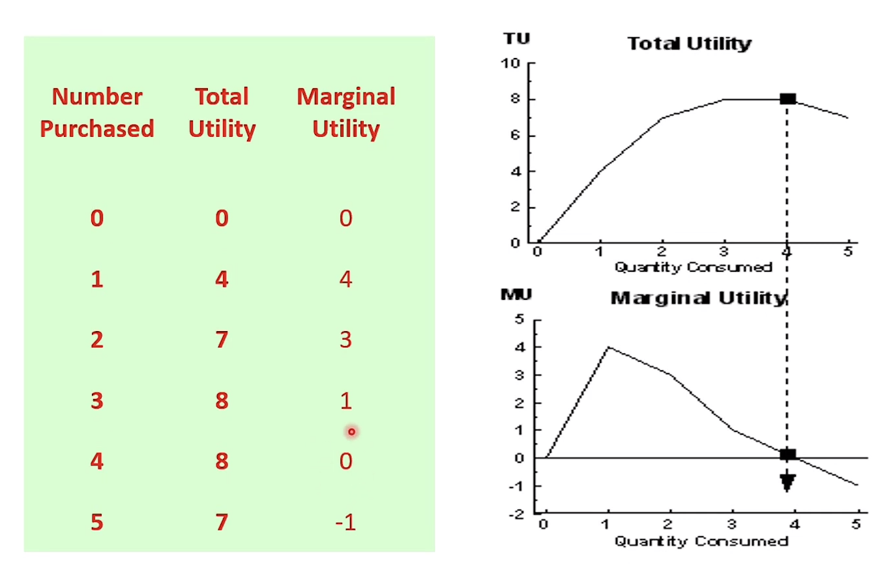
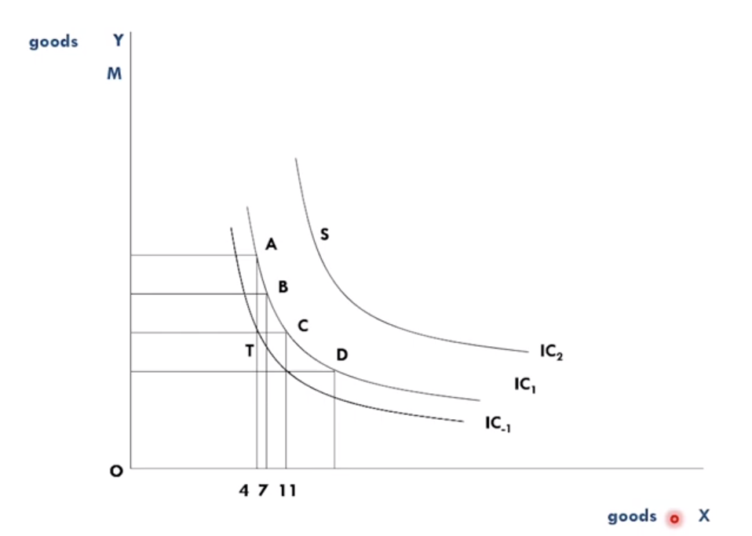

# Consumer Behaviour 
The principle assumption upon which the theory of consumer behaviour and 
demand is built is:

A consumer attempts to allocate his/her limited money/resources among 
available goods and services so as to maximize his/her utility (satisfaction).

## Utility Concepts
### The Cardinal Utility Theory (TUC)
- Utility is measurable in a cardinal sense
- Cardinal utility assumes that we can assign values for utility.

    !!! example 
            Derive 100 utils (theoretical unit for utility) from 
            eating a slice of bread

#### Total Utility 
The overall level of satisfaction derived from consuming a good or
service.

#### Marginal Utility 
Additional satisfaction that an individual derives from consuming an 
additional unit of a good or service.

$$ \text{MU} = \frac{\text{Change in total utility}}{\text{Change in quantity}}$$

$$ \implies \frac{\Delta \text{TU}}{\Delta Q} $$

#### Law Of Diminishing Utility
- Law of Diminishing Utility (Return) states that as more and more of a good 
are consumed , the process of consumption will (at some point) yield smaller 
and smaller additions to utility.
- When the total utility maximum , marginal utility = 0
- When the total utility begins to decrease , the marginal utility = negative (-ve)
  
    !!! example
        

#### Consumer Equilibrium
- So far , we have assumed that any amount of goods and services are always
available for consumption.
- In reality , consumers face constraints (income and prices).
- Consumer's objective is to maximize his/her utility subject to income constraint.

- Suppose there are 2 goods $X$ and $Y$ with fixed prices $P_X$ and $P_Y$.
Then consumer will reach an equilibrium when the ratio of marginal utlity to the prices
is equal.
    $$ \frac{MU_X}{P_X} = \frac{MU_Y}{P_Y} $$

    Similarly , when the ratio is higher for a good than the other , then the consumer will
    prefer former.

    $$ \frac{MU_X}{P_X} > \frac{MU_Y}{P_Y} $$
    In this case consumer will prefer $X$ more than $Y$.

    !!! example 
        Raj wants to eat a pack of biscuits. Raj goes to a nearby corner shop and sees there are only 2
        option available **Parle-g** and **Tiger**. Both of them have the same price and same weight.

        In this case Raj might buy a smaller pack of both or a bigger pack of either of them as ,
        Raj gets an equal amount of utility from both **Parle-g** and **Tiger**.

        Another scenario might be that Raj likes **Parle-g** more than **Tiger** so Raj will buy 
        **Parle-g** biscuit as it gives him more utility.

### The Ordinal Utility Theory (TUO)
- Utility is measurable in an ordinal sense
- Ordinal utility approach - does not assign values , instead works 
with a ranking of preferences.
- The utlity derived from consuming a good , such as $X$ , is a function of the quantities
of $X$ and $Y$ consumed by a consumer.
    
    $$ U = f(X,Y)$$

- The ranking of goods according to TUO is done with the help of Indifference Cruves (IC).
These curves are representations of combinations of items when the consumer is in an
indifferent situation , i.e. certain combinations of goods will give the consumer the same
level of satisfaction.

- In general consumers tend to move to higher *IC* curves within their budget constraint.

    !!! example 
        

#### Properties of IC Curves
- **Downward Sloping** from left to right: This shows increase in quantity of certain good.
- **Convex to the origin**: the marginal rate of substitution (MRS) decreased.
    MRS = Quantity of goods $Y$ willing to substitute to obtain one unit of goods $X$ & this 
    substitution is to maintain its position at the same level of satisfaction.

    !!! example
        Buying 5 *Cadburry DairyMilk* or getting 1 *Premium Dark Chocolate*.

- **Do not cross (intersect)**: Consumer preferences transitive.
- **Different ICs show different level of satisfaction** : The farther the curve from origin , the higher
the satisfaction.

