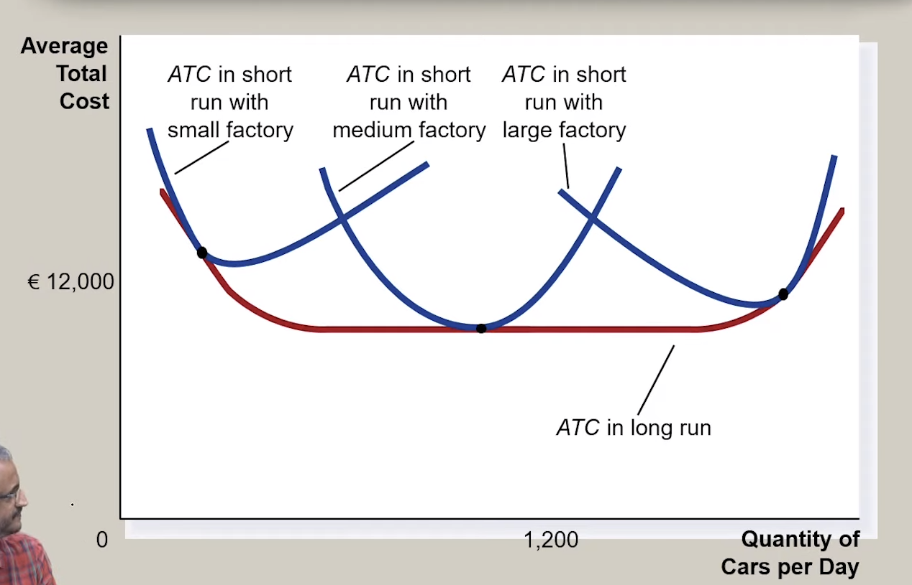

# Cost Curves 
## Importance of relation between marginal and average cost curves
- The amount of output/quantity of output is determined by the producer.
- It is of utmost importance for the producer to decide the range of this output in
terms of cost efficiency in terms of quantity output.
- This can be identified as region around the point of intersection of the Marginal
Curve and The Total Cost Curve
- This forms important decision for a firm

??? abstract "Reasonable Expansion Path of a Firm"
    Start with a small factory as the demand increases, firm moves to medium
    factory and next with increase in demand again moves to large factory.

## Economies of Scale 
{: style="width:80%;"}

- It is a part of the 'Long Run Total Average Cost Curve'
- As and when your production (output volume) increase, the average total
cost(ATC) keeps falling
- Reasons for this could be many: bulk purchases(cost advantages), technological
innovation, and etc.

    !!! example 
        This is the region when 10 units are produced at cost of 1 unit of ATC

## Constant Returns of Scale
- This is the region of 'Long Run ATC' for 1 unit of production 1 unit of ATC is
incurred.
- It is a one-one relation
- Most firms operate in this region

## Diseconomies of Scale
- It is a part of the 'Long Run Total Average Cost Curve'
- As output volume of production is increased, with respect to this; the ATC
increase is by a factor of more than that of the production.

    !!! example 
        2% increase in output will result in 6% increase in total costs
