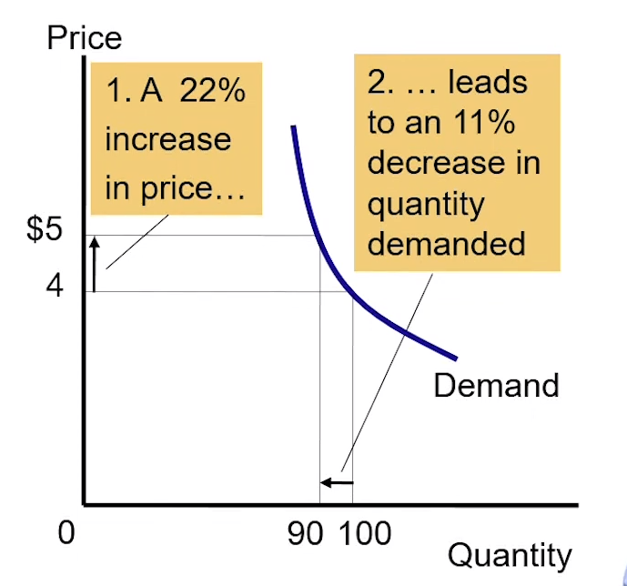

## 
# The Elasticity of Demand 
Elasticity is the measure of responsiveness of quantity demanded or 
quantity supplied to a change in one of its determinants.

## Types of Elastic Demands
- **Elastic Demand** : It is when quantity demanded responds subtantially
to changes in price.

- **Inelastic Demand** : It is when quantity demanded responds only slightly
to changes in price.

## Price Elasticity of Demand 
How much much the quantity demanded of a good reponds to a change in 
that price of that good.

It is the percentage change in quantity demanded divided by the percentage
change in price. Only the absolute value of the result is taken into consideration.

### Determinants of Price Elasticity of Demand
- **Availability of close substitutes** : Goods with close substitutes have
more elastic demand.

- **Necessities vs. Luxuries** : Necessities have inelastic demand and Luxuries have
elastic demand.

    !!! example
        Buying a medicine no matter how costly it is for a family member is a necessity.
        During the 2nd covid wave , even when the price of oxygen cylinders was sky high ,
        people still bought them as it was a necessity for their loved ones.

        Luxuries like eating out have elastic demand because , if our favorite resturaunt 
        suddenly increases prices of all their food , we will most likely look for an alternate
        option which offers a better price.

### Types of Demand Curves
- **When Price elasticity of demand > 1** : It is said that Demand is elastic.

    !!! example 
        {: style="width:50%;"}

- **When Price elasticity of demand < 1** : It is said that Demand is inelastic.
    
    !!! example 
        {: style="width:50%;"}

- **When Price elasticity of demand = 1** : It is said that Demand has unit elasticity.
    
    !!! example 
        

- **When Price elasticity of demand = 0**: The demand curve formed is vertical 
and Demand is said to be perfectly inelastic.

    !!! example 
        {: style="width:50%;"}

- **When Price elasticity of demand = infinity**: The demand curve formed is horizontal
and Demand is said to be perfectly elastic.
    
    !!! example 
        {: style="width:50%;"}

!!! note 
    The flatter the demand curve the greater the elasticity of demand.

    Moreover , elasticity is not just the slope , but also the position on the curve.

## Income Elasticity of Demand
How much the quantity demanded of a good responds to a change in consumers' income.

It is the percentage change in the quantity demanded divided by the percentage change
in income.

### Classification of Goods 
#### Normal Goods 
- **Positive Income Elasticity**
- **Necessities** : Smaller income elasticities 
- **Luxuries** : Large income elasticities 

#### Inferior Goods 
- **Negative Income Elasticity**

## Cross-Price Elasticity of Demand 
How much the quantity demanded of one good responds to a change in price of another good.

It is the percentage change in quantity of demanded of first good divided by the 
percentage change in the price of the second good.

### Classification of Goods 
#### Substitutes 
- Goods typically used in place of one another.
- Positive cross-price elasticity 

#### Complements 
- Goods that are typically used together.
- Negatice cross-price elasticity.

---

# Elasticity of Supply 
## Price Elasticity of Supply
- How much the quantity supplied of a good responds to a change in the price of that good.
- It is the percentage change in quantity supplied divided by the percentage change in price.
- Depends on the flexibility of sellers to change the amount the goods they produce.

### Classification of Goods 
- **Elastic Supply Goods** : Quantity supplied responds substantially to changes in the price.
- **Inelastic Supply Goods** : Quantity supplied responds only slightly to changes in the price.

### Determinants of Price Elasticity of Supply 
- **Time Period** : Supply is more elastic in long run

### Types of Supply Curves
- **When Price elasticity of Supply > 1** : It is said that Supply is elastic.
- **When Price elasticity of Supply < 1** : It is said that Supply is inelastic.
- **When Price elasticity of Supply = 1** : It is said that Supply is unit elastic.

### Effects of a Price Change
- **Income Effect** : A change in a consumer's real purchasing power brought about by a 
change in the price of a good.
- **Substitution Effect** : An incentive to increase consumption of a good whose price 
falls , at the expense of other , now relatively more expensive , goods.
