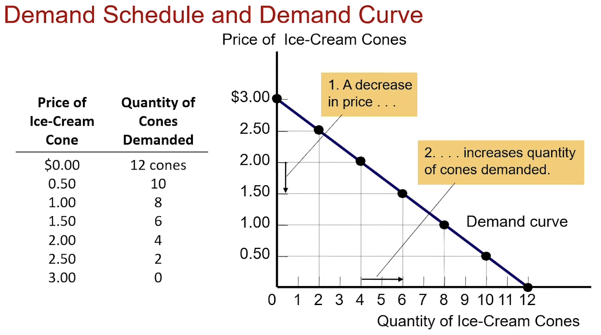
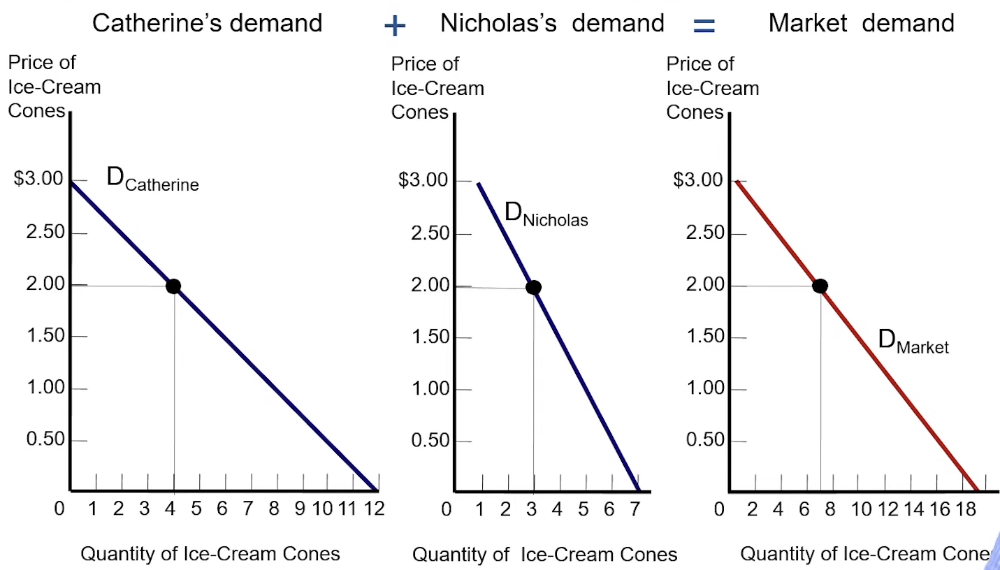
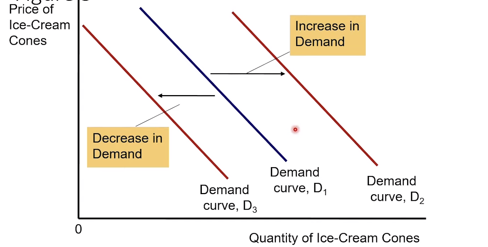
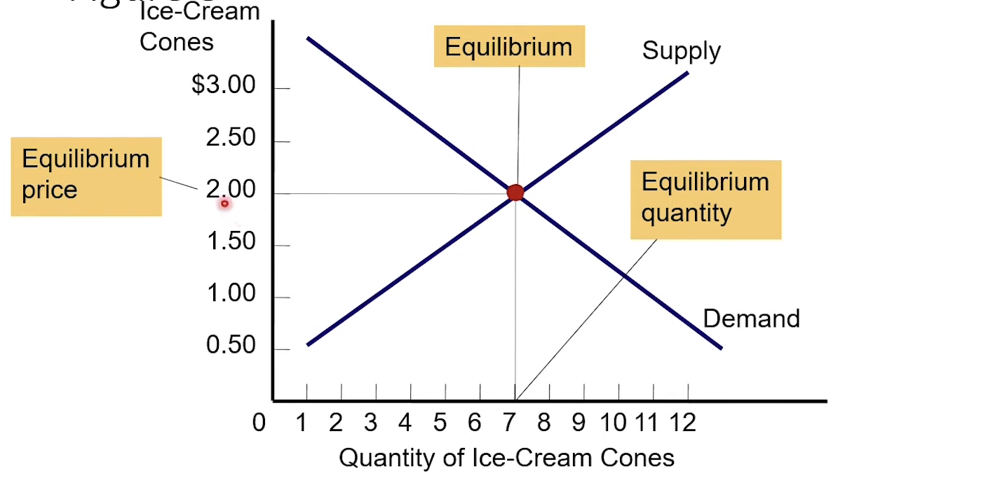

# Markets and Competiton 
- Market is a group of buyers and sellers of particular good or service.
- Buyers determine the demand for the product.
- Sellers determine the supply of the product.

## Demand
- **Quantity Demanded** : Amount of a good buyers are willing and able to purchase.
 
    !!! example
        When price of good is increases , quantity demand of that good decreases.
        
        If Amul raises the prices of *Toned Milk* by 10 ruppees suddenly , then 
        consumers will switch to a different brand. Hence , decreasing the demand for 
        *Amul Toned Milk*.

- **Law Of Demand**: When the price of the good increases , quantity demanded of a good falls.
- **Demand Schedule (table)**: Relationship between the price of a good and quantity demanded.
- **Demand Curve (graph)**: Relationship between the price of a good and quantity demanded.
- **Individual Demand**: Demand of an individual.

!!! example "Demand Schedule and Demand Curve"
    

### Market Demand Curve 
It is the sum of individual demand curves horizontally.

- Total quantity demanded of a good varies
    - As the price of the good varies
    - Other things constant

!!! example "Market Demand as the Sum of Individual Demands"
    

### Shifts in the Demand Curve 
- **Increase in demand**
    - Any change that increases the quantity demanded at every price.
    - Demand curve shifts right
- **Decrease in demand**
    - Any change that decreases the quantity demanded at every price.
    - Demand curve shifts left.

!!! example "Shifts in the Demand Curve"
    

### Factors affecting Demand Curve 
- **Income** (Other factors are constant)
    - Normal Good: An increase in income leads increase in demand.
        
        !!! example 
            If the income increases a person can now buy more of a certain goods.

            Buying trendy clothes becomes normal.

    - Inferior Good: An increase in income leads to decrease in demand

        !!! example 
            If the income increases a person will look for better options for slightly 
            higher price

            Buying expensive shoes from brands like *nike* and *puma*.

- **Prices of related goods**
    - Substitute (two goods): An increase in the price of one leads to an increase in demand of the other

        !!! example
            If the price of *Tata Tea* increases , consumer will move to a different brand,
            which will lead to increase in demand of the latter.

    - Complements (two goods): An increase in the price of one leads to an decrease in demand of the other

        !!! example 
            If the price of fuel increases , all the goods become costly due to transportation
            expenses , this will lead to decrease in demand of certain goods because of high price.

- **Tastes**: Changes in tastes over time changes the demand.
    
    !!! example 
        A person when of young age does not like coffee but as he grows older coffee/tea
        gives the person utility/satisfaction.

- **Expectations** : Expectation about the future
    - Expecting an increase in income might lead to increase in current demand of a certain good.

        !!! example 
            Buying goods on loan/EMI
            
    - Expecting higher prices might also lead to increase in current demand.

        !!! example 
            Buying grains in large quantity when the news of bad harvest breaks out.

- **Number of buyers**

### Supply and Demand Together 
**Equilibrium** is a situation when,

- Supply and demand forces are in balance.
- A sitation in which market price has reached a level where $\text{Quantity Supplied} = \text{Quantity Demanded}$
- Supply and demand curves intersect.

**Equilibrium Price**: Balances quantity supplied and quantity demanded , also known
as market-clearing price.

**Equilibrium Quantity**: Quantity supplied and quantity demanded at the equilibrium price.

!!! example "Equilibrium of Supply and Demand"
    
