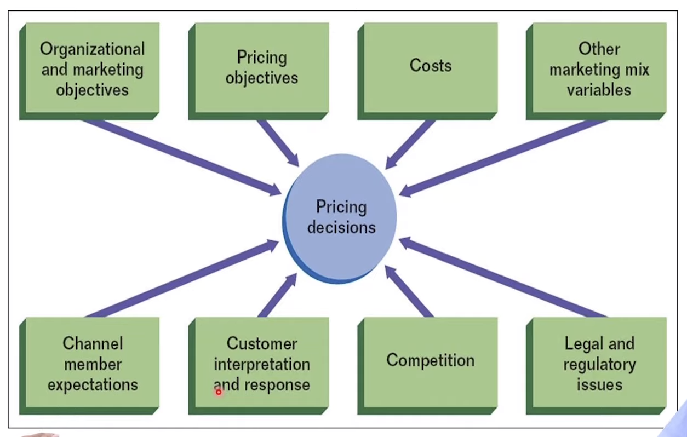

# Pricing Strategies 
- Pricing of a product depends on the market (monopoly, competitive, etc)
- In general ‘price’ cannot be changed much in an competitive markets like FMCG,
etc
- Pricing also depends on its product category
- Pricing depends on the long run vision of the firm on that product eg: to
maximize sales or to maximize profits, or to capture market share etc.

## Pricing Strategies Objectives
In general products have a life cycle of their own, for example: A newly launched
product might have a slow start to enter the market and then it gets diffused and
faces the competition, then comes the maturity stage for the product when it hits
the max volumes and after that comes the declining phase of the product life
cycle.

At each stage/phase of product life cycle, different pricing strategies are needed.

- Long Run Profits
- Short Run Profits 
- Increase Sales Volume 
- Company Growth 
- Match Competitors Price 
- Create Interest & Excitement about the Product
- Discourage Competitors from cutting price.
- Social , Ethical and Ideological Objectives 
- Discourage New Entrants 
- Survival

## Decisions In Pricing Strategy 
- Fixed & Variable Cost 
-  Competition 
- Company Objectives 
- Proposed Positioning Strategies 
- Target Group & Willingness to Pay
- External Market Demand 
- Internal Factors : Product Cost & Objectives of Company

## Factors Affecting Pricing 
- Consumer’s primary goals with respect to the product affects pricing of a product
- Having or not having a Unique Selling Point (USP) for the product vs. competition
- Bundling low-value and high-value products or services (eg: sedan features in a
hatchback car)
- Geographical segmentation of market (city -district - income groups) also plays
an important factor in pricing. Different regions in the same country may have
varied prices sometimes

{: style="width:80%;"}

## Types of Pricing Strategies 
### Market Skimming Prices 
- This type of pricing strategy depends, if one has complete information on
customer demand (willingness and ability to buy)
- High Price low volume products.
- Skim Profit from the Market 
- Suitable for the products that have short life cycle or which will face some 
comptetion at some point in the future.

!!! example 
    PlayStation , Digital Technology , Fast Fashion , etc.

### Value Pricing 
- Based on consumer perception.
- Price charged according to Customers Perception.
- Price set by the company as per the Percived value.
- Value pricing for a firm largely depends on the insights about via consumer

!!! example
    Status Products (apple iphone) / Exclusive Products 

### Loss Leader Pricing 
- Goods / services deliberately sold below cost to encourage 
large volume of sales for a certain period of time.
- Purchases of other items more than covers 'loss' on item sold.

!!! example 
    Festival Sales , Supermarket special sales , etc.

### Psychological Pricing 
- Setting a price according to what consumers think the price to be .
- Its used to play on consumer perception , high value goods are priced 
according to what customers THINK should be the price of that premium good.

!!! example
    Rs. 9.99 instead of Rs 10.99

### Going Rate Pricing 
- Constantly monitor rival’s pricing
- Match the price or cut the price below the competitors price
- Increase the price when needed based on competitor’s price

### Tender Pricing 
- This is Low cost but high value delivery model
- Typically government tenders
- Many contracts are given via tenders
- Reputation (past track record) is important
- Entry barriers are high (tender placing requirements such as annual turnover of
minimum 10cr and etc)
- Chances of collusion are there as tenders are kept somewhat secret.

### Price Discrimination 
- Same product or service are sold to different people at different prices is called
price discrimination

!!! example 
    Airline Tickets , Perishable Goods , etc.

- This strategy is possible where there is no resale of the product is possible.

!!! abstract "Subcategories of Price Discrimination"
    - Peak load pricing is a variant of price discrimination (metro prices at peak hours
    vs. non-peak hours)
    - Cross-price subsidization: For example, there are 2 customers customer#1 does
    not have the ability to pay more for a service - you subsidize the price and
    customer#2 has ability to pay more - you charge more to recover from
    subsidizing the price for customer#1, electricity is another example, classes in
    train trave

### Penetration Pricing 
- Pricing set to penetrate the market

!!! example 
    Jio gave free data to new consumers in order to penetrate the market and expand its userbase.

- Initially price is very very low and focus on high volume sales
- Suitable for newly launched product
- Commonly a long term strategy

### Cost Plus Pricing 
- Cost-plus pricing is a pricing model used to maximize the rates of return for the
companies
- Cost price(CP) + Mark-Up(MU) = Selling Price
- Cost price = FC + VC (FC: fixed costs. VC: variable cost)

### Target Pricing 
- I want this much of profits
- To reach those profits, vary the mark-ups
- Markup = profit /cost X 100
- When demand is low, you reduce the mark-up
- When the demand is high, you increase the mark-up

### Marginal Cost Pricing 
- Marginal cost is the cost of producing one extra unit or one fewer unit.
- Margincal Cost allows flexibility as it allows variable pricing structure.
- Particularly relevant in transport where fixed costs may be relatively high.
- Marginal cost pricing MC = Δ Total Cost / Δ Output = $80 / 2 = $40

### Full Cost Pricing 
- Full cost pricing is an attempt at pricing the commodity to cover both fixed and
the variable costs

#### Absorption Cost Pricing
- Absorption cost pricing is an attempt to price the commodity to cover variable
costs and some of the fixed costs
- In certain markets where the sunk cost is high, one uses absorption cost pricing.

### Destroyer Pricing 
- To destroy the post entry of new entrant
- Undercut the pricing to destroy the competition and force to exit

!!! abstract "Summary"
    - The firm should have an idea about the demand of the product and the perception 
    of that product by the consumer.
    - The firm should have full information about the costs which go into manufacturing 
    the product.
    - The firm should also have information about the rivals pricing strategy.

    With all this information a firm arrives at an appropriate pricing strategy.

    
