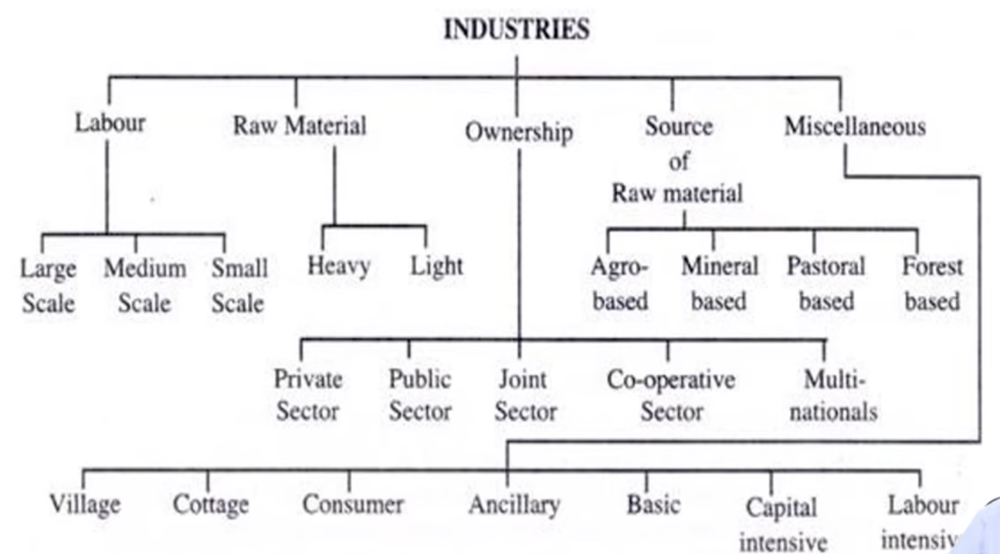

# Industry Definition 
- Industry is collection of firms which are based on related business activities
- Eg: Cement Industry: Ultra Tech, ACC, Maha, etc
- Industry wise analysis provides for broad economic insights and projections that
enable for future investment decisions

!!! info "Classification of Industries"
    

??? question "What is MNC?"
    Any company with >10% equity and with operations in more than 1 country is called an MNC

## Types of Industries 
### Large Scale Industry
Industries which employ a large number of labourers in each unit are called large-scale industries.
!!! example
    Cotton or jute textile industries are large scale industries.

### Medium Scale Industry
The industries which employ neither very large nor very small number of labourers are put in
the category of medium scale industries. 

!!! example 
    Cycle Industry , radio and television industries are medium scale industries.

??? question "What is Missing Middle Phenomenon"
    - This phenomenon ‘missing middle’ is unique to India, usually found in the
    manufacturing industry.
    - Compared to small sector and large sector industries, medium sector industries
    are very very less, eg: manufacturing industry
    - We call this missing medium sector industries phenomenon as ‘missing middle

### Small Scale Industry 
Industries which are owned and run by individuals and which employ a small number of
labourers are called small scale industries.

### Heavy Industry
Industries which use heavy and bulky raw-materials and produce products of the same category
are called heavy industries.

!!! example
    Iron and steel industry

### Light Industry 
The light industries use light raw-materials and produce light finished products.

!!! example
    Electric Fans , Sewing Machines , etc.

### Private Sector Industry 
Industries owned by individuals or firms such as Bajaj Auto or TISCO are called private
sector industries.

### Joint Sector Industry
Industries owned jointly by private firms and the state or its agencies.

!!! example
    Gujarat Alkalies Ltd , Oil India Ltd.

### Co-operative Sector Industries 
Industries owned and run co-operatively by a group of people who are generally 
producers of raw materials of the given industry such as sugar mill owned and run by 
farmers are called co-operative sector industries.
