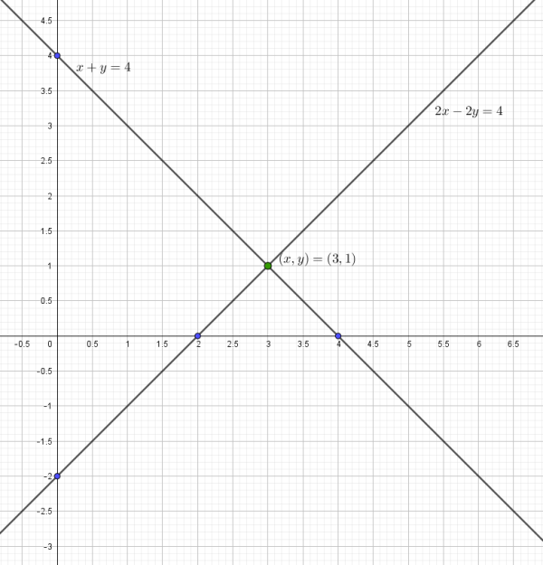
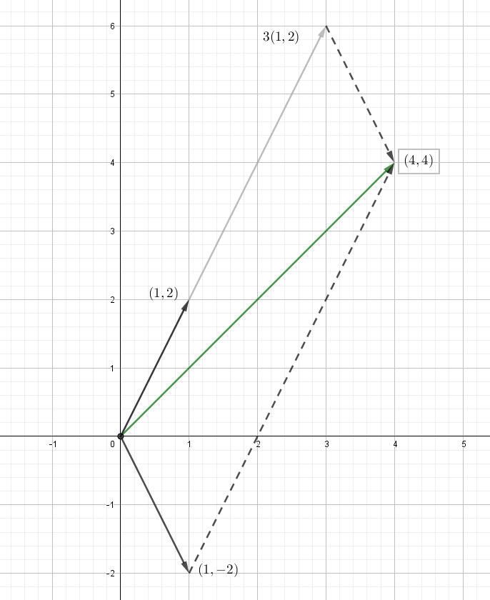

# Matrices and Gaussian Elimination 
## Section 1.2
### Solution 1.2.1
The exercise asks to draw the row and the column pictures for the system of equations

$$\begin{align}
x + y &= 4 \\
2x -2y &= 4
\end{align}$$

Let's start with the row picture. The first equation produces a line passing through the points 
(0,4) and (4,0) (see Figure 1). These points can be easily found if you set a value of one of the variables equal to zero and solve the equation for the other one.

In the same way, we can find that the second equation produces the line passing through the points (0,−2) and (2,0) (see Figure 1).

The point of intersection lies on both lines. It is the only solution to both equations.
{: style="width:70%;"}
<figcaption>Figure 1 : Lines meet at x=3 , y=1</figcaption>

The second approach looks at the columns of the linear system. The two separate equations are really one vector equation:

$$x \begin{bmatrix} 1 \\ 2 \end{bmatrix} + y \begin{bmatrix} 1 \\ -2 \end{bmatrix} = \begin{bmatrix} 4 \\ 4 \end{bmatrix}$$

The problem is to find the combination of the column vectors on the left side that produces the vector on the right side

Those vectors 
(1,2) and (1,−2) are represented by the bold arrows in Figure 2. The unknowns are the numbers 
$x$ and $y$ that multiply the column vectors. The whole idea can be seen in that figure, where 
3 times column 1 is added to column 2. Geometrically this produces a famous parallelogram. Algebraically it produces the correct vector (4,4), on the right side of our equations. The column picture confirms that $x =3$ and $y=1$.

{: style="width:60%;"}
<figcaption>Figure 2: Columns Combine with 3 and 1</figcaption>

### Solution 1.2.2
**Step 1**
Solve to find a combination of the columns that equals b.

$$\begin{align}
u - v - w &= b_1 \\
v + w &= b_2 \\
w &= b_3
\end{align}$$

**Step 2**
Using Substitution,

$$\begin{align} \boxed{w = b_3} \\
\boxed{v} = b_2 - w \boxed{= b_2 - b_3} \\
\boxed{u} = b_1 + v + w = b_1 + b_2 - b_3 + b_3 \boxed{= b_1 + b_2} \end{align}$$

**Step 3 (Result)**

$$\begin{align}
u &= b_1 + b_2 \\
v &= b_2 - b_3 \\
w &= b_3
\end{align}$$
