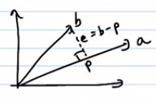

## Column Space C(A)
The column space of a matrix is the span (set of all possible linear combinations) of its columns.

!!! example
    ```
    A = 
    [1,2,3]
    [2,4,6]
    ```

    - C(A) = span([1,2])
    - The 2nd and the 3rd column are multiples of the first column.
    - Therefore column space of matrix A is span([1,2])

    !!! note
        $Ax = b$ will always have a solution for all $b \in C(A)$ 


## Null Space N(A)
The nullspace (also called kernel) of a matrix A is the set of all vectors x that satisfy the equation Ax = 0.

!!! example
    ```
    A = 
    [1 2]
    [3 6]
    [4 8]

    ```
    - The 2nd and the 3rd rows are the multiples of the first row.
    - Therefore null space of matrix A is $x_1 + 2x_2 = 0$ 
    - $N(A) = span([-2 , 1])$
      
    !!! note
        If A is invertible , then $N(A)$ has $\phi$ only and $C(A)$ is the whole space.
          (If A is invertible means a unique solution exists for $Ax = b$)


## Row Space R(A)
The row space of a matrix A is the span of its row vectors. In other words, it is the set of all possible linear combinations of the rows of A.

!!! example
    ```
    A = 
    [1 2 3]
    [4 5 6]
    [7 8 9]
    ```

    - The 3rd row is linear combination of the first 2 rows.
    - Therefore $R(A) = span([1,2,3] , [4,5,6])$
      
    !!! note
        The row space of a matrix A can also be written as $R(A) = C(A^T)$


## Left Null space
It is the same as null space but its for $A^T$


# Orthogonal Vectors and Subspaces 
## Orthogonal Vectors 
Orthogonal vectors are two or more vectors that are perpendicular to each other, meaning that they form a 90-degree angle at their intersection. Geometrically, two vectors are orthogonal if and only if their dot product is equal to zero.
If $x = \begin{bmatrix}x_1 & x_2 & x_3\end{bmatrix}$ and $y = \begin{bmatrix}y_1 & y_2 & y_3\end{bmatrix}$ then $x$ and $y$ are orthogonal only if 
$y^T x = 0$

## Orthogonal Subspaces 
Orthogonal subspaces are subspaces of a vector space that are perpendicular to each other. Specifically, two subspaces S and T of a vector space V are said to be orthogonal if every vector in S is orthogonal to every vector in T. This is denoted as S ⊥ T.

# Projections 


$p = \hat{x}a$
$e = b-p$
$e = b - \hat{x}a$

$e \perp a$
$b - \hat{x}a \perp a$
$a^T(b - \hat{x}a) = 0$
$\hat{x} = \frac{a^Tb}{a^Ta}$
$\implies p = \hat{x}a = \frac{a^Tb}{a^Ta}a$

## Projection matrix 
$p =(\frac{a^Tb}{a^Ta})a$
Let $\mathbb{P} = \frac{aa^T}{a^Ta}$ , then projection of $b$ onto $a$ is $\mathbb{P}b$
We can see that to get the projection , we can _left_ multiply the projection matrix on $b$

!!! note "Properties of Projection Matrix"
    - $\mathbb{p}$ is always symmetric.
    - $\mathbb{p} = \mathbb{p}^2$ (i.e. its idempotent)


# Least Squares 
## Minimizing Least Sqaures 
Suppose for a system of linear equations like

$$\begin{align}
2x = b_1 \\
3x = b_2 \\ 
4x = b_3
\end{align}$$

The system of linear equations is only solvable if $b$ is on the line through $\begin{pmatrix} 2 \\ 3 \\ 4\end{pmatrix}$

- **Problem:** The problem with this approach is that for some inputs there is no error and some there might be huge error.
- **Solution:** A solution to this problem can be minimizing the average error

$$E^2 = (2x-b_1)^2 + (3x-b_2)^2 + (4x - b_3)^2$$

To minimize this we will derivate it w.r.t. x and equate it to zero 

$$\begin{align}
2[ 2(2x - b_1) + 3(3x - b_2) + 4(4x - b_3)] = 0 \\
x = \frac{2b_1 + 3b_2 + 4b_3}{2^2 + 3^2 + 4^2}
\end{align}$$

We can see that $x$ is very similar to the projection matrix $\frac{a^Tb}{a^Ta}$ with $a = \begin{pmatrix} 2 \\ 3 \\ 4\end{pmatrix}$

Projection of $b$ onto $S$ is $p = A\hat{x}$
Orthogonal vector $e = b - p = b - A\hat{x}$

!!! note
    - $e \perp$ to every vector in $C(A)$.
    - Also $C(A) \perp N(A^T)$ , every vector in $C(A)$ is orthogonal to every vector in $N(A^T)$
    - $e \in N(A^T)$
    $\implies A^Te = 0$
    $\implies A^T(b - A\hat{x}) = 0$

    !!! note "Final Equation"
        $A^TA\hat{x} = A^Tb$

        - This equation gives the projection of $b$ onto $C(A)$
        - Even if $Ax =b$ has no solution , this equation has a solution

### Properties 
#### When columns of $a$ are linearly independent 
then ,  $a^ta$ is invertible 
solving $a^ta\hat{x} = a^tb$ when $(a^ta)$ is invertible gives $\hat{x} = (a^ta)^{-1}a^tb$

projection $\mathbb{p} = a\hat{x} = a(a^ta)^{-1}a^tb$

#### When $b$ belongs to $c(a)$ , $\mathbf{ax= b}$
$\mathbb{p} = a(a^ta)^{-1}a^tb = a(a^ta)^{-1}a^tax = ax = b$

#### When $b$ belongs to $n(a^t)$ 
$\mathbb{p} = a(a^ta)^{-1}a^tb = 0$ , since $a^tb = 0$

#### When $a$ is a square matrix and inveritible
$\mathbb{P} = A(A^TA)^{-1}A^Tb = b$

# Projection Matrix Properties 
- Its idempotent , i.e. $\mathbb{P} = \mathbb{P}^2$
- It is a symmetric matrix , i.e. $\mathbb{P} = \mathbb{P}^T$


