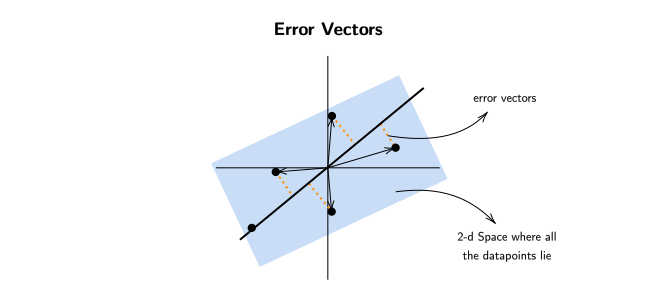
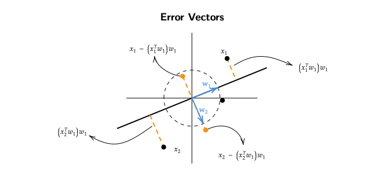

# Principal Component Analysis (PCA)

## Introduction
Unsupervised learning, specifically "representation learning," is a subset of 
machine learning where the goal is to automatically discover meaningful representations
or features from raw data without explicit supervision or labeled examples. 
In representation learning, the algorithms aim to capture the underlying structure, 
patterns, or features within the data itself. 
This can be highly valuable for various tasks like data compression, feature extraction, 
data visualization, and even for improving the performance of other machine learning models.

## Representation Learning (1)
The main objective of representation learning is to transform 
the input data into a more meaningful and **compact** representation.
This representation should capture the essential characteristics 
of the data, making it easier to analyze or use in downstream tasks.

!!! question "What is the need for compression of data points?"
    Compressing a dataset, especially in the context of unsupervised learning 
    or data preprocessing, can serve several important purposes and 
    provide various benefits , mainly:

    - **Reduced Storage Space**: Large datasets can require significant storage space. 
    Compressing the dataset reduces storage requirements,
    which can be cost-effective, especially when dealing 
    with massive datasets in cloud storage or on limited storage devices.

    - **Faster Data Transfer**: Smaller datasets transfer more quickly over networks, 
    which is crucial when moving data between systems or 
    uploading/downloading data from the internet.

    - **Faster Training**: When working with machine learning models, 
    smaller datasets can lead to faster training times. 
    This is particularly important when experimenting 
    with different models, hyperparameters, or architectures.

    !!! question "How to Compress Data Points?"
        Lets say there are 4 data points $\left\{
        \stackrel{x_1}{\begin{bmatrix} -7 \\ -14 \end{bmatrix}} , 
        \stackrel{x_2}{\begin{bmatrix} 2.5 \\ 5 \end{bmatrix}} ,
        \stackrel{x_3}{\begin{bmatrix} 0.5 \\ 1 \end{bmatrix}} ,
        \stackrel{x_4}{\begin{bmatrix} 0 \\ 0 \end{bmatrix}}
        \right\}$

        > Now one might ask , "how many data points are needed to store this
        dataset?"

        > The naive answer would be to say , "as there are 8 data points , hence 8
        real numbers are required to store this dataset."

        A better way to represent this dataset would be to find a "function" which takes 
        1 real number and outputs a matrix of 2 real numbers.
        If we look at the dataset we can see that the first coordinate is half of the second coordinate.
        We can exploit this feature of the dataset to reduce the number of data points to be 
        stored.

        One way to form this "function" would be to get a "representative" $\begin{bmatrix} 1 \\ 2 \end{bmatrix}$
        and "coefficients" $\{ -7 , 2.5 , 0.5 ,1 \}$. Now we can get the back our dataset by multiplying them with 
        the coefficients.
        
        Using this way we only need to store 6 real numbers (4 for coefficients + 2 for representative).
        Similarly, on a dataset of $2n$ points , we can store them as $n +2$ real numbers ($n$ coefficients +
        2 for representative).

### Working with a Realistic Dataset
In the above example we were able construct a function which reduced the number of real
numbers required to represent the dataset , but in a realistic dataset all the points do not lie
on the same line , they are scattered and its very hard to derive meaningful conclusions from them.

> "What to do if all the points dont lie in the dataset?"

> A simple answer would be, "We can get more **representatives** to accommodate the points which do not lie on the same line."
This approach does accommodate the outliers but it also increases the number of real numbers required to represent the dataset.

> "Whats the solution then?"

> There has to be a tradeoff between the "accuracy" or the "size" of the dataset. If we want to reduce the size 
of the "size" then approximating the outlier to the "line" with least lost would be the best bet.

To represent outliers and reduce the size of the dataset at the same time , we must project the 
outlier onto the line.

Let there be a vector $\begin{bmatrix} w_1 \\ w_2 \end{bmatrix}$ which represents the "line".
The projection of the vector $\begin{bmatrix} x_1 \\ x_2 \end{bmatrix}$ onto the line would be 

$$ \left[ \frac{x_1w_1 + x_2w_2}{w_1^2 + w_2^2} \right] \begin{bmatrix} w_1 \\ w_2 \end{bmatrix} $$

This will give us a point on the "line" with the least loss/distance.

Now if we pick vector $(w_1 , w_2)$ which lies on the "line" such that $w_1^2 + w_2^2 = 1$,
the above equation becomes

$$ \left[ {x_1w_1 + x_2w_2} \right] \begin{bmatrix} w_1 \\ w_2 \end{bmatrix} $$

## Representation Learning (2)
Our original objective was to find a "compressed" representation of the data 
when all the data-points not necessarily fall on the same line.

> "How do we know that the line we picked is the best line?"

> One could argue that the same line doesnt fit all the data-points with the "*least loss*" ,
where "*loss*" is the average of all the "*errors*" when projecting outliers onto the given "*line*".

!!! question "How to find the Best Line?"
    To find the **Best Line** we should first have a certain way to compare 
    2 different lines. In our case it would be the line with the least "*reconstruction error*".

    Lets say for a dataset $\{ x_1 , x_2 , .... x_n \}$ , where $x_i \in \mathbb{R}^d$

    $$\begin{equation*}
    \begin{split}
    \text{Error}(\text{line} , \text{dataset}) & = \sum_{i=1}^n \text{error}(\text{line} , x_i) \\ 
    & = \sum_{i=1}^n \text{length}^2(x - (x^Tw)w) \\
    & = \sum_{i=1}^n || x - (x^Tw).w||^2 \\
    \end{split}
    \end{equation*}$$

    To minimize the above equation we can think of it as a function $f(W)$

    $$\begin{equation*}
    \begin{split}
    f(W) &= \frac{1}{n}\sum_{i=1}^{n} || x - (x^Tw).w ||^2 \\
    &= \frac{1}{n}\sum_{i=1}^{n} (x - (x^Tw).w)^T(x - (x^Tw).w)  \\
    &= \frac{1}{n}\sum_{i=1}^{n} \left[ x_i^Tx_i - (x_i^Tw)^2 - (x_i^Tw)^2 + (x_i^Tw)^2(1) \right] \\
    &= \frac{1}{n}\sum_{i=1}^{n} \left( x_i^Tx_i - (x_i^Tw)^2 \right)
    \end{split}
    \end{equation*}$$

    Here we are minimzing $f(W)$ with respect to $w$ , the first term of the above 
    equation $x_i^Tx_i$ can be ignored as its a constant.

    So we can write the new function as $g(W)$

    $$\begin{equation*}
    \begin{split}
    \min_{W_{||w||^2 = 1}} g(W) &= \frac{1}{n}\sum_{i=1}^n - (x_i^Tw)^2
    \end{split}
    \end{equation*}$$
    
    Alternatively this same function can be written as 

    $$\begin{equation*}
    \begin{split}
    \max_{W_{||w||^2 = 1}} g(W) =  \frac{1}{n}\sum_{i=1}^n (x_i^Tw)^2 &= \frac{1}{n} \sum_{i=1}^{n} (w^Tx_i)(x_i^Tw) \\ 
    &= \frac{1}{n} \sum_{i=1}^{n} w^T(x_ix_i^T)w \\
    &= \frac{1}{n} w^T(\sum_{i=1}^{n} x_ix_i^T)w \\
    \end{split}
    \end{equation*}$$

    The above equation can also be written as 

    $$ \max_{w_{||w||^2 = 1}} w^TCw $$
    
    where $C = \frac{1}{n}\sum_{i=1}^{n}x_ix_i^T$
    
    **Note that $C$ is also the covariance matrix and the solution for the above maximization equation 
    would be the eigenvector corresponding to the largest eignevalue of $C$.**

### Error Vector has Information 

Our hypothesis was that there is a line which best represents the data but , if all the 
data points lied along a plane then this part (dotted orange lines) which we are imagining to be error may not be 
the error but rather useful information because the necessary information , the structure
is in a plane but not on a line , so the bits we lose while selecting the best line will
also contain some information.

!!! question "How do we extract this information?"
    One possible algorithm could be ,
    
    - Input : $\{ x_1 , x_2 , x_3 ...... x_n \}  x_i \in \mathbb{R}^d$
    - Find the "*best*" line $w_1 \in \mathbb{R}^d$
    - Replace $x_i$ with $x_i - (x_i^Tw)w$
    - Repeat to obtain $w_2$

    !!! note
        Sometimes the data might not be centered around the origin.
        To counter that we can subtract the average of the dataset 
        from the points.

## Principal Component Analysis (1)

From the algorithm above we can find a $w_2$ vector which represents the line
which passes through the "error/residues" generated while finding out $w_1$.

??? info "Observations made while finding out $\mathbf{w_2}$"
    - All "residues/errors" are orthogonal to $w_1$.
    - Any line which minimizes sum of errors w.r.t. residues 
    must also be orthogonal to $w_1$

> A question which comes to mind is , "is there a relationship between $w_1$ and $w_2$?"

> The answer is "Yes , there is a relationship."

$w_1$ and $w_2$ are orthognal to each other.

$$\implies w_1^Tw_2 = 0$$

By continuing this procedure for dataset of $d$ dimension,
we get a set of vectors $\{ w_1 , w_2 , w_3 .... w_d \}$ with the 
following properties.

- $||w_k||^2 = 1 \; \; \; \forall k$
- $w_iw_j = 0  \;\;\;\;\; \forall i \neq j$

Hence , we get a set of Orthonormal Vectors.

!!! question "What is the use of Set $D$ of Orthonormal Vectors?"
    Residue after round 1 is 
    
    $\left\{ x_1 - (x_1^Tw_1)w_1 , ..... , x_n - (x_n^Tw_1)w_1   \right\} \;\;\;\; \forall \;\; \text{vectors} \in \mathbb{R}^d$

    Residue after round 2 is 
    
    $\{ x_1 - (x_1^Tw_1)w_1 - (x_1 - (x_1^Tw_1)w_1)^Tw_2 , ..... \}$

    $\{ x_1 - (x_1^Tw_1)w_1 - (x_1^Tw_2 - (x_1^Tw_1).w_1^Tw_2)w_2 , ......   \}$

    $\{ x_1 - (x_1^Tw_1)w_1 - (x_1^Tw_2)w_2 , ......  \}$ as $[w_1^Tw_2 = 0]$

    Residue after $d$ rounds is 

    $\forall i \;\;\;\;\;\; x_i - ((x_i^Tw_1)w_1 + (x_i^Tw_2)w_2 + ...... (x_i^Tw_d)w_d) = 0$
    
    After $d$ rounds all the error vectors become zero vectors. 

    $\forall i \;\;\;\;\;\; x_i = ((x_i^Tw_1)w_1 + (x_i^Tw_2)w_2 + ...... (x_i^Tw_d)w_d)$

    **This leads to the conclusion that if data lives in a "low" dimensional linear sub-space,
    then residue becomes 0 much earlier than $d$ rounds.**

    !!! question "What does the above statement actually mean?"
        Lets say for a dataset $\{x_1 , x_2 \cdots , x_n \}$ , where $x_i \in \mathbb{R}^d$ , 
        all the residues/error vectors become 0 after 3 rounds.

        This means that every datapoint can be expressed as the sum of projections itself onto
        the residues/error vectors.

        $$ \forall i \;\; x_i = (x_i^Tw_1)w_1 + (x_i^Tw_2)w_2 + (x_i^Tw_3)w_3 $$

        where $\{w_1 ,w_2 ,w_3 \} \in \mathbb{R}^d$

        **Note** that the $\{w_1 ,w_2 ,w_3 \}$ are the representatives and 
        $\{x_i^T w_1 , x_i^T w_2 , x_i^T w_3 \}$ are the coefficients for a datapoint $x_i$
        
    !!! example
        Lets assume for a dataset of dimension $d$ and $n$ points , after $k$ rounds the 
        error vectors become zero vectors.
        
        This means that now the dataset can be represented with $\mathbf{d \times k + k \times n}$
        points instead of $d \times n$ points.

        > In the case shown above where the residues/error vectors become 0 after $k = 3$ rounds,
        we can represent the whole dataset as,
        $d \times 3$  +  $3 \times n$

        > Where , $d \times 3$ = Total numbers required to store the representatives

        > $3 \times n$ = Total numbers required to store datapoints

## Principal Component Analysis (2)
Our original problem was 

$$ \max_{w_{||w||^2 = 1}} w^TCw $$
    
where $C = \frac{1}{n}\sum_{i=1}^{n}x_ix_i^T$ , and the solution for this problem 
was the **eigenvector corresponding to the maximum eigenvalue**.

We also observed that the set of eigenvectors $(\{w_1 , w_2 , .... w_d\})$ coresspnding to the eigenvalues of $C$
form an orthonormal basis. 

Now lets look at this problem in a more "linear algebraic" way,

We know,

$$\begin{equation*}
\begin{split}
Cw_1 &= \lambda_1 w_1 \\ 
w_1^TCw_1 &= w_1^T(\lambda_1w_1) = \lambda_1 \\
\lambda_1 &= w_1^TCw_1 = w_1^T(\frac{1}{n}\sum_{i=1}^{n}x_ix_i^T)w_1 \\
\lambda_1 &= \frac{1}{n}\sum_{i=1}^{n}(x_i^Tw_1)^2
\end{split}
\end{equation*}$$

Usually we take highest $L$ lambdas such that 95% of the variance in the dataset
is captured,

$$\frac{\sum_{i=1}^L \lambda_i }{ \sum_{i=1}^d \lambda_i } \geq 0.95$$

where , $\lambda_i$ are the eigenvalues of the covariance matrix .

### Relation between Variance and $\mathbf{\lambda}$
For an arbitrary set of points $(\{(x_1^Tw) , (x_2^Tw) ...... (x_n^T)w   \})$
projected onto line represented by vector $w$.

The average $\mu$ of the projected points will be $\frac{1}{n}\sum_{i=1}^{n}(x_i^Tw)$.
If the data is centered then,

$$\frac{1}{n}\sum_{i=1}^{n}(x_i^Tw) = (\frac{1}{n}\sum_{i=1}^{n}x_i)w = 0w = 0$$

This implies that average for a centered dataset is $\mu = 0$.

The variance of this same dataset will be ,

$$\frac{1}{n}\sum_{i=1}^{n}(x_i^Tw - \mu)^2 = \frac{1}{n}\sum_{i=1}^{n}(x_i^Tw)^2$$

We can see that the variance is same as $\lambda$ required to solve the maximization problem.

**Hence we can say that , variance maximization is the same as error minimization on 
centered dataset**
