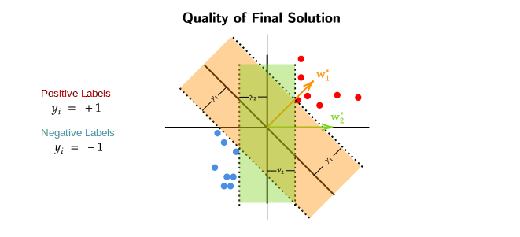

# Support Vector Machine
## Perceptrons and Margin
We know that in the Perceptron Algorithm the number of mistakes is given by,
$\text{#mistakes} \leq \frac{R^2}{\gamma^2}$ , we also said that data is linearly 
separable with margin $\gamma$ , which means that there exists some $w^*$ such that 
$w^{*^T} x_i \geq \gamma \quad \forall i , \gamma>0$ 

??? question 
    If we were given a dataset like in the above image , which of the 2 $w^*$ would be 
    a better choice?

- We can see that $w_1^*$ has a greater margin $\gamma_1$ when compared to $w_2^*$ which 
has a smaller margin $\gamma_2$.

- If we want to decrease the number if mistakes our algorithm makes, we can increase 
the value of $\gamma$ because $\text{#mistakes} \leq \frac{R^2}{\gamma^2}$ , in other
words number of mistakes is inversely proportional to $\gamma^2$.**The greater the $\gamma$
the lower will be the number of mistakes.**

- Therefore , the better of the 2 $w^*$ here is $w_1^*$.

## Maximum Margin: Formulation
Now that we know that $w^*$ which have larger $\gamma$ margin are better than other
$w^*$ , our goal now is to come up with a formulation that maximizes $\gamma$ margin.

$$\label{max-margin-formulation} \tag{1}
\underset{w,\gamma}{\max} \quad \gamma \quad
\text{such that } (w^T x_i)y_i \geq \gamma \;\; \forall i$$

> We want to maximize $\gamma$ over $w$ , but we arent choosing any random $w$ ,
the $w$ should satisfy the condition of $(w^T x_i)y_i \geq \gamma$.

!!! failure "Problem With Above Formulation"
    Lets say for some $w$ the $\gamma$ margin is , $\{ x:w^T x = 5 \}$ , it can 
    be argued that there exists another $w$ such that $(2 w)^T x = 2 \times 5 = 10$.
    So for this $w$ , there exist infinitely many "scaled versions".

To solve the above stated problem , we will "ground" the value of $w$ such that 
$||w||^2 = 1$. Therefore our new formulation will be,

$$\begin{split}
\underset{w , \gamma}{\max} \gamma \\ 
\\
\text{such that } \\
(w^T x_i)y_i \geq \gamma \quad \forall i \\
\text{and } ||w||^2 = 1
\end{split}$$

### Simplified Formulation
The above maximization can be reformulated into an expression with just 
one variable ($w$). 

$$\label{abcd} \tag{1} \begin{split}
\underset{w}{\max} \;\; \text{width}(w) \\ 
\\
\text{such that} \\
(w^T x_i)y_i \geq 1 \quad \forall i \\
\end{split}$$

> The equation here basically means that , we are allowing any $w$ which linearly 
separates our dataset with $\gamma$ margin and the norm square 
of that $w$ must be 1 and instead of 
maximizing $\gamma$, we are maximizing the width. The width here is 
the distance between to parallel lines of $\gamma$ margins.

!!! question "What is width(w)?"
    For some $w$ which classifies a dataset , $x_1$ and $x_2$ be the points lying on 
    the $\gamma$ margins. The distance between these points (width(w)) can be given by,

    $$\begin{equation*}
    \begin{split}
    x_1 ^T w - x_2 ^T w &= 2 \\
    (x_1 - x_2)^T w &= 2 \\ 
    ||x_1 - x_2||_2 \; ||w||_2 \; \cos(\theta) &= 2 \quad \quad (\theta =  0°) \\ 
    \therefore || x_1 - x_2 ||_2 &= \frac{2}{||w||_2}
    \end{split}
    \end{equation*}$$

    

#### Re-Simplified Formulation
Now that we know what width(w) is , we can reformulate our maximization equation as ,

$$\begin{split}
\underset{w}{\max} \;\; \frac{2}{||w||^2} \\
\\
\text{such that} \\
(w^T x_i)y_i \geq 1 \quad \forall i \\
\end{split}$$

Equivalently , the above experession can be turned into a minimization equation,

$$\begin{split}
\boxed{\underset{w}{\min} \;\; \frac{1}{2} ||w||^2} \\
\\
\text{such that} \\
(w^T x_i)y_i \geq 1 \quad \forall i \\
\end{split}$$

## Constrained Optimization
Our goal now is to formulate a "dual problem" for the above minimization ("primal")
problem.

But for now we will look at,

$$\begin{split}
\underset{w}{\min} f(w) \\ 
\\
\text{such that } \\
g(w) \leq 0 \\
\end{split}$$

To solve for the above minimization problem we will form a lagrangian function,

$$ \mathcal{L}(w , \alpha) = f(w) + \alpha g(w) $$

For a fixed value of $w$ , consider , 

$$ \underset{\alpha \geq 0}{\max} \mathcal{L}(w , \alpha) = \underset{\alpha \geq 0}{\max} f(w) + \alpha g(w) $$

### Case 1 
- Now that we have fixed a value of $w$ , lets assume that $g(w) > 0$.
- If $g(w) > 0$ and $f(w) \in \{-\infty , \infty \}$ , to maximize the above function,
we can keep increasing the value $\alpha$. When the value of alpha is increased , the 
value of $g(w)$ will also increase.
- Hence , when $g(w) > 0$ the solution if $\infty$

!!! example "Example1 f(w) > 0"
    - Lets say $f(w) = 10$ and $g(w) = 20$ , if the value of $\alpha$ is increased,
    the value of overall function will also increase. We can keep on increasing the 
    value of $\alpha$ and the value of overall function will keep on increasing.
    - Hence , we say that the solution in this subcase is $\infty$

!!! example "Example2 f(w) < 0"
    - Lets say $f(w) = -100$ and $g(w) = 20$ , if the value of $\alpha$ is increased,
    just like above , the value of overall function will also increase. 
        - When $\alpha = 5$ ,the function will evalute to zero.
        - When $\alpha = 100$ , the function will evalute to 1900.
    - Hence , we can say that the solution in this subcase also is $\infty$

### Case 2
- In Case 2 we will assume that $g(w) \leq 0$.
- If $g(w) < 0$ and $f(w) \in \{-\infty , \infty \}$ , the only way to maximize the above 
function is to put $\alpha = 0$. When $\alpha =0$ , $g(w)$ will also become zero.
- Hence , when $g(w) < 0$ the solution is always $f(w)$.

!!! example "Example1 f(w)>0"
    - Lets say $f(w) = 10$ and $g(w) = -20$ , no matter what value (except 0) of $\alpha$ we use here
    the overall function value will always decrease. The only way to maintain the value of the overall
    function is to put $\alpha = 0$.
    - Hence, we say that the solution in this subcase is always $f(w)$.

!!! example "Example2 f(w)<0"
    - Lets say $f(w) = -10$ and $g(w) = -20$ , no matter what value (except 0) of $\alpha$ we use here
    the overall value of the function (just like above) will decrease.
        - When $\alpha = 5$ the function will evaluate to -110.
        - When $\alpha = 100$ the function will evaluate to -2010.
        - It can be seen that if the value of $\alpha$ is increased , the overall value of the 
        function decreases.
    - Hence , we can say that the solution in this subcase is always $f(w)$.
    
**Therefore the solutions for the above lagrangian maximization are,**

$$ \underset{\alpha \geq 0}{\max} \mathcal{L}(w , \alpha) = 
\begin{cases} \infty & g(w)>0 \\ 
f(w) & g(w) \leq 0 \\
\end{cases}$$

### Langrangian Function Maximization

  
Inside the shaded region , the function evaluates to $f(w)$ , while outside the 
shaded region the function evaluates to $\infty$.

From the above diagram we can see that for multiple values of $w$ the function evalutes
to $f(w)$. We want to find the minimum $w$ at which the function evaluates to $f(w)$,

$$\underset{w}{\min} \left[ \underset{\alpha \geq 0}{\max} f(w) + g(w)  \right] $$

!!! note 
    Note that this expression is same as the [original](#constrained-optimization) 
    minimization problem we started with,

    $$\begin{split}
    \underset{w}{\min} f(w) \\ 
    \\
    \text{such that } \\
    g(w) \leq 0 \\
    \end{split}$$

To gain more insight over our newly derived min-max problem we will try to turn it into
a max-min problem.

The max-min expression will be,

$$\underset{\alpha \geq 0}{\max} \left[ \underset{w}{\min} f(w) + g(w)  \right] $$

**Note** that we can turn it into a max-min problem because both $f$ and $g$ are 
convex functions.

### Multiple Constraints
If there are problems which require multiple constraints , they can be formulated 
as,

$$\begin{split}
\underset{w}{\min} f(w) \\ 
\\
\text{such that } \\
g_i(w) \leq 0 \;\; \forall i \\
\end{split}$$

Equivalently this can also be written as,

$$\underset{w}{\min} \left[ \underset{\underset{\geq 0}{\alpha_1} , \underset{\geq 0}{\alpha_2} , ... \underset{\geq 0}{\alpha_k}}{\max} f(w) + \alpha_1 g_1(w) + \alpha_2 g_2(w) \cdots + \alpha_k g_k(w)  \right] $$

**Note** that $i$ here represents the number constraints and there are total $k$ constrains.

## Formulating the Dual Problem
- We started off with <a href="#mjx-eqn%3Amax-margin-formulation">maximizing </a> $\gamma$ so that the number of mistakes made by our algoritm
are less/reduced. 
- We then turned it into a [expression](#simplified-formulation) with only one variable $w$
- After that , we [resimplified](#re-simplified-formulation) the 
maximization expression for $||w||$ instead of width(w).
- Then we took a detour and solved for a [constrained opitmization problem](#constrained-optimization).
- We then modified the constrained optimization problem and ended with
 [lagrangian maximization](#langrangian-function-maximization) expression.

> But where does this all lead to?

This leads us to getting back to the [re-simplified problem](#re-simplified-formulation) and 
change it in such a way that it matches with the [constrained optimization](#constrained-optimization)
problem.

Our Re-Simplified Expression was,

$$\begin{split}
\underset{w}{\min} \;\; \frac{1}{2} ||w||^2 \\
\\
\text{such that} \\
(w^T x_i)y_i \geq 1 \quad \forall i \\
\end{split}$$

To treat this expression as a constrained optimization problem that we did above ,
we have to convert this to standard form. Here the constraint is $(w^T x_i)y_i \geq 1$ but in our
constrained optimization problem the constraint was $g(w) \leq 0$.

### Standardized Form 
The standard form will be,

$$\label{efgh} \tag{2} \begin{split}
\underset{w}{\min} \;\; \frac{1}{2} ||w||^2 \\
\\
\text{such that} \\
1 - (w^T x_i)y_i \leq 0 \quad \forall i \\
\end{split}$$

Now the langrangian function for this standardized form will be,

$$\mathcal{L}(w , \alpha) = \frac{1}{2} ||w||^2 + \sum_{i=1}^{n} \alpha_i (1 - (w^T x_i)y_i)$$

We know that a langrangian function can be written as an 
[min-max](#langrangian-function-maximization) expression,

$$\underset{w}{\min} \underset{\alpha \geq 0}{\max} \left[
\frac{1}{2} ||w||^2 + \sum_{i=1}^n \alpha_i \left( 1 - (w^T x_i)y_i  \right)
\right]$$

Similarly , this can also be written as max-min problem,

$$\underset{\alpha \geq 0}{\max} \underset{w}{\min} \left[
\frac{1}{2} ||w||^2 + \sum_{i=1}^n \alpha_i \left( 1 - (w^T x_i)y_i  \right)
\right]$$

**Note** that $\alpha \geq 0$ means that $\alpha$ is a column matrix with 
all the $\alpha_i$ to be $\geq 0$.

We will now work with this max-min problem to further deepen our understanding 
about our original $||w||$ maximization problem. 

### Solution for Langrangian Max-Min Problem
For some $\alpha \geq 0$,the inner minimization problem becomes an unconstrained
optimization problem. We will try to find its solution using gradients,

$$\underset{w}{\min} \quad \frac{1}{2} ||w||^2 + \sum_{i=1}^{n} \alpha_i (1 - (w^T x_i)y_i )$$

The gradient of above expression is ,

$$\begin{split}
w^*_{\alpha} + \sum_{i=1}^n \alpha_i (-x_i y_i) = 0 \\
w^*_{\alpha} = \sum_{i=1}^n \alpha_i ( x_i y_i) \\
\end{split}$$

From this we can conclude that for a fixed value of $\alpha$ our best $w$ would be 
a linear combination of $x_i,y_i,\alpha_i$

If we substitute this value of $w^*_\alpha$ we can find the minimizer of the min-max 
expression above. On simplification after substitution,

$$ \alpha^T I - \frac{1}{2} (XY \alpha)^T (XY \alpha) $$

**Note** that here $w^*_\alpha$ here is in matrix notation form ($w^*_\alpha = XY \alpha$).

Therefore the "dual" problem to the "primal" problem will be,

$$\underset{w \geq 0}{\max} \alpha^T I - \frac{1}{2} \alpha^T Y^T X^TX Y \alpha $$

> So what have we gained after finally arriving at this dual problem?

- Dual Variable is in $\mathbb{R}^n$ dimension , while the primal problem is in 
$\mathbb{R}^d$ space.
    - If $d >> n$ , its better to solve the dual problem.
- The objective in dual problem depends on $X^TX$ , **which can be kernalized.**

## Recap Flowchart

## Support Vector Machine
Now that we know that $w^*_\alpha$ depends on $\alpha_i$ , where importance of a 
datapoint is given by $\alpha_i$ , we want to find out the points where $\alpha_i > 0$.

> We will take a small detour and get back to this question.

$$\begin{equation*}
\begin{split}
\underset{\mathbf{w^*} \text{ is the primal solution}}{\overset{\textbf{Primal}}
{\underset{w}{\min} \left[ \underset{\alpha \geq 0}{\max} f(w) + \alpha g(w)  \right]}} &=
\
\underset{\pmb{\alpha^*} \text{ is the dual solution}}{\overset{\textbf{Dual}}
{ \underset{\alpha \geq 0}{\max} \left[ \underset{w}{\min}  f(w) + \alpha g(w)  \right]}} \\
\end{split}
\end{equation*}$$

Now we will input the solutions of the dual and primal problems back into their 
equations,

$$ \underset{\alpha \geq 0}{\max} f(w^*) + \alpha g(w^*) \quad \quad \quad \quad 
\underset{w}{\min} f(w) + \alpha^* g(w) $$

The function on the left (primal problem) will evaluate to $f(w^*)$

$$$$

$$\begin{equation*}
\begin{split}
f(w^*) = \underset{w}{\min} f(w) + \alpha^* g(w) &\leq f(w^*) + \alpha^* g(w^*) \\
f(w^*) &\leq f(w^*) + \alpha^* g(w^*) \\
\alpha^* g(w^*) &\geq 0 \\
\end{split}
\end{equation*}$$

But we already know  $\alpha^* \geq 0$ and $g(w^*) \leq 0$. 
The only point where both our equations are true is,

### Complementary Slackness
$$\alpha^* g(w^*) = 0$$

Similarly , for multiple constraints

$$\alpha_i^* g_i(w^*) = 0 \quad \forall i$$

Also , $g(w^*) = 1 - (w^T x_i)y_i$ , this means the above equation 
can also be written as,
$$ \alpha_i ( 1 - (w^T x_i)y_i) = 0 \quad \forall i $$

Now, according to Complementary Slackness , if $\alpha_i > 0$ , then
$1 - (w^T x_i)y_i = 0$,

$$ \boxed{(w^T x_i)y_i = 1} $$

From the above equation we can **conclude** that,
points which have $\alpha_i > 0$ lie on some line denoted by $(w^T x_i)y_i = 1$.
This means that the points which contribute to the best $w^*$ only lie on the 
$(w^T x_i)y_i = 1$ line. Rest of the datapoints which dont lie on this line do
not matter for formulation of $w^*$.

- Only the points that are on the "Supporting" hyperplane ($(w^T x_i)y_i = 1$)
contribute to $w^*$.
- These special points are called supoort vectors.
- Hence , this algorithm is called "Support Vector Machine (SVM)".
- $w^*$ is a sparse linear combination of the datapoints.

### Kernalization of SVM 
Given a point $x_\text{test}$ the prediction for that point is ,

$$\begin{equation*}
\begin{split}
(w^*)^T x_\text{test} &= \left( \sum_{i=1}^n \alpha_i \; x_i y_i  \right)^T x_\text{test} \\
&= \sum_{i=1}^n \alpha_i \; y_i (x_i^T x_\text{test}) \\
(w^*)^T \phi(x_\text{test}) &= \sum_{i=1}^n \alpha_i \; y_i K(x_i , x_\text{test})
\end{split}
\end{equation*}$$
