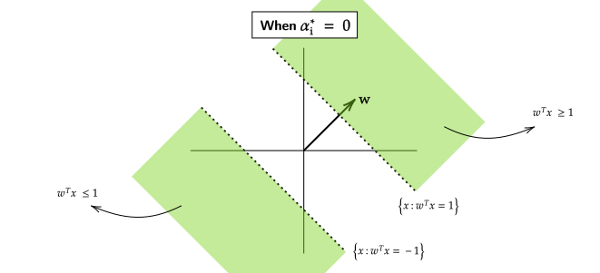
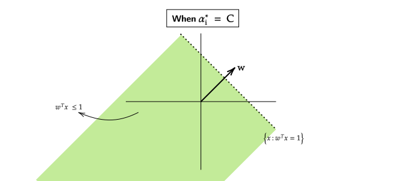
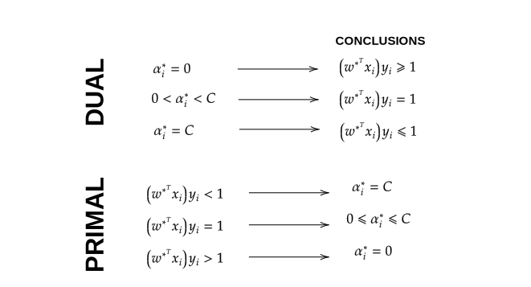
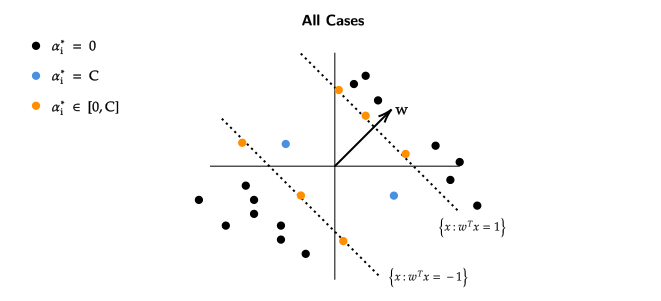
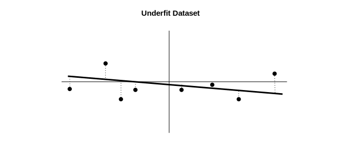

## Dual Formation for Soft Margin SVM
We know that SVM works well on a linearly separable dataset, but our
goal was to accommodate outliers/noise in the dataset and hence we
created a new formulation from SVM called "Soft Margin SVM" , given
by the formula,

$$\begin{split} 
\underset{w \in \mathbb{R}^d}{\min} \frac{1}{2}||w||^2 + C \sum_{i=1}^n \xi_i  \\
\text{such that } (w^T x_i)y_i + \xi_i \geq 1 \;\; \forall i \\
\xi_i \geq 0 \;\; \forall i \\
\end{split}$$

We want to kernalize this equation so that it is able to 
perform even on "non-linear" datasets.

!!! example 
    

    This example depicts how we want our "Kernalized Soft Margin SVM" to be.

    - It should be able to work on a non-linearly separable dataset.
    - It should also be able to identify "non-linear" structures within 
    the dataset.

The first step towards our goal would be to form a "Dual Problem" for the 
"Soft Margin SVM" equation.

To formulate the "Dual Problem" we will first make a langrangian function,

$$ \mathcal{L}(w, \xi , \alpha , \beta) = 
\frac{1}{2}||w||^2 + C \sum_{i=1}^{n}\xi_i + \sum_{i=1}^n \alpha_i(1 - w^T x_i y_i - \xi_i) 
+ \sum_{i=1}^n \beta_i (- \xi_i)$$

!!! note
    - $\alpha$ corresponds to the first constraint ($(w^T x_i)y_i + \xi_i \geq 1$).
    - $\beta$ corresponds to the second constraint ($\xi_i \geq 0$).
    - The constraints are written in standard form , in the above equations.

Therefore , the "Dual Problem" will be,

$$ \underset{w , \xi}{\min} \left[ 
\underset{\substack{\alpha \geq 0 \\ \beta \geq 0}}{\max} \frac{1}{2} 
||w||^2 + C \sum_{i=1}^n \xi_i + \sum_{i=1}^n \alpha_i (1 - (w^T x_i)y_i - \xi_i)) + \sum_{i=1}^n \beta_i (- \xi_i)
\right] $$

For a fixed value $\alpha$ and $\beta$,

The derivative of "Dual Problem" with respect to $w$ will be,

$$ w^*_{\alpha , \beta} = \sum_{i=1}^n \alpha_i x_i y_i \label{w-star} \tag{1} $$

The derivative of "Dual Problem" with respect to $\xi$ will be,

$$\begin{equation*}
\tag{2}
\begin{split}
C + \alpha_i(-1) + \beta_i(-1) &= 0 \\
\alpha_i + \beta_i &= C \\
\end{split}
\end{equation*}$$

From Equation **1** and Equation **2** , Our new dual problem will be,

$$\boxed{\underset{\substack{\alpha \geq 0 \\ \beta \geq 0 \\ \alpha + \beta = C}}{\max} 
\alpha^T I - \alpha^T Y^T X^TX Y \alpha}$$

**Note** that this is same as the dual problem we had in "SVM/Hard SVM".

$\alpha \geq 0$ and $\alpha + \beta = C$ , which means $\beta$ is restricting 
the range of $\alpha$, in other words , $\alpha$ can be at most $C$.

We can equivalently say that,

$$\boxed{\underset{0 \leq \alpha \leq C}{\max} 
\alpha^T I - \alpha^T Y^T X^TX Y \alpha}$$

### Cases of Different Value of $C$
!!! abstract "When $C = 0$"
    If $C = 0$ , this means that $\alpha = 0$ , also from Equation $\eqref{w-star}$,
    $w^*_{\alpha , \beta} = 0$.

!!! abstract "When $C = \infty$"
    If $C = \infty$ , that means there is no upper bound on $\alpha$ and 
    the above "Dual Problem" becomes exactly the same as Hard-Margin SVM.

## Complementary Slackness Conditions for Soft-Margin SVM
- Let ($w^* , \xi^*$) be the "Primal" optimal solutions.
- Let ($\alpha^* , \beta^*$) be the "Dual" optimal solutions.

### Complementary Slackness Conditions 
At optimality , 

$$\forall i \quad \alpha_i^* (1 - (w^{*^T} x_i)y_i - \xi_i^*) = 0 \label{CS1} \tag{1}$$

$$\forall i \quad \beta_i^* (- \xi_i^*) = 0 \label{CS2} \tag{2}$$

#### Cases for Complementary Slackness 
!!! abstract "When $\alpha_i^* = 0$"
    - $\implies \beta_i^* = C$ as $\alpha_i^* + \beta_i^* = C$.
    - $\implies \xi_i^* = 0$ as $\beta_i^* = C$ (From $\eqref{CS2}$)
    - We know that , $w^{*^T} x_i y_i + \xi_i^* \geq 1$
        - $\implies w^{*^T} x_i y_i \geq 1$ as $\xi_i = 0$
        - $w^*$ classifies $(x_i ,y_i)$ correctly.
        

!!! abstract "When $\alpha*_i \in (0,C)$"
    - $\implies \beta_i^* \in (0,C)$
    - $\implies \xi_i^* = 0$ (From $\eqref{CS2}$)
    - $\implies 1 - (w^{*^T}x_i)y_i - \xi_i = 0$ (From $\eqref{CS1}$)
        - $\implies 1 - (w^{*^T}x_i)y_i  = 0$ as $\xi_i^* = 0$
        - $\implies  (w^{*^T}x_i)y_i  = 1$
        

!!! abstract "When $\alpha^*_i = C$"
    - $\implies \beta_i^* = 0$ as $\alpha_i^* + \beta_i^* = C$
        - $\xi_i^* \geq 0$ as $\beta_i^* = 0$

    - $1 - (w^{*^T}x_i)y_i + \xi_i = 0$ (From $\eqref{CS1}$)
        - $\implies \xi_i^* = 1 - (w^{*^T}x_i)y_i$
        - $\implies 0 \leq 1 - (w^{*^T}x_i)y_i$ as $\xi_i^* \geq 0$
        - $\implies (w^{*^T}x_i)y_i \leq 1$
            
        - $w^*$ will either classify the points incorrectly or
        - $w^*$ will correctly classify the points but not with enough margin.

## Summary for Soft-Margin SVM
Lets see things from the "Primal" point of view,

!!! abstract "$(w^{*^T}x_i)y_i < 1$"
    - We know that, $(w^{*^T}x_i)y_i + \xi_i^* \geq 1$
    - $\implies \xi_i^* \geq 1 - (w^{*^T}x_i)y_i$
    - $\beta_i^* = 0$ as $\xi_i^* > 0$ (From $\eqref{CS2}$)
        - $\alpha_i^* = C$

!!! abstract "$(w^{*^T}x_i)y_i = 1$"
    - We know that , $(w^{*^T}x_i)y_i + \xi_i^* \geq 1$
    - $\implies \xi_i^* \geq 1 - (w^{*^T}x_i)y_i$
    - $\implies \xi_i^* \geq 0$ as  $(w^{*^T}x_i)y_i = 1$
        - $\alpha_i^* \in [0,C]$

!!! abstract "$(w^{*^T}x_i)y_i > 1$"
    - $\implies \underbrace{1 - (w^{*^T}x_i)y_i}_{<0} - \underbrace{\xi_i^*}_{\leq 0} < 0$
        - $\implies \alpha_i^* = 0$ (From $\eqref{CS1}$)
    - Points which are strictly greater than 1 , do not constribute to $w^*$.

### Summary

- Black Points have either $\gamma$(margin) greater than 1 or less than 1.
    - These points do not constribute to $w^*$
- Blue Points are classified correctly but not with enough margin.
- From Orange Points there is nothing much to conclude except the fact 
that they will lie on the hyperplane.

The only points which contribute to our $w^*$ are either on the supporting
hyperplane (Orange Points) or they are on the wrong side of supporting 
hyperplane (Blue Points).

Our assumption is that these (Blue and Orange) points will be much lesser than
the other (Black) points. Hence, we will get a sparse solution.    

## Overfitting and Underfitting
We will take a look at meta/ensemble classifiers. These type of classifying 
techniques help in transforming "Weak Learners" into "Strong Learners".
By "Weak Learners" we mean , algorithms which are better than random 
performance but dont have high accuracy.

To broaden our understanding about "Weak Learners" we will first 
take a look at Overfitting and Underfitting,

!!! note
    The relationship between input and output is assumed to be 
    some structure + noise.

    $$ \text{Input} = \underbrace{\text{Structure + Noise}}_{\text{Output}} $$

    Error is given by,

    $$\text{Error} = \text{Bias} + \text{Variance}$$

    !!! example
        

### Overfitting 
Overfitting happens when our algorithm "fits noise" as a part of 
the structure.

Overfit models change a lot when theres a change in variance of the 
dataset.These models suffer from high Variance.

!!! example 
    In the case of a Decision Tree , we can keep increasing the depth
    of the Decision Tree to an arbitrary amount to get the least 
    possible error on the training dataset. The problem with this 
    training method is that it may produce great results on the training
    dataset but its accuracy will reduce significantly when on testing
    dataset.

    <figure markdown>
    
    <figcaption>
    In the Overfit Dataset , the training error is zero. Even though the actual
    structure is sinusoidal the overfit dataset "fits noise" thinking that the
    noise is part of the structure.
    </figcaption>

### Underfitting 
Underfitting is the opposite of Overfitting. It happens when our 
algorithm assumes some part of the structure to be noise.

Underfit models dont change much even if the variance of the dataset
increases a lot. These type of models suffer from high Bias.

!!! example
    <figure markdown>
    
    <figcaption>
    In the Underfit Dataset , even though the Actual Dataset is sinusoidal , 
    the structure is assumed to be a linear structure. Our algorithm thinks
    that some of the input is noise not structure.
    </figcaption>

## Bagging (Boostrap Aggregation)
Lets say some points $\{x_1 , x_2 , \cdots x_n  \} \in \mathcal{N}(\mu , 1)$ with
some mean $\mu$ and variance 1.

The estimator of unknown mean $\mu$ can be,

$$\begin{equation*}\begin{split}
\hat{\mu_1} &= x_1 \\  
\hat{\mu_2} &= x_2 \\  
& \vdots \\
\hat{\mu_n} &= x_n \\  
\end{split}\end{equation*}$$ 

Though the best way to estimate $\mu$ would be to use maximum 
likelihood estimator , $\hat{\mu_\text{ML}} = \frac{1}{n} \sum_{i=1}^n x_i$

> But why is the Maximum Likelihood the best estimator? 

When take an average over a huge dataset for mean $\mu$ the , **averaging,
reduces the variance/fluctuation** of the mean $\mu$.

We can use this technique of averaging to counter the "High Variance Issue"
in Overfitted Datasets.

### Bagging
Lets say there are $D_1 , D_2 , \cdots , D_m$ datasets , each with $n$ 
datapoints.

We will now make "Overfit" Decision Trees for each of these datasets.

>Yes , we are specifically making overfit decision trees.

- Where each Decision Tree is represented as $DT_1 , DT_2 , \cdots , DT_m$.
- Each Decision Tree outputs a Classifier $h$ , which is represented as, 
$h_1 , h_2 , \cdots , h_m$. Moreover , each $h_i:\mathbb{R} \to [0,1]$
- Our assumption is that each classifier ($h_i$) is trained independently.
- As we are making the Decision Trees "Overfit" on the training dataset,
these models will suffer from high variance.

To reduce their variance , we can average the $h_i$ classifiers such that,

$$\begin{split}
h^*(x) = \text{sign} \left(\frac{1}{m} \sum_{i=1}^n h_i(x) \right) \\
\text{where,} \\ 
h(z) = \begin{cases} +1 & \text{if } z \geq 0 \\
0 & \text{otherwise} \end{cases}
\end{split}$$

This aggregate classifier ($h^*(x)$) will have lower variance than the 
original classifiers.

> The problem with this approach is that , we only get a single dataset
not $m$ different datasets.

In general , we only get a single dataset , where $D = \{(x_1,y_1) , (x_2,y_2) , \cdots (x_n,y_n)\}$
and $x_i \in \mathbb{R}^d$ and $y \in [0,1]$. To apply this method of 
averaging (shown above) , our input needs to be $m$ different datasets.

> A simple approach to divide the single dataset into $m$ different 
datasets would be to just make $m$ datasets each having $n/m$ , 
datapoints , where $n$ is equal to total number of datapoints in the 
single dataset.

>The issue with this type of approach is that , each of these $m$ datasets
will not have full "information" about the overall dataset.

To divide the dataset into $m$ different datasets , we will make it so 
that each dataset ($D_i$) has repeated points in them. **This procedure 
of creating different datasets with repeated points in called Bootstrapping.**

We will create $m$ different "Bags" and draw datapoints at random **with replacement**
from the original (single) dataset. Each "Bag" will have the same number of datapoints
as in the original (single) dataset.

This makes it so that some "Bags" have may have datapoints common and even have 
repeated datapoints within them.

At the end when we have $m$ "Bags" , we can run an algorithm (Example :  Decision Tree) 
over the "Bags" and reduce their variance by the "Bagging (Bootstrap Aggregation) Method".

### Probability of Repetition of Points 
Now that we know that , datapoints are repeated inside the Bags , 
we want to get a general Probability for the amount of repetition that happens.

- A point appears with the chance of $1 / n$ in a bag.
- Probability that it does not appear in the bag is $(1 - (\frac{1}{n}))^n$
- Probability that it actually appears in the bag $1 - (1 - (\frac{1}{n}))^n$
    - **For large enough $n$ , this probability approximates to around 67%.**

**Overfit datasets have low Bias and high Variance , but after applying the 
"Bagging Method" the Variance also reduces (in most cases).**

## Boosting (Adaptive Boosting)
The Adaptive Boosting Algorithm can be used to convert "Weak Learners"
into "Strong Learners" , underfit models are one such example,
as they suffer from High Bias and Low Variance.

The input for Adaptive Boosting is our usual $D = \{(x_1 , y_1) , (x_2 , y_2) \cdots , (x_2 , y_2) \}$
where $x_i \in \mathbb{R}^d$ and $y_i \in [0,1]$.

1. The first step is to initialize the weights for Boosting.
    - $D_0(i) = \frac{1}{n}$ , $D_0$ represents the weights at 
    initilization (iteration 0).

2. We will now create a "Bag" and sample points with replacement
from $D_t$. Then we will input our dataset and distribution/weights ($S,D_t$)
into a weak learner to get $h_t$.
    - If the weak learner/algorithm is not able to handle both the 
    dataset and its distribution/weights then we create a "Bag"
    and use the distribution/weights as probabilities for sampling
    points with replacement.
    - $h_t$ is the classifier , $h_t : \mathbb{R}^d \to [0,1]$

> After performing step 1, we get the weights for a dataset $S$.

> Lets say at the end of step 2 , we get a decision tree ($h_t$)
which classifies 600 points correctly and 400 points incorrectly.
We can change the weights such that , those  400 incorrectly classified 
datapoints they are classified correctly in the next round ,
but how? , what changes should we make?

3. The third step would be to increase or decrease the weights 
of the points for the next iteration.

$$ \hat{D_{t+1}}(i) = \begin{cases} 
D_t(i) \cdot e^{\alpha_t} & \text{if } h_t(x_i) \neq y_i \\
D_t(i) \cdot e^{-\alpha_t} & \text{if } h_t(x_i) = y_i \\
\end{cases} $$

- We are going to decrease the weights of the points which are
classified correctly and
- Increase the weights of the points classified incorrectly.

!!! failure 
    The problem with current formulation of distribution/weights
    is that, when we increase or decrease the weights , they no
    longer sum upto 1.

- At the end we will normalize the weights,

$$ D_{t+1}(i) = \frac{\hat{D_{t+1}(i)}}{\sum_{i=1}^n \hat{D_{t+1}}(j)} $$

4. Repeat step3 unless training error is zero.

At the end of all these steps we are left with $t$ classifiers 
$(h_1 , h_2 , \cdots h_t)$ for $t$ iterations.
To combine these classifiers somehow into one single 
classifier,

$$ h^*(x) = \text{sign}\left(\sum_{i=1}^n \alpha_t h_t(x) \right) $$

!!! note 
    $$ \alpha_t = \ln \sqrt{\frac{1 - \text{err}(h_t)}{\text{err}(h_t)}} $$

Also, one can prove that 

$$ \text{If } T \geq \frac{1}{2 \gamma^2} \ln(2n) $$

then , Training error becomes 0. Here $T$ is total number of iterations and 
$\gamma$ is the value which determines "By how much is the weak 
learner better than random classifier".

> If the random classifier has the accuracy of 55% and Weak Learner 
has accuracy of 60% then $\gamma = 60\% - 55\% = 5\% = 0.05$

111
