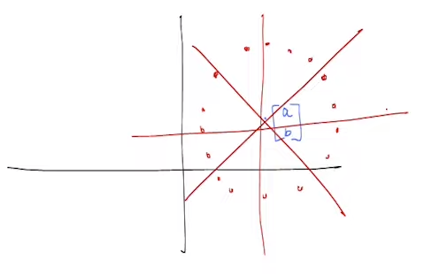

# Kernel PCA

## Issues with PCA
In the previous week we learned about using PCA to reduce 
the number of features required to represent the dataset 
without much loss.

There are 2 main issues/concerns with PCA

- **Time Complexity** : Finding the eigenvector and eigenvalues of 
matrix $C \in \mathbb{R}^(d \times d)$ typically takes $O(d^3)$ time.
This becomes an issue when the number of features is much higher than number
of points.

- **PCA works only linearly** : For a dataset with 3 features , if the 
features are not related linearly then using PCA does not give good 
results.

## Solving Time Complexity Issue
The time complexity issue occurs when the number of features is 
much much greater than the number of points in the dataset , i.e. 
$d >> n$.

According to our algorithm the solution for maximizing the variance 
of the dataset was to find the eigenvector corresponding to the max 
eigenvalue of $C$ , where $C = \frac{1}{n}\sum_{i=1}^{n}x_ix_i^T$

if $X \in \mathbb{R}^{d \times n}$ is the matrix which represents 
all the points in the dataset , $C$ can also be written as $C = \frac{1}{n}XX^T$

> This was just recalling and putting in the context to what is 
about to happen now 

Let $w_k$ be the eigenvector corresponding to the $k^{th}$ largest eigenvalue 
of $C$ ($\lambda_k$).

$$\begin{equation*} 
\begin{split}
C w_k &= \lambda_k w_k \\
\left(\frac{1}{n} \sum_{i=1}^{n} x_ix_i^T \right) w_k &= \lambda_k w_k \\
w_k &= \frac{1}{n \lambda_k} \sum_{i=1}^{n} (x_i^Tw_k)x_i \\
w_k &= \sum_{i=1}^{n} \left( \frac{x_i^Tw_k }{n \lambda_k} \right)x_i \\
\end{split}
\end{equation*}$$

From this equation we can obeserve that $w_k$ is a linear combination of datapoints,
assuming $\lambda_k \neq 0$.

$$\implies w_k = X\alpha_k$$ 

for some $\alpha_k \in \mathbb{R}^n$

> Now we need to find $\alpha_k$ to get $w_k$ , strange ik :C

We know,

$$\begin{equation*}
\begin{split}
w_k &= X \alpha_k \;\;\;\;\;\;\;\;\; \forall k \\
\\
Cw_k &= \lambda_k w_k \\
\left( \frac{1}{n} XX^T \right)(X \alpha_k) &= \lambda_k X \alpha_k \\
\\
\text{Premultiplying by} X^T \\
\\
X^T((XX^T) X \alpha_k) &= X^T(n \lambda_k X \alpha_k) \\
(X^TX)(X^TX)\alpha_k &= n \lambda_k (X^TX) \alpha_k \\
\\
\text{Let} X^TX = K \\ 
\\
K^2 \alpha_k &= n \lambda_k K \alpha_k \\ 
\boxed{K \alpha_k = (n \lambda_k) \alpha_k} \\
\end{split}
\end{equation*}$$

> It is observed that for any $\alpha_k$ lets say $u$ which satisfies 
this equation , there exists a scaled version $u$ (Example $4u$) which 
also satisfies this equation.

> To prevent the possibilities of scaled values of $alpha_k$ , we will 
narrow down the possible values using the idea that length of $w_k$ is 1 i.e.
$||w_k|| = 1$.

We know,

$$\begin{equation*}
\begin{split}
w_k &= X \alpha_k \\ 
w_k^Tw_k &= (X\alpha_k)^T(X\alpha_k) = \alpha_k^T (X^TX) \alpha_k \\
&\boxed{1 = \alpha_k^T K \alpha_k} \\
\end{split}
\end{equation*}$$

Now we have 2 equations , which $\alpha_k$ must satisfy.

> Up until now , we wanted the eigenvectors of $XX^T$ which is $d \times d$ 
matrix , but now we are saying we can solve the eigenequation of $K$ , where
$K = X^TX$ which is a $n \times n$ matrix.

> But now the issue is , to get the value of $K$ in the 
equation 

> $$K \alpha_k = (n \lambda_k) \alpha_k$$

> the value of $\lambda_k$ is required  , which we can only get when we 
solve for $XX^T$ matrix. Back to square one 😭.

Now to find $\lambda_k$ we will find a relation between eigenvalues of 
$XX^T$ and $X^TX$.

!!! success ""
    **Linear Algebra Fact** :The non zero eigenvalues of $XX^T$ and $X^TX$ are exactly the same.

$$\begin{equation*}
\begin{split}
\text{For } C, \\
C &= \frac{1}{n} XX^T \hspace{1cm} & \text{Eigenvectors} = \{w_1 , w_2 .... , w_n \} \hspace{1cm} & \forall k , ||w_k||^2 = 1 \\ 
&& \text{Eigenvalues} = \{ \lambda_1 \geq \lambda_2 \geq .... \geq \lambda_n \}  \\ 
\\
\\
\text{For  } XX^T,
\\
XX^T &= n \times C & \text{Eigenvectors} = \{ w_1 , w_2 .... , w_l \}  \\
&& \text{Eigenvalues} = \{ n\lambda_1 \geq n\lambda_2 \geq .... \geq n\lambda_l \}  \\ 
\\
\\
\text{For } X^TX \\
&X^TX & \text{Eigenvectors} = \{\beta_1 , \beta_2 , ..... \beta_l  \} \hspace{1cm} &  \forall k, ||\beta_k||^2 = 1 \\
&& \text{Eigenvalues} = \{ n\lambda_1 \geq n\lambda_2 \geq .... \geq n\lambda_l \}  \\ 
\end{split}
\end{equation*}$$

> Note that the eigenvalues of $XX^T$ are the same $X^TX$ from the 
linear algebra fact.

This gives us the final result as,

$$\boxed{K \beta_k = (n \lambda_k)\beta_k}$$ 

> Now we need to check if $\beta_k = \alpha_k$?

$$\begin{equation*}
\beta_k^T K \beta_k = \beta_k^T(n \lambda_k \beta_k) = n \lambda_k \beta_k^T\beta_k = \boxed{n \lambda_k}
\end{equation*}$$

Therefore,

$$\alpha_k = \frac{\beta_k}{\sqrt{n\lambda_k}} , \;\;\;\; \forall k $$

The gist of this solution is that , when  $d >> n$  we use the eigenvectors of 
$X^TX \in \mathbb{R}^{n \times n}$ instead of $XX^T \in \mathbb{R}^{d \times d}$
which reduces the computation time required to get the eigenvectors.

## Non-Linear Relationship of Datapoints 
The issue of non-linear relationship arises when the datapoints 
are related to each other in a "non-linear" way , it might be quadratic , cubic or 
even biquadratic.

Now if the points of the dataset lie in a circle , determining the "best fit line"
is pointless , almost all of the lines will be the best fit lines for this circle with
a marginal difference of "reconstruction error" between them.

The features of each in this dataset is can be represented using the equation of circle,

$$(f_1 - a)^2 + (f_2 - b)^2 = r^2$$

> We can see that this equation has quadratic terms which cannot be 
represented linearly. To solve this problem we will map it to function
with more features in order to represent it linearly.

$$\begin{equation*}
\begin{split}
\underset{\mathbb{R}^2}{[f_1 , f_2]} \xrightarrow{\phi} \overset{\phi(x)}{\underset{\mathbb{R}^6}{[1 , f_1^2 , f_2^2 , f_1 f_2 , f_1 , f_2]}} \\ 
\\
\text{Let } u \in \mathbb{R}^6  \hspace{1cm} [a^2 + b^2 - r^2 , 1 , 1, 0 , -2a , -2b] \\
\end{split}
\end{equation*}$$

The function to map $[f_1 , f_2]$ to $\mathbb{R}^6$ is called $\phi$ and $u$
is a point such that each datapoint of the original circular dataset satisfies,

$$\boxed{\phi(x)^Tw = 0}$$

