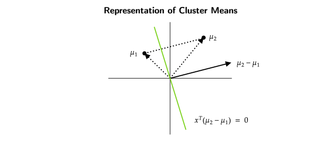
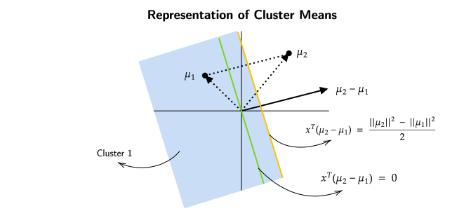
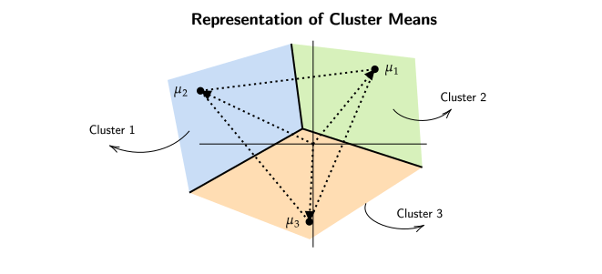

# Clustering 

## Introduction To Clustering
Clustering is a technique in unsupervised machine learning that involves 
grouping similar data points together into clusters or groups based 
on some similarity or distance measure. The goal of clustering is 
to discover hidden patterns, structures, 
or natural groupings within a dataset without 
any prior knowledge of the groups or categories.

### Problems with Clustering
> The goal of this weak is to understand the information about
datapoints which are clustered together.

If we were to cluster datapoints into $k$ different clusters 
the total number of ways $n$ datapoints can be clustered is 
$k^n$ (this includes empty clusters).

For a set of datapoints from $\{x_1 , x_2  , x_3 .... x_n \}$ 
and the cluster indicators from $\{z_1 , z_2 , z_3 , .... z_n \}$ ,
we need to develop a metric to get an idea of how good the 
clusters are.

!!! example "2 clusters for a set of 5 datapoints"
    $$\stackrel{z_1 = 1 }{X_1} , \stackrel{z_2 = 2}{X_2} , \stackrel{z_3 = 1}{X_3} , \stackrel{z_4 = 1}{X_4} , \stackrel{z_5 = 2}{X_5}$$

A common algorithm which can be used for this purpose is to 
measure the distance of the datapoints from the mean of their 
respective clusters and summing those values for each cluster 
individually , a lower value indicates that the points are closely
packed within a cluster , while a higher value indicates that the 
points are spread apart.

This algorithm can be formalized into a function as follows 

$$ F(z_1 , z_2 , z_3 , .... z_n ) = \sum_{i=1}^{n} ||x_i - u_{z_i}||_2^2 $$

where $\mu_{z_i}$ is mean of each $z_i^{th}$ cluster.

This way of clustering is considered an NP-Hard problem and 
its computationally intensive as there are total of $k^n$ possible
combinations of datapoints.

## K-Means Clustering (Lloyd's Algorithm)
To solve the above problem of clustering we will take a look 
at K-Means Algorithm.

- The first step is **Initialization** , where each cluster 
indicator is assigned a cluster between $1$ to $k$ for the 
$0^{th}$ iteration.  
$$ z_1^0 , z_2^0 , z_3^0 , .... z_n^0  \;\;\;\; \in \{1,2,3, .... k \}$$

- We then **compute the mean** of each cluster for the $t^{th}$ iteration.  
$$ \mu_k^t = \frac{\sum_{i=1}^{n}x_i \mathbb{1}(z_i^t = k)}{\sum_{i=1}^{n}\mathbb{1}(z_i^t = k)} \;\;\;\;\;\; \forall k $$

- The next step is **reassignment of the datapoints**,  
$$ Z_i^{t+1} = \underset{k}{\text{arg } \min} ||x_i  - \mu_t^k ||_2^2 $$

    This step compares every point's distance to the mean of every other cluster ,
    if the distance of the point to any cluster besides the "current cluster" is strictly
    less than the distance to the "current cluster" , then the point is assigned to the 
    cluster with least distance

- Then until convergence , loop between the second and third step until no new cluster assignments 
are made.

!!! note 
    K-Means Algorithm does not always produce the optimal solution but 
    usally produces reasonable clusters.

!!! info "Animation"
    <iframe width="800" height="400"  src="https://www.youtube.com/embed/2lZZ_FzlIJY" allowfullscreen></iframe>

    **This video was made by <a href="https://jacobbumgarner.github.io/" target="_blank">Jacob Bumgarner</a>**

> But what if the algorithm never actually converges?

> The short answer is Yes , the algorithm does converge.
But how?

## Convergence of K-Means Algorithm
**FACT 1**

Let $X_1 , X_2 , X_3 ..... X_l \in \mathbb{R}^d$  
$$ v^* = \underset{v \in \mathbb{R}^d}{\text{arg min }} \sum_{i=1}^{l} {|| x_i - v ||}^2$$

> For a bunch of datapoints we want a $v$ such that it minimizes the average of sum of 
squared distances.

Using differentitation to solve this problem  
$$ v^* = \frac{1}{l}\sum_{i=1}^{n}X_i $$

> It can be seen that the answer to our problem will be the mean of all the datapoints.
We will use the "FACT" (stated above) later in our proof of convergence of K-Means 
Algorithm.

Lets assume that we are at iteration $t$ of Lloyd's/K-Means Algorithm.  
Then our current assignment of cluster indicators would look like  
$$ Z_1^t , Z_2^t , Z_3^t .... Z_n^t \;\;\;\;\; \in \{ 1, 2, 3 .... k\}$$

Here $t$ corresponds to the iteration number and $n$ corresponds to 
the data point.  
Also , $\mu_k^t$ is the mean for cluster $k$ in the $t^{\text{th}}$ (current) iteration.

Now lets assume the algorithm does not converge and see what happens.
If it doesnt converge , then the cluster indicators would be reassigned.

$$ Z_1^{t+1} , Z_2^{t+1} , Z_3^{t+1} , ...... Z_n^{t+1} \;\;\;\;\;\;\; \in \{1,2,3....k\} $$

> After this reassignment we dont know for sure that this assignment of 
cluster indicators is better than the previous one , to solve this problem 
we will take a look at the "objective function".

$$ \begin{equation}
\sum_{i=1}^n {|| x_i - \mu_{Z_i^t}^t ||}^2 \tag{1} \label{1}
\end{equation} $$
:point_up: Here we can see that we are in the $t^{th}$ iteration in which every point in 
this experession , is being measured to the mean of the box/cluster its assigned to.

Basically , this experession captures the distances of each point to its own box/cluster 
in the $t^{\text{th}}$ iteration.

$$ \begin{equation}
\sum_{i=1}^{n} {||x_i - \mu_{Z_i^{t+1}}^t ||}^2 \tag{2} \label{2}
\end{equation} $$

:point_up: Here the distance of every point is measured to the mean of the box/cluster *it wants to switch to*.

> If the algorithm hasnt converged,  
Some points might have lesser distance to their current cluster than the *new cluster mean,
they want to switch to* , in that case $Z_i^{t+1}$ is the same as $Z_i^t$.  
While the other points might have distance closer to the *new cluster mean* 
than their current mean , in that case they jump to the new cluster and thats when 
the actual reassignment happens.

As our assumption above , if the algorithm does not converge then there must be some points 
who *want to jump/switch to a new cluster mean* which is closer to them.

This means that the sum of $\eqref{2}$ will be less than the sum of $\eqref{1}$.

??? inline end question "Why Does K-Means algorithm have finite number of iterations?"
    The total number of possible clusters is always $k^n$ , which is a finite number.

**Basically , after each iteration the objective function (distance of points to the cluster mean)
strictly decreases , which shows that after finite number of iterations , the algorithm will converge.**

## Nature of Clusters
> Now that we know that the algorithm converges , 
what can we say about the clusters formed using this algorithm 

Lets understand this with an example where there are only 2 clusters.
The means of the 2 clusters are $\mu_1$ and $\mu_2$.

By the algorithm's construction we know that every point is happy with their own
mean , this also can be thought of as that every point that is assigned to cluster 
1 is closer to $\mu_1$ than it is to $\mu_2$.

This can be expressed as,

$$ {||x - \mu_1||}^2 \leq {||x - \mu_2||}^2 $$

This equation can further be changed into 

$$ \begin{equation*}
\begin{split}
{||x||}^2  + {||\mu_1||}^2 - 2x^T\mu_1 \leq {||x||}^2 + {||\mu_2||}^2 - 2x^T\mu_2 \\
x^T(\mu_2 - \mu_1) \leq \frac{{||\mu_2||}^2 - {||\mu_1||}^2}{2}
\end{split}
\end{equation*}$$

**Note** that the above equation is very much similar to a linear equation like $x^T w \leq b$

> Now how do we visualize this ? , what does this 
actually represent?

:point_up: Here the black line is the difference between $\mu_1$ and $\mu_2$ and the green 
line is the set of all points such that $x^T(\mu_2 - \mu_1) = 0$ , also this green line is 
perpendicular to the black line.

> From this figure a rough estimate would be that length of $\mu_2$ is greater than 
length of $\mu_1$ , i.e. ,  $||\mu_2|| > ||\mu_1||$.  
Also $x^T(\mu_2 - \mu_1)$ is at most  $\frac{{||\mu_2||}^2 - {||\mu_1||}^2}{2}$.  
As length of $\mu_2 > \mu_1$ , this means that the line corresponding to $x^T(\mu_2 - \mu_1) = \frac{{||\mu_2||}^2 - {||\mu_1||}^2}{2}$
will lie on the right hand side of the "green" line.

:point_up: The yellow line is drawn from the middle point of $\mu_2 - \mu_1$ parallel to 
the green line , this is the line that divides the plane into 2 regions for cluster 1 
and cluster 2.

> We are classifying all the points as a part of Cluster 1, which lie on the left of 
$\frac{{||\mu_2||}^2 - {||\mu_1||}^2}{2}$ (orange line).

??? info "Cluster Means Representation (k=3)"
    

> Essentially, We divide the entire space into $k$ regions according the lines formed by the perpendicular bisectors 
of, the line joining the means of $k$ different clusters. Such regions are also known as Voronoi Regions.

## Initialization of Centroids, K-Means++
>Initially we assigned the points to random boxes , but this is not
the best way to assign the points. If the means are carefully picked ,
that will most likely decrease the time taken to get to the solution 
produced by K-Means Algorithm.  
The idea behind K-Means++ is to give the algorithm a slight push/headstart
when initializing cluster means.

In K-Means++ Algorithm we pick means of points which are as far apart
as they can be.

- It chooses first mean $\mu_1^0$ uniformly at random from 
$\{x_1 , x_2 , x_3 , .... , x_n \}$  
- For $l = 2 , 3 , .... k$ , (where $l$ represents the $l^{\text{th}}$ mean
that we are going to pick) choose $\mu_l^0$ probabilistically proportional 
to score. Here *score* is a positive number.

$$ S(x) = \underset{j=1,2,.... l-1}{\min} {||x - \mu_j^0||}^2 $$

- The scores generated this way wont lie in the range of 0 to 1,
to use these scores probabilistically we will normalize them by dividing the scores
with the sum of all the distances from that cluster.

- After selecting the $k$ means , we continue with K-Means Algorithm.

!!! info "Animation"
    <iframe width="800" height="400"  src="https://www.youtube.com/embed/4qJWhvFQb9g" allowfullscreen></iframe>

    **This video was made by <a href="https://jacobbumgarner.github.io/" target="_blank">Jacob Bumgarner</a>**
## Choice of K
According to our original objective function,  
$$ F(z_1 , z_2 , z_3 , .... z_n ) = \sum_{i=1}^{n} ||x_i - u_{z_i}||_2^2 $$

If $k=n$ , i.e. , number of clusters is the same as number of datapoints then ,
our objective function will output 0.

However , such large values of $k$ arent helpful for drawing insights from a 
clustered data.

### Modified Objective Function
> What is the solution for the problem of large $k$? What changes should we 
make to our objective function?

Our goal is to,

- Make $k$ as small as possible while also having the smallest objective function value.  
- To counter the problem of large $k$ , we will penalize large values of $k$.

Our modified objective function will be,

$$\text{Objective Function} + \text{Penalty}(k)$$

As $k$ (number of clusters) increases the value of objective function will lesser and lesser , 
but , at the same time large values of $k$ will suffer a penalty.
