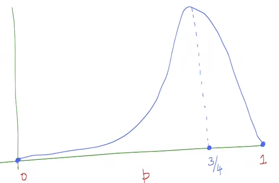

# Estimation 
There is some probabilistic mechanism that generates 
the data about which we dont know all the parameters.

The goal of estimation is to find the parameters 
we dont know about.

## Maximal Likelihood Estimation (ML)
> Is there a principaled way to get estimators 
from data?

> The way one can do this is by using the likelihood
function.

Lets say $x \in \{1,0,1,1\}$ , the $P(X_1 =1 , X_2 = 0 , X_3 = 1 , X_4 = 1)$
will be 

> If we were to guess the probability that $X$ takes a certain 
value , $\frac{3}{4}$ would be what most people agree on , 
this guess is also justified with the plot above but how do 
we actually end up with this guess? , is there a certain mathematical
way/formula to get here?

### Fisher's Principle of ML 

$$\begin{equation*}
\begin{split}
L(p , \{x_1 , x_2 , .... x_n \}) &= P(x_1 , x_2 , x_3 , ... x_n ; p) \\
&= P(x_1 ;p) \cdot P(x_2;p)  .... P(x_n;p) \\
&= \prod_{i=1}^{n} p^{x_i} (1-p)^{1- x_i}
\end{split}
\end{equation*}$$

From the above likelihood function we can see that 
the following function is to be maximized 

$$\begin{equation*}
\begin{split}
\hat{P}_{\text{ML}} &= \underset{p}{\arg \max} \prod_{i=1}^n p^{x_i} (1-p)^{1 - x_i} \\
\\
\text{As log is monotonous increasing function,} \\
\text{the point where } \hat{P}_{\text{ML}} \text{ and } \log (\hat{P}_{\text{ML}}) \\
\text{ take the maximum value is the same}\\
&= \underset{p}{\arg \max} \log \left(\prod_{i=1}^n p^{x_i} (1-p)^{1 - x_i} \right) \\
&= \underset{p}{\arg \max} \left(\sum_{i=1}^n \log p * {x_i} * \log (1-p)*(1 - x_i) \right) \\
\\
\text{Taking derivative of }\log (\hat{P}_{\text{ML}}) \\
\hat{P}_{\text{ML}} &= \frac{1}{n}\sum_{i=1}^n x_i \\
\end{split}
\end{equation*}$$

> We can now see where our guess previously originates from
