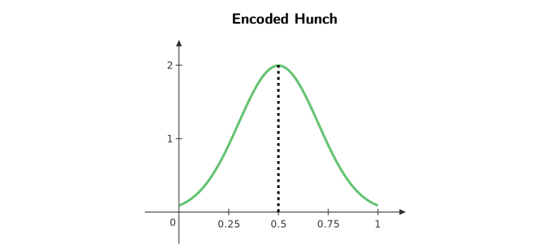
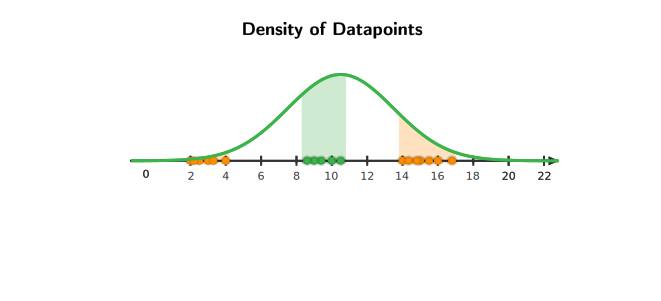

# Estimation
## Introduction to Estimation
There is some probabilistic mechanism that generates 
the data for which, we dont know all the parameters.

The goal of estimation is to find the parameters 
we dont know about.

> Is there a principaled way to get estimators 
from data?

> The way one can do this is by using the likelihood
function.

## Maximum Likelihood Estimation (MLE)
Lets say there is a button, when pressed , gives the output as either 0 or 1.  
The button generates the following distribution , when pressed 4 times $x \in \{1,0,1,1\}$. 

>If we were to estimate the probability of $P(X_1 =1 , X_2 = 0 , X_3 = 1 , X_4 = 1)$, our 
**assumption** would be that the above distribution was originally generated from some 
probabilistic model/mechanism.

The $P(X_1 =1 , X_2 = 0 , X_3 = 1 , X_4 = 1)$ will be 

If we were to guess the probability that $X$ takes a certain 
value , $\frac{3}{4}$ would be what most people agree on.  
This guess is also justified with the plot above, but how do 
we actually end up with this **guess**? Is there a certain mathematical
way/formula to get here?

### Fisher's Principle of MLE 

!!! note "Assumptions About The Distribution"
    1. It is always **assumed** that the distribution for which we are 
    estimating unknown parameters , is **always independent**.
        - This means that the probability of 2 events dont affect each other.
        - $P(x_i | x_j) = P(x_i) \quad \forall i \neq j$
    2. It is always **assumed** that the distribution for which we are 
    estimating unknown parameters , is always **identically distributed**.
        - This means that 2 different events from the same distribution ,
        always follow the same "assumed probabilistic model/mechanism".

#### Maximum Likelihood of Bernoulli Distribution
$$\begin{equation*}
\begin{split}
\mathcal{L}(p , \{\mathbf{x}_1 , \mathbf{x}_2 , .... \mathbf{x}_n \}) &= P(\mathbf{x}_1 , \mathbf{x}_2 , \mathbf{x}_3 , ... \mathbf{x}_n ; p) \\
&= P(\mathbf{x}_1 ;p) \cdot P(\mathbf{x}_2;p)  .... P(\mathbf{x}_n;p) \\
&= \prod_{i=1}^{n} p^{x_i} (1-p)^{1- x_i}
\end{split}
\end{equation*}$$

From the above likelihood function we can see that 
the following function is to be maximized 

$$\begin{equation*}
\begin{split}
\hat{P}_{\text{ML}} &= \underset{p}{\arg \max} \prod_{i=1}^n p^{x_i} (1-p)^{1 - x_i} \\
\\
\text{As log is monotonous increasing function,} \\
\text{the point where } \hat{P}_{\text{ML}} \text{ and } \log (\hat{P}_{\text{ML}}) \\
\text{ take the maximum value is the same}\\
&= \underset{p}{\arg \max} \log \left(\prod_{i=1}^n p^{x_i} (1-p)^{1 - x_i} \right) \\
&= \underset{p}{\arg \max} \left(\sum_{i=1}^n \log p * \mathbf{x}_i * \log (1-p)*(1 - x_i) \right) \\
\\
\text{Taking derivative of }\log (\hat{P}_{\text{ML}}) \\
\hat{P}_{\text{ML}} &= \frac{1}{n}\sum_{i=1}^n \mathbf{x_i} \\
\end{split}
\end{equation*}$$

> We can now see where our guess previously originates from.

!!! failure "Issues with Maximum Likelihood Estimation"
    Lets say for a data of random numbers which depicts the 
    height of different people , we want to estimate the parameters
    from the data.

    > Here we cannot use the same "button" which we used earlier as it
    only outputs 0 or 1.

    Gaussian Distribution is **assumed** to be the probabilistic model 
    behind data of people's heights.  
    The parameters for a gaussian distribution are $\mu$ (mean) 
    and $\sigma^2$ (variance).

    For the sake of simplicity we will assume that $\sigma^2$ (variance) is 
    known.  
    The likelihood function for the **assumed gasussian distribution** will be, 

    $$\begin{equation*}
    \begin{split}
    \mathcal{L}(\boldsymbol{\mu} , \boldsymbol{\sigma^2} , {x_1 , x_2 , \cdots , x_n}) &= P(x_1 , x_2 , \cdots , x_n , \boldsymbol{\mu} , \boldsymbol{\sigma^2}) \\
    &= \prod_{i=1}^n P(x_i ; \boldsymbol{\mu} , \boldsymbol{\sigma^2}) \\
    \end{split}
    \end{equation*}$$

    We know that Gaussian Distribution is a Continuous Distribution, which means that 
    probability of $x$ taking a specific value is always 0.  
    Hence, $P(x_i ; \mu , \sigma^2) = 0 \quad \forall i$

    !!! success
        To counter the above problem , **instead of taking probabilities in maximum likelihood estimation,
        we use Probability Density Functions.**

        Therefore our new Likelihood Function will be,

        $$\begin{equation*}
        \begin{split}
        L(\mu , \sigma^2 , {x_1 , x_2 , \cdots , x_n}) &= \mathcal{f}_{x_1 , x_2 , \cdots , x_n}(x_1 , x_2 , \cdots , x_n ; \mu , \sigma^2) \\
        &= \prod_{i=1}^n \mathcal{f}_{x_i}(x_i ; \mu , \sigma^2)
        \end{split}
        \end{equation*}$$    

#### Maximum Likelihood Estimation of Gaussian Distribution
$$\begin{align*}
\mathcal{L}(\boldsymbol{\mu}, \boldsymbol{\sigma}^2;\{\mathbf{x}_1, \mathbf{x}_2, \ldots, \mathbf{x}_n\}) &= f_{\mathbf{x}_1, \mathbf{x}_2, \ldots, \mathbf{x}_n}(\mathbf{x}_1, \mathbf{x}_2, \ldots, \mathbf{x}_n;\boldsymbol{\mu}, \boldsymbol{\sigma}^2) \\
&=\prod _{i=1} ^n  f_{\mathbf{x}_i}(\mathbf{x}_i;\boldsymbol{\mu}, \boldsymbol{\sigma}^2) \\
&=\prod _{i=1} ^n \left [ \frac{1}{\sqrt{2\pi}\boldsymbol{\sigma}} e^{\frac{-(\mathbf{x}_i-\boldsymbol{\mu})^2}{2\boldsymbol{\sigma}^2}} \right ] \\
\therefore \log(\mathcal{L}(p;\{\mathbf{x}_1, \mathbf{x}_2, \ldots, \mathbf{x}_n\})) &= \sum _{i=1} ^n \left[ \log \left (\frac{1}{\sqrt{2\pi}\boldsymbol{\sigma}}  \right ) - \frac{(\mathbf{x}_i-\boldsymbol{\mu})^2}{2\boldsymbol{\sigma}^2} \right] \\
\end{align*}$$

By differentiating with respect to $\boldsymbol{\mu}$ and $\boldsymbol{\sigma}$ we get,

$$\begin{align*}
\hat{\boldsymbol{\mu}}_{\text{ML}} &= \frac{1}{n}\sum _{i=1} ^n \mathbf{x}_i \\
\hat{\boldsymbol{\sigma}^2}_{\text{ML}} &= \frac{1}{n}\sum _{i=1} ^n (\mathbf{x}_i-\boldsymbol{\mu})^T(\mathbf{x}_i-\boldsymbol{\mu})
\end{align*}$$

## Bayesian Estimator 
Sometimes when estimating the unknown parameters of some data , we might have a "hunch"
about the parameters of the data.  
To incorporate this "hunch" about parameters of interest 
into the estimation procedure, we will take 
look at Bayesian Estimation.

> Our approach for Bayesian Estimation would be to think of 
the *parameter to estimate* as a random variable.  
Earlier to estimate a parameter (lets say) $p$ , we used to 
find out the "most likely" value of $p$ using MLE.  
Now, if we are given a coin and asked to estimate the probability 
of *Heads* , our "hunch" before even seeing the data of coin 
toss would be that the coin is unbiased.  
In reality , the coin may be biased or it may also be unbiased but according to 
our "hunch" about the *probability of coin landing on Heads* , the "most likely"
value should be $\frac{1}{2}$.

We will incorporate our "hunch" into MLE 
by thinking of our "hunch" as a probability distribution over 
some random variable $\theta$.

- The Probability Density Function of $P(\theta)$ represents 
    our "hunch/belief" about the *parameter of interest* , 
    **before seeing the data**.  

- This distribution of $P(\theta)$ is called the **Prior Distribution**.

- !!! example "Encoded Hunch for a Coin"
    

        **Note:** The coin may be biased or it also may be unbiased but our 
        "hunch" will say that coins in general tend to be unbiased , hence the 
        "most likely" probability is 0.5

**After seeing the data** , we have to update our belief/hunch.  
There are 2 cases which occur after seeing the data.  

1. Our assumption/belief is against the actual data.
    - In the case of a Coin , if the coin is biased ,
    then our hunch (that the probability is 0.5) is against the data.

2. Our assumption/belief is closer to the actual data.
    - In the case of a Coin , if the coin is biased , 
    but the *Probability of Coin landing on Heads* , is near $0.5$.  
    Then our assumption/belief about the parameter $p$ is closer 
    to the actual data.

In both the cases above , we need to update our "hunch/belief" 
in order to get a better estimate.  

- This estimate is given by $P(\theta | \text{Data})$.  
- This distribution of $P(\theta|\text{Data})$ is called the **Posterior Distribution**.

 
??? inline end info "Bayes Theorem"
    $$ P(A|B)  = \frac{P(B|A) \times P(A)}{P(B)}$$

For a given dataset $\{ x_1 , x_2 , \cdots , x_n \}$ and a parameter $\theta$,
according to bayes theorem,

$$\begin{equation*}
\begin{split}
P(\theta | \{ x_1 , x_2 , \cdots , x_n \} ) = \frac{P(\{ x_1 , x_2 , \cdots , x_n \}|\theta) \times P(\theta)}{P(\{ x_1 , x_2 , \cdots , x_n \})} \\
\end{split}
\end{equation*}$$

### Bayesian Estimate of Bernoulli Distribution 
For a dataset $\{ x_1 , x_2 , \cdots , x_n \}$ where $x_i \in \{ 0,1 \} \quad \forall i$ with parameter $\theta$.

A suitable distribution for incorporating our "hunch/belief/prior" is **Beta Distribution**. 

$$\begin{equation*}
\begin{split}
f(p;\alpha,\beta) = \frac{p^{\alpha-1}(1-p)^{\beta-1}}{z} \quad \forall p \in [0,1] \\
\text{where z is the normalizing factor}
\end{split}
\end{equation*}$$

Using the above Beta Distribution as a Prior we get,

$$\begin{equation*}
\begin{split}
P(\theta|\{x_1, x_2, \ldots, x_n\}) &\propto P(\theta|\{x_1, x_2, \ldots, x_n\})*P(\theta) \\
f_{\theta|\{x_1, x_2, \ldots, x_n\}}(p) &\propto \left [ \prod _{i=1} ^n {p^{x_i}(1-p)^{1-x_i}} \right ]*\left [ p^{\alpha-1}(1-p)^{\beta-1} \right ] \\
f_{\theta|\{x_1, x_2, \ldots, x_n\}}(p) &\propto p^{\sum _{i=1} ^n x_i + \alpha - 1}(1-p)^{\sum _{i=1} ^n(1-x_i) + \beta - 1}
\end{split}
\end{equation*}$$

$$ 
\text{BETA PRIOR }(\alpha, \beta) \xrightarrow[Bernoulli]{\{x_1, x_2, \ldots, x_n\}} \text{BETA POSTERIOR }(\alpha + n_h, \beta + n_t)
$$

$$
\therefore \hat{p_{\text{ML}}} = \mathbb{E}[\text{Posterior}]=\mathbb{E}[\text{Beta}(\alpha +n_h, \beta + n_t)]= \frac{\alpha + n_h}{\alpha + n_h + \beta + n_t}
$$

!!! info "Types of Beta Distribution"
    

## Gaussian Mixture Models (GMM)

A Gaussian Mixture Model (GMM) is a probabilistic model that represents a mixture of multiple Gaussian (normal) distributions.  
In simpler terms, it's a way of describing a dataset as a combination of several Gaussian-shaped clusters.

??? question "What is the need of Gaussian Mixture Models? (GMM)"
    To answer this question lets take a look at a simple example 
    where maximum likelihood fails.  

    Lets say there are points lying on whole number line , which 
    represents the datapoints of a dataset $D$.  
    To represent these points in a probabilistic manner we would 
    have to "assume" that these points are generated from some 
    distribution.  
    To find this distribution , we will use the method of maximum
    likelihood for a gaussian distribution.

    

    It can be seen that the Gaussian Distribution derived from 
    maximum likelihood is centered somewhere around 10.

    The issue with this approach is that the orange cluster of points 
    dont have the same density as the green cluster of points.
    In other words , according to the derived gaussian distribution ,
    the chance of generating points around orange clusters is very less
    when compared to that of green clusters.  

    

    **Hence , the above gaussian distribution (derived using maximum likelihood) 
    does not represent the "true/actual" distribution of datapoints.**

    > What is the solution for this problem then? What would be an appropriate 
    density estimation?  

    > Answer : Combine several gaussian distributions together

    

    The above density distribution is a much better representation of the 
    "assumed" probabilistic model for all the datapoints.

### Procedure of Generating GMM
- Generate a mixture componenet among $\{ 1,2,\cdots K \}$ where $z_i \in \{ 1,2,\cdots K \}$.
We obtain,
$$
P(z_i=k) = \pi_k \hspace{2em} \left [ \sum _{i=1} ^K \pi_i = 1 \hspace{1em} 0 \le \pi_i \le 1 \hspace{1em} \forall i \right ]
$$
    - $z_i$ is the mixture indicator.
    - This step selects a mixture from which the datapoint originates.

- Generate $x_i \sim \mathcal{N}(\mu_{z_i} , \sigma^2_{z_i})$
    - Every mixture has its own mean and variance. Lets say the 3rd mixture is selected among the $K$ mixtures.
    We will generate a datapoint from $\mathcal{N}(\mu_{z_3} , \sigma^2_{z_3})$.
    - This step generates a datapoint from the selected mixture.

!!! question "How many parameters do we have to find using parameter estimation?"
    Each mixture has:  

    - A $\pi_k$ probability , such that $\sum_{i=1}^K \pi_i = 1$ (all the probabilities 
    sum upto 1)
    - 2 variables , mean ($\mu$) and variance ($\sigma^2$). Both of these parameters 
    are unknown to us.

    Therefore , for $K$ mixtures , the number of parameters which need to estimated are $(K-1) + 2K = 3K -1$.

    > Where does "-1" in $K -1$ come from?  
    > All the probabilities sum upto 1 , if we know all the probabilities except the last one , 
    we can find out the last probability by summing the rest and subtracting from 1.

## Likelihood of GMM
