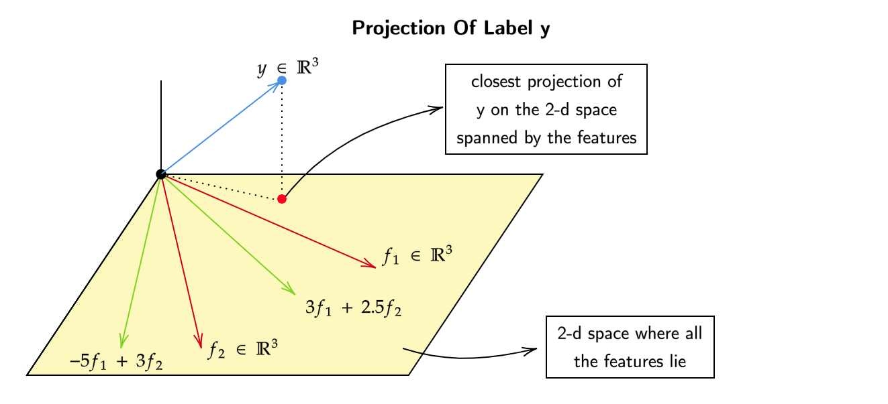

# Supervised Learning
For a bunch of datapoints $\{x_1 , x_2 , .... x_n \} \;\;\;\; x_i \in \mathbb{R}^d$ 
are called features/attributes and $\{y_1 , y_2 , .... y_n  \}$ corresponding to the 
datapoints are called the labels. These labels provide "supervision" for our 
algorithms.

These labels can take different types of values

- **Binary Classification**: Where the labels take only two values and they 
come from $\{+1 , -1 \}$.
- **Multiclass Classification** : Where the labels take multiples values/classes from a set 
like $\{0,1,2,.....9 \}$.

## Linear Regression 
For input/training data $\{x_1 , x_2 , .... x_n \} \;\;\;\; x_i \in \mathbb{R}^d$ 
our goal is to learn a function $h : \mathbb{R}^d \to \mathbb{R}$ which converts
a feature to a label.

> There are many functions which map $\mathbb{R}^d \to \mathbb{R}$ , so 
how do we measure the "goodness" of a function?

To measure the error of a function 

$$\text{error}(h) = \sum_{i=1}^n (h(x_i) - y_i)^2 $$

> In the best case scenario , how small can this error be?

0 is the least value the error function can take and it only happens 
when $h(x_i) = y_i \forall i$

> However this $h(x)$ may not always be the best function for the mapping

Some of the problems with $h(x)$ are 

- To achieve 0 error , we always output the same label for each feature ,
this $h(x)$ "memorizes" the mapping from $\mathbb{R}^d$ to $\mathbb{R}$ and this 
function may not always be useful.
Functions like this tend to overfit the training data and produce considerable 
errors on testing data.

> How to prevent overfitting of training data?

Our goal now is to use the same squared error function , 
but impose a certain structure to reduce our search space.

One of the simplest structures we could impose is a linear 
structure.

Now our modified goal is 

$$\underset{h_w \in H_{\text{linear}}}{\min} \sum_{i=1}^{n} (h_w(x_i) - y_i)^2$$

or equivalently 

$$\underset{w \in \mathbb{R}^d}{\min} \sum_{i=1}^{n} (w^Tx_i - y_i)^2$$

## Optimizing the Error Function 
> Now that we have identified a function for our 
algorithm , we should think of a way to optimize this function 

The above function can be rewritten as follows 

$$\begin{equation*}
\begin{split}
\underset{w \in \mathbb{R}^d}{\min} & {||X^Tw - y||}^2 \\
\underset{w \in \mathbb{R}^d}{\min} & (X^Tw - y)^T(X^Tw - y) \\
\end{split}
\end{equation*}$$

The above equation is an unconstrained optimization problem ,
to minimize the equation we will now take the derivative and 
equate it to zero.

$$\begin{equation*}
\begin{split}
f(w) &= (X^Tw - y)^T(X^Tw - y) \\
\nabla f(w) &= 2 (XX^T)w - 2(Xy) \\
(XX^T)w^* &= Xy \\
w^* &= (XX^T)^\dagger(Xy)
\end{split}
\end{equation*}$$

## Geometric Interpretation of Linear Regression 
Lets say for a dataset with number of features to be 2 
($d=2$) and number of points be 3 ($n=3$).

> How can we interpret $w^* = (XX^T)^\dagger(Xy)$ geometrically?

Now if we draw an $n$ dimensional space , in our case its $n =3$,
the first vector that we will have will be in $\mathbb{R}^3$ and the other 
vector also in $\mathbb{R}^3$.

**Note** that we are not plotting the the datapoints but the features themselves.

Now we plot the label in the same $\mathbb{R}^3$ subspace.

We can see that the linear combinations of the features (green vectors)
will lie in the same plane as the features themselves.

Now if we also plot the label vector ($y$) onto the same $\mathbb{R}^3$
subspace , it may or may not lie in the same plane as of the features themselves.

In the case it does not lie in the plane spanned by the features , we will find the closest projection
of $y$ onto the plane.

We also know that the red point will also be a linear combination of the features 
as it lies in the same plane as of the features themselves.

So for some real numbers like $\alpha^*_1 , \alpha^*_2$ , the red point can be 
expressed as the linear combination of features ($\alpha^*_1f_1 + \alpha^*_2f_2$)

$$\implies \alpha^*_1f_1 + \alpha^*_2f_2 = X^T \alpha^*$$

We also know that $X^T\alpha^*$ and $y - X^T \alpha^*$ are orthogonal to each other.

$$\begin{equation*}
\begin{split}
\implies (X^T \alpha^*)^T(y - X^T \alpha^*) &= 0 \\
y^TX^T \alpha^* - {\alpha^*}^T(XX^T) \alpha^* \\
\end{split}
\end{equation*}$$

Now what happens if we put $w^* = \alpha^*$ , where 
$w^* = {(XX^T)}^\dagger Xy$

The new equation will be,

$$y^T X^T ((XX^T)^\dagger Xy) - ((XX^T)^\dagger Xy)^T (XX^T) (XX^T)^\dagger Xy = 0$$

With this equation we basically prove that the solution $\alpha^*$ we were looking for 
is the same as $w^*$

## Gradient Descent 
> We know that $w^*$ has a closed form solution which is $w^* = (XX^T)^\dagger Xy$,
but it is computationally expensive to compute $w^*$ as it takes $O(d^3)$ iterations.
Also, solving for $w^*$ is an unconstrained optimization problem , which can be solved
using the method of Gradient Descent.

Gradient Descent is an iterative way to find minimizers of functions using just
first order information , which is gradient of the function (vector of partial 
derivatives).

$$ w^{t+1} = w^t - \eta_t \nabla f(w^t) $$

> The gradient tells you the direction where function will increase , instead ,
when doing gradient descent we move opposite to the direction of the gradient 
along the function , where it gradually decreases.

> - $\eta_t$ is a scalar value and it is the step-size we take to move along the function.
- $f(w^t)$ gives us the direction of the gradient.

> After some iterations , we eventually reach the global minima of the function.

Our original Mean Squared Error function was,

$$\begin{equation*}
\begin{split}
f(w) &= ||Xw - y||^2 = \sum_{i=1}^{n} (w^T x_i - y_i)^2 \\
\nabla f(w) &= 2 (XX^T)w - 2Xy \\
\end{split}
\end{equation*}$$

Now we can use this gradient of $f(w)$ in the gradient descent equation,

$$ w^{t+1} = w^t - \eta_t [2(XX^T)w - 2Xy] $$

This solves the problem of not having to compute the inverse of $XX^T$ , which
takes $O(d^3)$ iterations. Using gradient descent to calculate $w^*$ makes it
less computationally expensive.

> Now what to do if $n$ is too large, we know that $XX^T$ is a $d \times n * n * \times d$
matrix , just to calculate $XX^T$ there is an inner dependency of $n$, hence it becomes 
computationally expensive to solve for $XX^T$.

> Is there any way we can avoid computing $XX^T$?

### Stochastic Gradient Descent
for $t = 1,2,3 ...... T$ 

- At each step sample a bunch ($k$) of datapoints uniformly at random from the set of 
all datapoints.
- Pretend as if this sample ($k$ datapoints) is the entire dataset and take a gradient 
step with respect to it, 

$$2(\tilde{X}\tilde{X}^T w^t - \tilde{X} \tilde{y})$$

where $\tilde{X}$ is the sampled ($k$) datapoints and $\tilde{y}$ are the labels corresponding 
to the datapoints.

> This makes calculating $XX^T$ managable as we only take $k$ points at a time.

After $t$ rounds , use 

$$ w^T_{\text{SGD}} = \frac{1}{T} \sum_{i=1}^{t} w^t $$ 

> At the end we basically take the average of the $w^t$ obtained after several iterations ,
though the direction of descent may be noisy at first but in a typical case the average usually
gives out the $w^*$ with least possible noise.

!!! note ""
    Stochastic Gradient Descent is always guaranteed to converge to optima with high
    probability.

## Kernel Regression 
Our goal here is to map the data points to a higher dimensional space and 
then learn a linear model in higher dimension (regressor) without explicitly
computing the higher dimensional mappings.

The solution for $w^*$ in $w^* = (XX^T)^ \dagger Xy$ lies in the subspace spanned
by the datapoints.

It can also be seen as $w^*$ lying in a $\mathbb{R}^3$ subspace spanned by the datapoints.

>How?

Lets say that there are some data points in $\mathbb{R}^3$ , even though they are 3-dimensional 
vectors , lets assume that they all line in some 2-d plane (in our case its the green area above)

For arguments sake , lets assume that our $w^*$ lies outside the (green) plane. To minimize 
the error we will now take a point which is closest to $w^*$ which lies on the same (green) plane.

Here , $\tilde{w}$ is the projection of $w^*$/ closest point to $w^*$ which lies in the 
same (2-d) space spanned by the datapoints.

Now , lets see what's the difference between error functions of $w^*$ and $\tilde{w}$ 

$$\sum_{i=1}^n ({w^*}^Tx_i - y_i) \;\;\;\;\; \text{and} \;\;\;\;\; \sum_{i=1}^n ({\tilde{w}}^Tx_i - y_i)$$

$w^*$ can be written as the sum of $\tilde{w}$ and the vector perpendicular to $\tilde{w}$ , which is 
$\tilde{w}_{\perp}$

**Note** that $\tilde{w}_{\perp}$ is perpendicular to the (2-d) plane itself , which means it 
is perpendicular / orthogonal to all the points which lie in the plane (datapoints).

$$\begin{equation*}
\begin{split}
w^* &= \tilde{w} + \tilde{w}_{\perp} \\
{w^*}^Tx_i &= {(\tilde{w} + \tilde{w}_{\perp} )}^T x_i \\
&= \tilde{w} x_i + \tilde{w}_{\perp}^T x_i  \\
&= \tilde{w} x_i \;\;\;\;\;\; \forall i \\
\end{split}
\end{equation*}$$

$\tilde{w}_{\perp}^T x_i$ will become 0 as explained above. 

Now we see that the error for both $w^*$ and $\tilde{w}$ is exactly 
the same.

It can also be seen that $w^*$ is some combination of the datapoints,
which can be written as 

$$w^* = X \alpha^*$$

for some $\alpha^* \in \mathbb{R}^n$ 

We also know that ,

$$\begin{equation*}
\begin{split}
w^* &= (XX^T)^\dagger Xy \\
X \alpha^* &= (XX^T)^\dagger Xy \\
(XX^T) X \alpha^* &= (XX^T)(XX^T)^\dagger Xy \\
(XX^T) X \alpha^* &=  Xy \\
X^T(XX^T) X \alpha^* &= X^TXy \\
(X^T X)^2 \alpha^* &= X^TXy \\
K^2 \alpha^* &= Ky \\ 
\alpha^* &= K^{-1}y \\
\end{split}
\end{equation*}$$

$K = X^T X$ , is the kernel matrix.

### Prediction
We know that,

$$ w = \sum_{i=1}^n \alpha_i x_i $$

Also Prediction $= w^T x_{\text{test}}$ ,

$$\begin{equation*}
\begin{split}
w^T x_\text{test} &= (\sum_{i=1}^n \alpha_i x_i )^T x_\text{test} \\
&= \sum_{i=1}^n \alpha_i (x_i^T x_\text{test}) \\
&= \sum_{i=1}^n ( \phi(x_i)^T \phi(x_\text{test}) ) \\
&= \sum_{i=1}^n \alpha_i K (x_i , x_\text{test}) \\
\end{split}
\end{equation*}$$

where $\alpha_i$ shows how important is $i^\text{th}$ point 
towards $w^*$ and $K(x_i , x_\text{test})$ shows how similar
is $x_\text{test}$ to $x_i$.

## Probabilistic view of Linear Regression 
In a linear regression problem we know that , $x \in \mathbb{R}^d$ , $y \in \mathbb{R}$ 
for a set of datapoints $\{ (x_1 , y_1) , (x_2 , y_2) , ..... (x_n , y_n) \}$.

The probabilistic we are going to assume is as follows,

$$ y|x \sim w^T x + \epsilon $$

For a given feature theres is an *unknown but fixed* $w \in \mathbb{R}^d$ and 
$\epsilon$ is a zero-mean gaussian ($\mathcal{N}(0 , \sigma^2)$)noise.

> Now we can view this as an estimation problem and solve it using the 
maximum likelihood approach.

The likelihood function will be ,

$$\begin{equation*}
\begin{split}
\mathcal{L}(w ; \substack{x_1 , x_2 , ... x_n \\ y_1 , y_2 , ... y_n} ) &= \prod_{i=1}^n e^{- \frac{(w^Tx_i - y_i)^2}{2 \sigma^2}} \times \frac{1}{\sqrt{2 \pi} \sigma} \\
\log \mathcal{L}(w ; \substack{x_1 , x_2 , ... x_n \\ y_1 , y_2 , ... y_n} ) &= \sum_{i=1}^n  \frac{-(w^Tx_i - y_i)^2}{2 \sigma^2} \times \frac{1}{\sqrt{2 \pi} \sigma} \\
\\
\text{equivalently} \\
\\
&= \underset{w}{\max} \sum_{i=1}^{n} - (w^T x_i - y_i)^2 \\
&= \underset{w}{\min} \sum_{i=1}^n (w^Tx_i - y_i)^2 \\
\end{split}
\end{equation*}$$

**Note** that the mean of the distribution becomes $w^Tx + 0$ as $\epsilon$ is a 
zero-mean gaussian distribution , which makes the final distribution to be 
$\mathcal{N}(w^Tx , \sigma^2)$

Also, we ignored the constants in the later half of the derivation because they are,
you guessed it , constants. :p

Finally from this we can conclude that $w^* = w_\text{ML} = (XX^T)^\dagger Xy$
