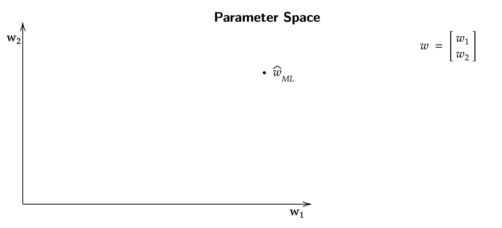
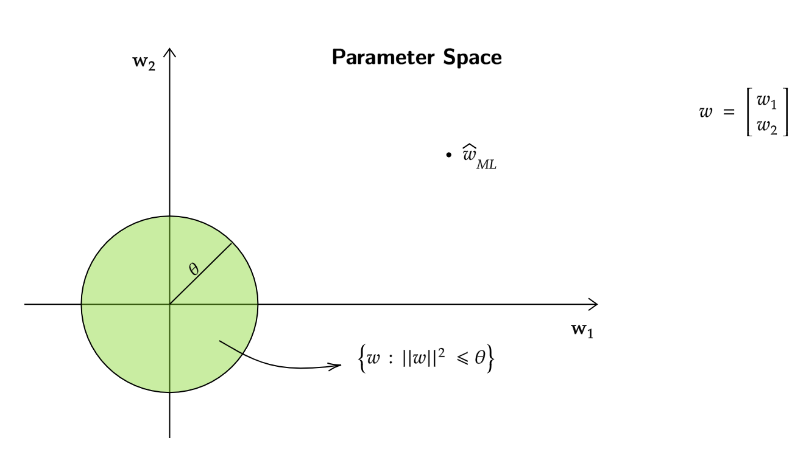
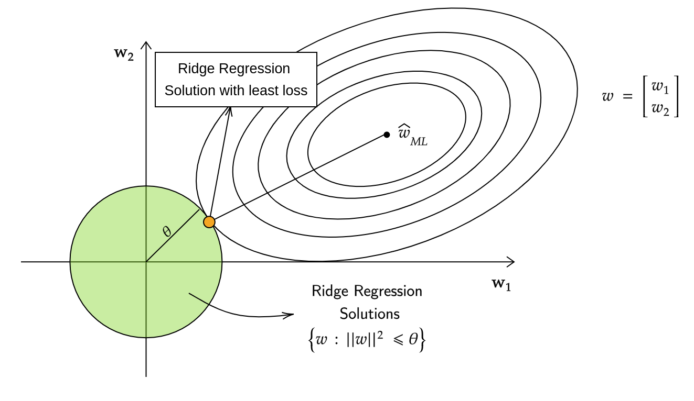
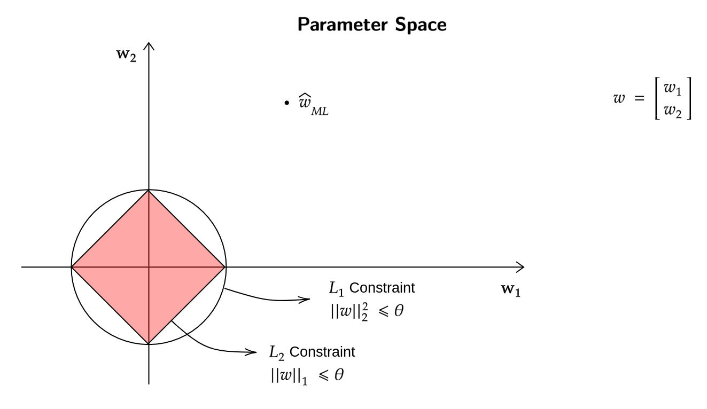
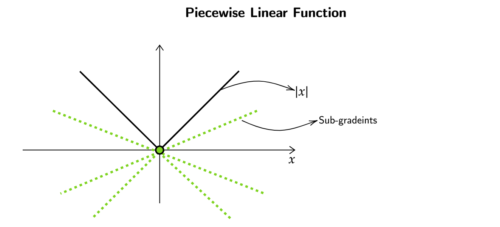
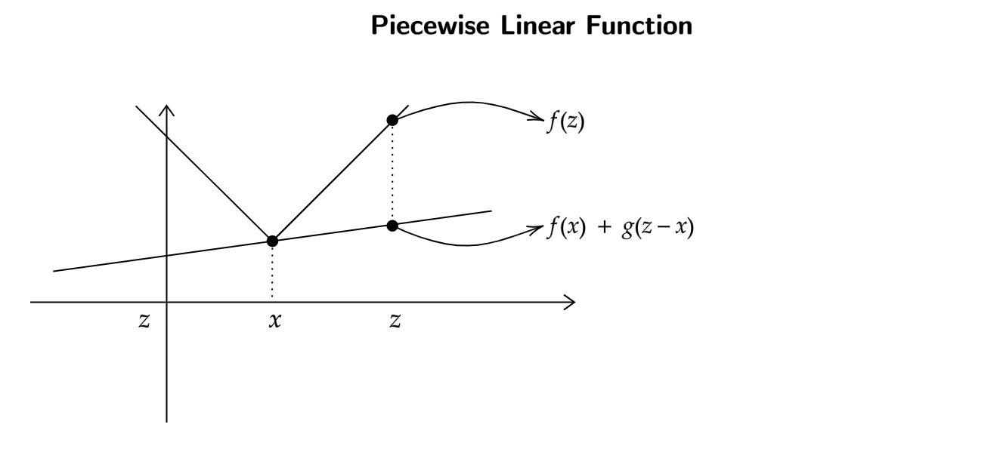

# Regression
## Goodness of Maximum Likelihood Estimator for linear Regression 
In the previous week we observed that $w^*$ which comes from the 
squared error equation is the same as $\hat{w}_{\text{ML}}$ which 
came from the maximal Likelihood equation.

Now we are going to look at $\hat{w}_{\text{ML}}$ and its properties ,
which will gives us a better idea of $w$.
For $\hat{w}_{\text{ML}}$ our assumption was that,

$$y|x = w^T x + \epsilon $$

where $\epsilon$ (gaussian noise) belongs to a gaussian distribution with mean 0 and variance $\sigma^2$ 
($\epsilon \sim \mathcal{N}(0 , \sigma^2)$).
For every $x$ in our data $y$ was generated using some $w^T x$ , using some unknown 
but fixed $w$ and then adding 0 mean gasussian noise to it.

Hence , $y$ given $x$ can be thought of as gaussian distribution with mean $w^T x$ and 
variance $\sigma^2$ ($y|x \sim \mathcal{N}(w^T x , \sigma^2)$)

>  For $\hat{w}_{\text{ML}}$ we should now look for a way to test that ,
how good the function is as a guess from true $w$.

A good function to compare $\hat{w}_{\text{ML}}$  to $w$ is

$${||\hat{w}_{\text{ML}} - w ||}^2$$

and to see what happens to this value on an average we will 
look at its expected value over the randomness in $y$, which can be written as 

$$E[{||\hat{w}_{\text{ML}} - w ||}^2]$$

If we solve for the expected value further , we get

$$E[{||\hat{w}_{\text{ML}} - w ||}^2] = \sigma^2 \text{trace}((XX^T)^ \dagger)$$

where $\sigma^2$ is the variance from the gaussian noise

> $\sigma^2$ in the expected value of the above function cant be reduced , 
it is the variance / loss which will always happen.
Only thing we can reduce is the trace of the inverse of covariance matrix

## Cross-validation for minimizing MSE 
> We know that trace of a matrix is the sum of the diagonal entries of matrix ,
but in previous courses we have also seen that trace of a matrix is also equal to 
the sum of the eigenvalues of that matrix.

$$\text{tr}(A) = \sum_{i=1}^{d} \lambda_i$$

where $A$ is any matrix , $d$ is the dimension of the matrix and 
$\lambda_i$ is the $i^{\text{th}}$ eigenvalue.

- Let the eigenvalues of $(XX^T)$ be $\{\lambda_1 , \lambda_2 , .... \lambda_d \}$.
- The eigenvalues of $(XX^T)^{-1}$ are $\{ \frac{1}{\lambda_1} , \frac{1}{\lambda_2} , .... \frac{1}{\lambda_d} \}$

The mean squared error equation $(\hat{w}_{\text{ML}})$,

$$E(|| \hat{w}_{\text{ML}} - w ||^2) = \sigma^2 \left( \sum_{i=1}^d \frac{1}{\lambda_i} \right)$$

**Consider the following estimator:**

$$\hat{w}_{\text{new}} = (XX^T + \lambda I )^{-1} XY $$

- For some matrix $A$ , let the eigenvalues be $\{ \lambda_1 , \lambda_2 , ..... \lambda_d \}$
- Now what will be the eigenvalues of $A + \lambda I$?

$$\begin{equation*}
\begin{split}
A v_1 &= \lambda_1 v_1 \\ 
(A + \lambda I)v_1 &= A v_1 + \lambda v_1 \\
&= \lambda_1 v_1 + \lambda v_1 \\ 
&= (\lambda_1 + \lambda) v_1 \\
\end{split}
\end{equation*}$$

$\implies$ eigenvalues will be $\{ \lambda_1 + \lambda , \lambda_2 + \lambda , ... \lambda_d + \lambda \}$

- Similarly eigenvalues of ${(XX^T + \lambda I)}^{-1}$ will be $\{ \frac{1}{\lambda_1 + \lambda} , \frac{1}{\lambda_2 + \lambda} , ... \frac{1}{\lambda_d + \lambda} \}$

$$\therefore \text{trace}((XX^T + \lambda I)^{-1}) = \left( \sum_{i=1}^d \frac{1}{\lambda_i + \lambda} \right)$$

> If the MSE is really large one of the reasons for 
it might because the trace of the matrix was really large , 
which means the eigenvalues were really small 
(smaller eigenvalues give large trace as they are inversely proportional).
To counter this we artifically introduced $\lambda$ 
which increases the overall eigenvalues and hence 
reducing the trace of the matrix , which in turn decreases MSE.

## Bayesian Modeling for Linear Regression 

??? question "What are conjugate priors?"
    The key property of a conjugate prior is that, 
    when combined with a likelihood function, 
    the resulting posterior distribution belongs to the same 
    family of distributions as the prior. 
    This property simplifies the computation of the posterior distribution.

**Note:** The conjugate prior for a gaussian distribution is gaussian distribution itself.

We know that our original likelihood function was, 

$$ y|x  \sim \mathcal{N}(w^Tx , 1) $$ 

where we are taking $\sigma^2 = 1$ for convenience , the following derivation will 
still be valid when variance is just $\sigma^2$.

Now our prior will be,

$$ w \sim \mathcal{N}(0 , \gamma^2 I) $$

where $\mu \in \mathbb{R}^d$ and $\gamma^2 I \in \mathbb{R}^{d \times d}$

Now,

$$\begin{equation*}
\begin{split}
P(w| \{ (x_1 , y_1) , (x_2 , y_2) , .... (x_n , y_n) \}) &\propto P(\{(x_1 , y_1) , (x_2 , y_2) , .... (x_n , y_n) \}|w) \times P(w) \\ 
&\propto \left(\prod_{i=1}^{n} e^{-\frac{(y_i - w^Tx)^2}{2}} \right) \times \left(\prod_{i=1}^{n} e^{-\frac{(w_i - 0)^2}{2 \gamma^2}} \right) \\
&\propto \left(\prod_{i=1}^{n} e^{-\frac{(y_i - w^Tx)^2}{2}} \right) \times e^{- \frac{||w||^2}{2 \gamma^2}} \\
\end{split}
\end{equation*}$$

Now how will maximum aposterior (MAP) estimate look like? (Here we are taking log of the above function)

$$\begin{equation*}
\begin{split}
\hat{W}_{\text{MAP}} &= \overset{\arg}{\underset{w}{\max}} \sum_{i=1}^{n}- \frac{(y_i - w^Tx_i)^2}{2} - \frac{||w||^2}{2 \gamma^2} \\ 
\hat{W}_{\text{MAP}} &= \overset{\arg}{\underset{w}{\min}} \sum_{i=1}^{n} \frac{(y_i - w^Tx_i)^2}{2} + \frac{||w||^2}{2 \gamma^2} \\ 
\end{split}
\end{equation*}$$

Taking gradient of this function,

$$\begin{equation*}
\begin{split}
\nabla f(w) &= (XX^T)w - Xy + \frac{w}{\gamma^2} \\ 
\hat{W}_{\text{MAP}} &= (XX^T + \frac{1}{\gamma^2}I )^{-1}Xy
\end{split}
\end{equation*}$$

We can see that the same estimator can be derived when 
find out MAP for a gaussian distribution prior.

## Ridge Regression 
> Previously our linear regression equation was, 

> $$ \hat{w}_{\text{ML}} = \underset{w}{\arg \min} \sum_{i=1}^{n} (w^T x_i - y_i)^2 $$

The Ridge Regression equation is given as,

$$ \hat{w}_{\text{R}} = \underset{w}{\arg \min} \sum_{i=1}^{n} (w^T x_i - y_i)^2 + \lambda ||w||^2 $$

where $\sum_{i=1}^{n} (w^T x_i - y_i)^2$ is the loss and $\lambda ||w||^2$ is the regularizer.

- The regularizer has bayesian viewpoint to it as shown in the above derivation,
also it can be thought of as adding a penalty on the overall function for 
prefering a certain type of $w$.
- The higher the weights of the $w$ the larger the penalty , it can also 
be thought of as prefering $w$ which have their features reduced to zero or almost zero.

!!! note 
    - Ridge Regression has more error than linear regression.
    - Ridge Regresison increases the training error so that the model does not overfit.

## Relation Between Solution of Linear Regression and Ridge Regression 
Lets say for a dataset we solved the linear regression problem and got $\hat{w}_{\text{ML}}$ on 
a 2-d subspace

> Now is there any way to find the ridge regression solution for the same dataset?

We know that equation of ridge regression is, 

$$ \hat{w}_{\text{R}} = \underset{w}{\arg \min} \sum_{i=1}^{n} (w^T x_i - y_i)^2 + \lambda ||w||^2 $$

It can be argued that this problem/equation is the same as 
constrained optimization problem,

$$\begin{equation*}
\begin{split}
\underset{w \in \mathbb{R}^d}{\min} & \sum_{i=1}^n (w^T x_i - y_i)^2 \\
\\
\text{such that}\\
& ||w||^2 \leq \theta \\
\end{split}
\end{equation*}$$

For every choice of $\lambda > 0$ , there exists a $\theta$ such that the
optimal solutions of Ridge Regression and Constrained Ridge Regression coincide.

In a 2-d space , when $||w||^2 \leq \theta$ , it can be written as,

$$\begin{equation*}
\begin{split}
||w||^2 \leq \theta \\
\implies w_1^2 + w_2^2 \leq \theta \\
\end{split}
\end{equation*}$$

This is very similar to the equation of a circle whose radius (here)
is $\theta$ and it is centered at origin.

> From the above image we can see that we have found out a constrained 
area for $\hat{w}_{\text{Ridge}}$ , but where it is exactly?

What is the loss/error value of linear regression at 
$\hat{w}_{\text{ML}}$?

!!! note 
    The loss calculated at $\hat{w}_{\text{ML}}$ is the least when 
    compared to any other $w$.
    
$$\begin{equation*}
\begin{split}
\sum_{i=1}^n (\hat{w}_{\text{ML}} x_i - y_i)^2 &= f(\hat{w}_{\text{ML}}) \\ 
\end{split}
\end{equation*}$$

Consider the set of $w$ such that 

$$\begin{equation*}
\begin{split}
f(w) &= f( \hat{w}_{\text{ML}} ) + c \;\;\;\;\;\; c>0 \\
S_c &= \{ w : f(w) = f( \hat{w}_{\text{ML}}) + c \} \\
\end{split}
\end{equation*}$$

Every vector in $S_c$ satisfies,

$$\begin{equation*}
\begin{split}
\underset{f(w)}{||X^Tw - y||^2} &= \underset{f(\hat{w}_{\text{ML}})}{|| X^T \hat{w}_{\text{ML}} - y ||^2 } + c \\ 
\\
\text{on simplification,}\\
(w - \hat{w}_{\text{ML}})^T (XX^T) (w - \hat{w}_{\text{ML}}) &= c' \\
\end{split}
\end{equation*}$$

> If we have $\hat{w}_{\text{ML}}$ , $XX^T$ and $c'$ we can get a set 
of all the $w$ which satisfy the above equation such that they 
are $c'$ distance away in terms of error when compared to $\hat{w}_{\text{ML}}$.

If $XX^T = I$ ($I$ = Identity Matrix),

$$\begin{equation*}
\begin{split}
(w - \hat{w}_{\text{ML}})^T I (w - \hat{w}_{\text{ML}}) &= c' \\
|| w - \hat{w}_{\text{ML}} ||^2 = c' \\
\end{split}
\end{equation*}$$

This again corresponds to the equation of a circle (with c' radius) in a 2-d space , 
but thats only the case when $XX^T = I$. If $XX^T \neq I$ then instead of a circle , 
an ellipse is formed around $\hat{w}_{\text{ML}}$ . 

 

If we keep increasing the $c'$ while using the same values for $\hat{w}_{\text{ML}}$
and $XX^T$ , ellipses with increasing size are formed around $\hat{w}_{\text{ML}}$ 
which eventually touch the circle formed by the constrained ridge regression equation.

The point where it touches (yellow dot) is the ridge regression solution with the 
least loss possible when compared to any other $\hat{w}_{\text{Ridge}}$ in the 
green circle. In other words that point (yellow dot) is closest to $\hat{w}_{\text{ML}}$ and yet 
satisfy the constrained ridge regression equation.

!!! abstract "Conclusion"
    We can see that Ridge Regression pushes the values in the wieght vector ($w$)
    to 0 , but does not necessarily make them 0.

## Relation betwen solution of Linear Regression and Lasso Regression 
> Our goal here is to change the regularizer in ridge regression 
equation in such a way that the elliptical contours around $\hat{w}_{\text{ML}}$ 
hit at a point where some of the features become zero.

We know that ridge regression pushes feature values towards 0. But does not 
necessarily make it 0.

An alternate way to regularize would be to use $||\cdot||_1$ norm instead 
of $||\cdot||^2_2$ norm.

$$ ||w||_1 = \sum_{i=1}^d | w_i | $$

For L1 Regularization , 

$$\begin{equation*}
\begin{split}
& \underset{w \in \mathbb{R}^d}{\min} \sum_{i=1}^{n} (w^T x_i - y_i)^2 + \lambda ||w||_1\\
\\
& \text{which is similar to} \\ 
\\ 
& \underset{w \in \mathbb{R}^d}{\min} \sum_{i=1}^{n} (w^T x_i - y_i)^2 \\
& \text{such that}\\
\\
||w||_1 \leq \theta \\
\end{split}
\end{equation*}$$

When compared to L2 Constraint on the regularizer , 
this is how L1 constraint would look like 

Now when we keep increasing the size of the elliptical contours 
around $\hat{w}_{\text{ML}}$ our hope is that it touches the point 
where some of the features of weight vector become zero.

> When looking at this , one can argue that the elliptical contours 
will not always touch red area in such a way that one of the weight
vectors becomes 0; Which is true when looking at it in a 2d subspace ,
but in higher dimensions the typical case is when some of weight vectors 
become 0.

This way of using L1 Regularizer is called LASSO (Least Absolute Shrinkage and
Selection Operator)

## Characteristics of Lasso regression 
> We know now that lasso regression makes certain weight vectors zero , 
so why not always use lasso?

Advantages of using Ridge Regression vs Lasso Regression,

- Lasso Regression does not have a closed form solution.
- Sub-gradient methods are usually used to solve for Lasso Regression.

### What are Sub-Gradients?
For a piecewise linear function at the point $x$ (purple) point the function 
is not differentiable , sub-gradient provide a lower bound for this function at 
$x$ (purple point).

At the blue point the function is differentiable and hence only 1 sub-gradient exists
which is the gradient/slope itself.

> Now , what is the use of sub-gradients in lasso regression?
We know that the regularizer in lasso regression takes the absolute values of 
weight vectors, 

At the origin (green point) finding the differential is not 
possible , hence we bound the function using sub-gradients.

Any sub-gradient between $[-1,1]$ lower bounds the function ($|x|$).

!!! note "Definition of Sub-Gradients"
    A vector $g \in \mathbb{R}^d$ is a sub-gradient of $f:\mathbb{R}^D \to \mathbb{R}$ at 
    a point $x \in \mathbb{R}^d$ , if 

    $$\forall z \;\;\;\;\;\;\;\;\; f(z) \geq f(x) + g^T(z - x)$$

     

!!! question "Whats the use of Sub-Gradients?"
    If function $f$ to minimize is a convex function , then 
    sub-gradient descent converges.
