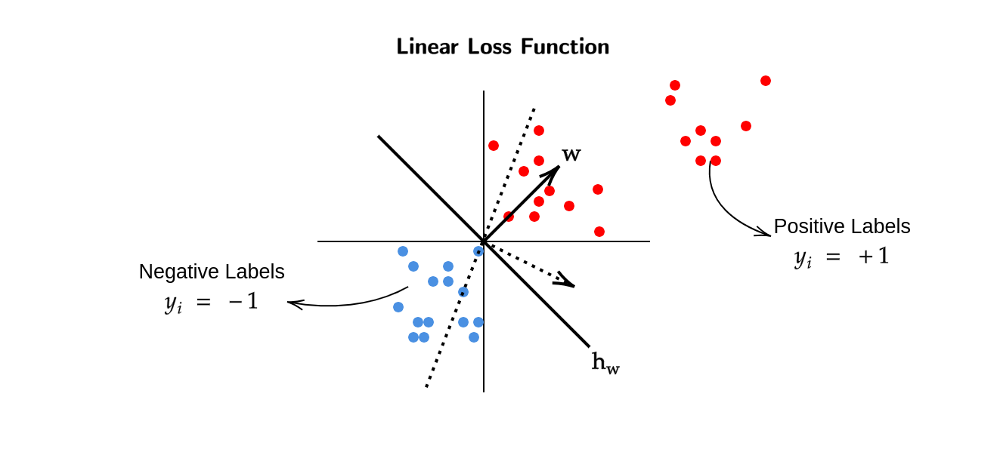
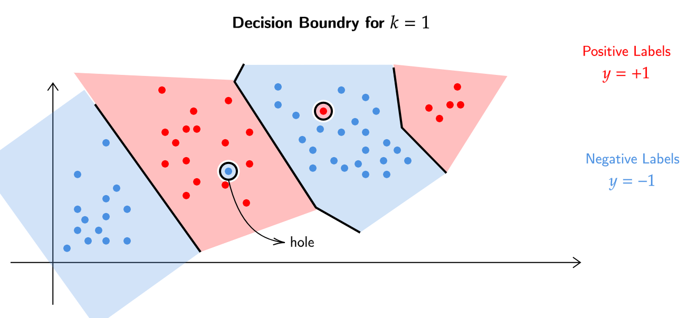

!!! note 
    Throughout the diagrams I have used red color to indicate a +1 or 
    positive label and blue color for -1 or a negative label 

# Classification
## Introduction to Binary Classification 
For a set of datapoints $\{ x_1 , x_2 , x_3 ... x_n \}$ where 
$x \in \mathbb{R}^d$ and labels $\{ y_1 , y_2 , y_3 ... y_n \}$ 
where $y \in \{ 0,1 \} / \{ -1,1 \}$.
Our goal is to get a function $h$ which maps the datapoints 
to the classes ($h:\mathbb{R}^d \to \{ 0,1 \}$).

### Loss Function 

$$\text{Loss}(h) = \frac{1}{n} \sum_{i=1}^n \mathbb{1}(h(x_i) \neq y_i)
\quad \quad \quad \mathbb{1}(z) = \begin{cases} 1 & \text{if true} \\
0 & \text{otherwise} \end{cases}$$

> Like in the case of linear regression , where we restricted the 
space for the loss function , to a linear space ; We can do something 
similar to that here too

$$\begin{equation*}
\begin{split}
\underset{h \in \mathcal{H}_\text{linear}}{\min} \sum_{i=1}^n \mathbb{1}(h(x_i) \neq y_i) \\
\\
\text{where,}\\
\\
\mathcal{H}_\text{linear} = \{ h_w : h_w(x) = \text{sign}(w^T x) \} \\
\text{sign}(z) = \begin{cases} 1 & \text{if z>0} \\ 0 & \text{otherwise} \end{cases}
\end{split}
\end{equation*}$$

> The above problem is an NP-Hard Problem in general.
In regression we used to take the gradient , set it to zero and find 
the $w$, that doesnt apply here because the loss here can only take 2 
discrete values (0 or 1) which makes this loss function non - differentiable
an non - continuous.

Can we somehow use linear regression to solve for this classification
problem?

For a dataset $\{(x_1 , y_1) , (x_2,y_2) , ... (x_n , y_n) \}$ , then we input
this dataset to a linear regression model which gives out a $w \in \mathbb{R}^d$.
At the end we use this $w$ to get $h_w$ by solving for $w^Tx =0$ ($h_w : \mathbb{R}^d \to \{ 0,1 \}$).

> Is this a good idea? Does this help us?

<video width="800"  controls>
    <source src="../videos/LinearLoss.mp4" type="video/mp4">
</video>

Now if we add more positive label datapoints ,

<video width="800" style="filter: none;" controls>
    <source src="../videos/LinearLoss_2.mp4" type="video/mp4">
</video>

We can see that the $w$ gets skewed which in turn changes $h_w$.
The above algorithm depends on a linear regression model which solves for $w$
by taking into account all the datapoints.

From a linear classification point of view , the classifying line $h_w$ shouldnt 
be changed when new datapoints are introduced on either side but from a
regression point of view these datapoints which are far apart from the classifying line 
,we are trying to minimize over all the datapoints , because of which  our $w$ gets 
tilted back and forth. 

> This will give us lines which dont actually classify the datapoints properly.

!!! abstract "Conclusion"
    Regression is sensitive to location of the datapoints and not just the 
    "side" on which the data lies with respect to the separator. 

## K-Nearest Neighbours (KNN)
> For some set of datapoints with corresponding labels , if a new datapoint's (for which we predict the label)
belongs to the training dataset , then we already have an answer for its (new datapoint's) label,
but what to do when it doesnt belong to the training dataset?

- Given a test points $x_\text{test} \in \mathbb{R}^d$ , find the closest 
point $x^*$ to $x_\text{test}$ in the training set.

- Predict $y_\text{test} = y^*$

> Is this a good algorithm? 

!!! failure "Issues with this algorithm" 
    - This algorithm can get affected by outliers. 
    - Lets say our nearest point to $x_\text{test}$ happens to be an outlier,
    then our algorithm will predict the same value as $y^*$ , which may label
    the point wrongly.

!!! note "Simple Fix for Issue Above"
    - Given $x_\text{test}$ , find the $k$ closest points in the training dataset 
    $(x_1^* , x_2^* , ... x_k^*)$.
    - Predict $y_\text{test} = \text{Majority}(y_1^* , y_2^* , ... y_k^*)$

We have to supply the parameter $k$ for the above fix , which the data does 
not tell us, so how many neighbours we should look for?

### Decision Boundry 
#### Case 1 (k = 1)
Lets look at the case when $k=1$,

**Note** that these datapoints already have specified labels which comes from
the dataset.

Because $k=1$ we get "holes" in certain regions for the decision boundry,
looking at it objectively the blue point in the red region and vis a vis are 
certainly outliers and should be ignored , but **our classification algorithm is 
sensitive to outliers.**

Also on the extreme right end we can see that there are some red points , which makes 
the whole area on the right region as red , ideally that should have been blue , 
as those extreme right red points are outliers.

> Now we know that taking $k=1$ is a bad idea. ;C

!!! info "Animation"
	<video width="800" style="filter: none;" controls>
    	<source src="../videos/KNN (k=1).mp4" type="video/mp4">
	</video>
	
	The nearest datapoint to $x_\text{test}$ (White Dot) is 
	the Positively Labelled (Red) Dot.

#### Case 2 (k=n)
Now lets look at the case when $k=n$

**Note** that these datapoints already have specified labels which comes from
the dataset.

Our algorithm here considers all the datapoints as closest , because $k=n$ , 
hence we take the majority of the labels and make the decision boundry.
In our case the majority of the labels are blue (negative) and hence the whole 
region is considered to be blue (negative).

In other words if we do a prediciton for a label of some point ,
our answer will always be negative (blue) label.

!!! warning "Problems Encountered"
    - Asking too few ($k=1$) neighbours gives us an outlier issue.
    - Asking too many ($k=n$) neighbours gives us the "majority label".

!!! info "Animation"
	<video width="800" style="filter: none;" controls>
    	<source src="../videos/KNN (k=n).mp4" type="video/mp4">
	</video>
	
	The Majority Label in the dataset is +1 (Red Dot)
	hence, $x_\text{test}$ (White Dot) is Positively Labelled.

> What to do then?

We must find such a $k^*$ that it ignores the outliers and yet it maintains 
a resonable decision boundry.

!!! info "Animation"
	<video width="800" style="filter: none;" controls>
    	<source src="../videos/KNN (k=k*).mp4" type="video/mp4">
	</video>
	
	- Here we took k=15.
	- It can be seen that $x_\text{test}$ (White Dot) lies 
	near a cluster of Positively Labelled (Red) Dots. 

> How do find the right number of neighbours ($k^*$)?

#### Chossing k*
We know that we can treat $k$ as an hyperparameter , because its not a part of 
the algorithm but rather the input which goes into the algorithm.

- We also know that , smaller the $k$ the more complicated the decision boundry is.
- To solve this , we choose different values of $k$ and cross validate for them 
respectively.

!!! failure "Issues with KNN Algorithm"
    - Choosing distance function (to identify the closest $k$ neighbours) might 
    become an issue.
    - When predicting a new datapoint $x_\text{test}$ we measure the distance of 
    $x_\text{test}$ from **all** the datapoints and then identify the $k$ nearest neighbours.
    Now if we want to predict the label for another datapoint , we have to repeat the whole 
    procedure again. This shows that we dont actually learn a "model" and our algorithm 
    solely relies on the datapoints. We cannot throw away the datapoints after learning a 
    "model" , because in the first place , **there is no model for KNN**.
    This is the biggest issue with KNN Algorithm.

## Introduction to Decision Trees 
The input for decision tree algorithm is the usual dataset 
$\{ (x_1,y_1) , (x_2,y_2) , ... (x_n,y_n) \}$ where for all $i$ , 
$x_i \in \mathbb{R}^d$ and $y \in \{ +1,-1 \}$.

The output of this algorithm is a "Decision Tree".

!!! question "What is a Decision Tree?"
    It is a tree-like structure where each internal node represents a 
    decision based on the value of a specific feature, each branch 
    represents the outcome of that decision, and each leaf node 
    represents the final predicted outcome or class label.

> How do we get a prediction for a point?

To get the prediction of a datapoint $x_\text{test}$ , we simply 
traverese through the decision tree , asking questions until we 
reach the leaf nodes.
At the end we assign the value of the leaf node to $y_\text{test}$.

The model here (which wasnt in there in KNN) is the decision tree ,
after training our dataset on the decision tree , we can get rid of 
the dataset and predict new "test points" by solely relying on the 
decision tree.

!!! question "Whats a question in a decision tree?"
    In a decision tree , a question is a feature-value 
    pair.

    Where the "feature" is the feature in the datapoint
    and the "value" is the number with which we compare 
    the "feature".

> How to measure goodness of a question?

For a dataset $D = \{ (x_1 , y_1), (x_2 , y_2), ... (x_n , y_n) \}$ , for 
a particular feature , we want to ask such a question that (ideally) it 
matches each datapoint to its label , in other words our predicition 
should be the same as the labels assigned to a datapoint in the dataset 
$D$.

In reality , such questions may not exist , this means we have to somehow
capture the notion of "impurity" for these questions.

### Measure of impurity for a set of datapoints 
For a dataset $D = \{ (x_1 , y_1), (x_2 , y_2), ... (x_n , y_n) \}$ , an
"impurity" function for a question can be given as 

$$\begin{equation*}
\begin{split}
\text{Entropy}(y_1 , y_2 , ... y_n) &= \text{Entropy}(p) \\
&= - (p \log_2 p + (1-p) \log_2 (1-p) ) \;\;\;\;\;\;\;\; [\text{convention} \;\; \log_2 0 = 0]
\end{split}
\end{equation*}$$

<video width="800"  controls>
    <source src="../videos/EntropyFunction.mp4" type="video/mp4">
</video>

- When $p=0$ or $p=1$ , it means that all of the datapoints 
are classified to a single label.
- At $p=0.5$ , entropy is the highest , hence its the worst case.
- **Note** that the entropy at $p$ and $1-p$ is always the same.
- By convention , $p = \frac{\text{Total Number of 1s}}{\text{Total Number of DataPoints}}$

> We know that for a given question , we assign labels to datapoints 
based on the question asked. A question always assigns datapoints to 
2 labels , either a 1 or -1. We can measure the entropy of the dataset $D$ and
the points which belong to the assigned labels , but how do we combine these 3
values (entropy of D , entropy of points assigned to label 1 , entropy of points 
assigned to label -1) into a singular value measure overall impurity?

### Information Gain 
Information Gain for a feature,value pair is given as,

$$\begin{equation*}
\begin{split}
\text{Information Gain}(\text{feature,value}) &= \text{Entropy}(D) - [\gamma \text{Entropy}(D_\text{yes}) + (1- \gamma)\text{Entropy}(D_\text{no})] \\
\\
\text{where,}\\
\\
\gamma &= \frac{|D_\text{yes}|}{|D|}
\end{split}
\end{equation*}$$

We use $\gamma$ to take into account the number of datapoints.
A dataset $\alpha$ with 100 datapoints , from which 99 are classified as 
label 1 and another dataset $\beta$ with 10000 datapoints , from which 9900 are
classified as label 1 , will have the same entropy but the measure of information 
gain will be higher for $\beta$ when compared to $\alpha$ , as the decision 
tree trained on $\beta$ was able to classify more datapoints.

## Decision Tree Algorithm
- Discretize each feature in the [min,max] range.
- Pick the question that has the highest information gain.
- Repeat the procedure for $D_\text{yes}$ and $D_\text{no}$.

> We can keep adding questions to the decision tree by using 
the above procedure , but where do we stop?

We stop adding new questions to the decision tree after we 
reach a certain "threshold of purity" , this is generally 
around 90% purity.

### Example of Decision Tree 

We classify the blue point on the right side as outlier when 
we use cross validation method.
If we were to keep adding more questions such that the outlier no longer 
lies in an "incorrect" region , the purity of the decision tree may increase
and so will the complexity.

Our goal is to make small decision trees with a respectable measure of
"purity".

## Generative and Discriminative Models 
In classical classification problems, two types of models are commonly employed:
generative models and discriminative models.

Generative models capture the joint distribution between features and labels
and are represented as:

$$P(x,y)$$

These models focus on modeling the feature generation process.

On the other hand, discriminative models directly model the conditional 
probability of labels given the features and are represented as:

$$P(y|x)$$

Discriminative models generate labels solely based on the provided data.

It is important to understand the differences between generative 
and discriminative models when choosing an appropriate modeling approach for a given
classification problem.

