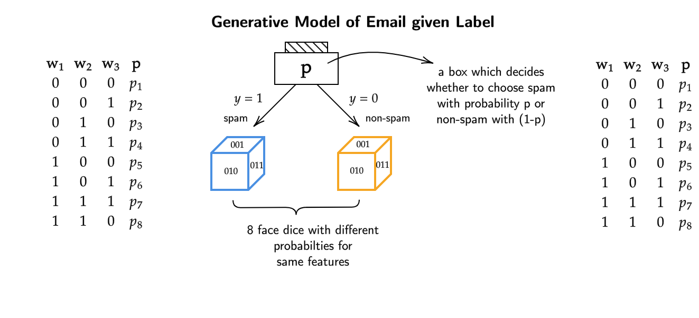

# Types of Models 

## Generative Model-Based Algorithm
For a dataset $D= \{ (x_1,y_1), (x_2,y_2), ... (x_n,y_n) \}$,
let $x$ and $y$ both be binary features such that $x_i \in \{ 0,1 \}^d$
and $y_i \in \{ 0,1 \}$

> Can features be binary? Does it even have an real life uses?

> The features can be binary and usually represent Yes/No type 
question. One of the examples is of spam classification of mail 
which we will be doing now.

### Spam Classifcication
For the spam classification of emails we will have to make $d$ 
length featuers for each email , even when the lengths and words 
of emails are different.

One of the ways we could do this is to make a very very long 
vector/list which stores the poisition of each word in a 
dictionary in ascending order.

!!! example 
    Lets say (for simplicity) our dictionary has 4 words,
    ["Welcome", "to" , "earth" , "aliens"]. Although, the 
    words arent ordered here, our feature vectors/lists will be 
    ordered.

    Now lets say that our mail has the following 2 words, "Welcome Aliens".
    We will encode it in such a way that each feature represents the poisition 
    and occurence of the word in dictionary.

    Feature vector of $d$ length for "Welcome Aliens" will be,
    [1 , 0 , 0 , 1].

To do Generative Modeling for our $d$ length feature vectors,
our next step would be assign probabilities to each word for 
being in the spam and non-spam category.

In other words each feature ($x$) has 2 possibilities of being 
spam or non-spam ($y$). Our task at hand is to assign probabilities
to all the features with all the possible combinations (2).

$$P(x,y) = \underbrace{P(x)}_{P (\text{email})} \times \underbrace{ P(y|x)}_{ P( \text{spam|email})}
= \underbrace{ P(y)}_{ P( \text{spam})} \times \underbrace{ P(x|y)}_{ P( \text{email|spam})}$$

> There are several advantages to writing $P(x,y)$ in such a way,
though we only care about at the end of the day is $P(y|x)$ , that is , given a feature vector 
what is probability it is spam or not spam.

> If we already know the structure of $P(y|x)$ we can ignore the probability of $P(x)$ , 
as it doesnt help us much with the predicition of a new test datapoint.
So in some sense, we can just do a discriminative model for $P(y|x)$ , instead of 
modeling $P(y|x)$ and $P(x)$.

In the second equation ($P(x|y) \times P(y)$) , we arent assuming a specific 
structure for $y$ given $x$ , instead we assume how labels are generated which 
is $P(y)$. Basically , we are assuming how to the structure/email will be given 
that we know the email is spam or not spam.

This is a more meaningful assumption as we have some way of understanding
for how the email will look like given that it is spam or not spam.
So now we will be modeling for $P(y)$ and $P(x|y)$.

### Generative Story for Email Given Label
To make a generative model we will now make generative story 
to train our model. Our generative story will have 2 steps,

- **Step 1**: Decide the label of the email by tossing a coin. $P(y_i = 1) = p$
- **Step 2**: Decide the features of the email using the label in previous step. 
$P(x_i | y_i)$

- In Step1 we are basically tossing a coin and if (lets say) comes out to be 
heads , we say that this email is spam with some probability $P$. The Step1 
is deciding on which type of email (spam or non-spam) are we trying to generate.

- In Step2 we are basically generating the email itself for a set of words with 
different probabilities (which sum upto 1) given we know which kind of email it is
from Step1.

We follow the **Step1** and **Step2** from our algorithm above,
and generate an email of features with $d$ length.

Now lets say our dictionary only had $3$ words, so the total
number of possible feature vectors will be $2^{d=3} = 8$, each 
feature can take 2 values (0,1).

For our spam category, the words like "lottery" , "win" will have
a higher probability as features than the non-spam category.

**Note** that the probability of each feature in a category represents 
its chance of occurence within that specific category.

Even if the feature vectors  on both the categories are the same , 
the sets of probabilities are different for both of them. Some of 
the probabilities might even be zero for for some features in (lets say)
spam category when compared to the non-spam category.

> Now if we want to learn a model from the above algorithm , 
we need to consider how many parameters are there for this coin 
and 2 dice.

- The coin has probability $p$ , so thats 1 of the parameters.
- The spam dice has $d$ probabilities , each probability coressponding 
to the combination of the features . Each feature has 2 possibilities (0,1),
for $d$ number of features we will have $2^d$ parameters. 
We know that all the probabilities sum upto 1 , 
which means we can always find out the $d^{\text{th}}$ probability 
using $2^d-1$ probabilities. Therefore at the end we are left with 
$2^d -1$ probabilities.
- The non-spam dice is the same as spam dice just the probabilities of the 
features is different , hence we will also have $2^d-1$ parameters for non-spam 
dice.

Our total number of parameters will be $1 + (2^d -1) + (2^d -1) = 2^{d+1} - 1$.

We can see that as we increase our number of features , the number of parameters 
increase exponentially. This is simply too many parameters to handle/compute.

If our dictionary had 10000 words , our parameters to compute would be 
$2^10000$ , to put that into perpective , this number is greater than the 
number of atoms in the entire observable universe.

