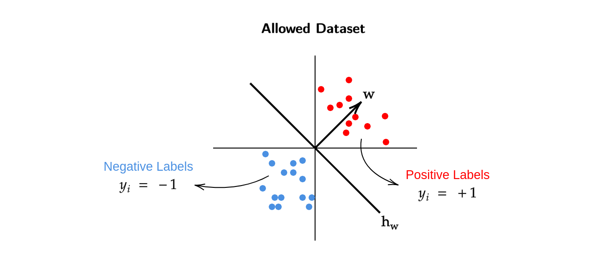
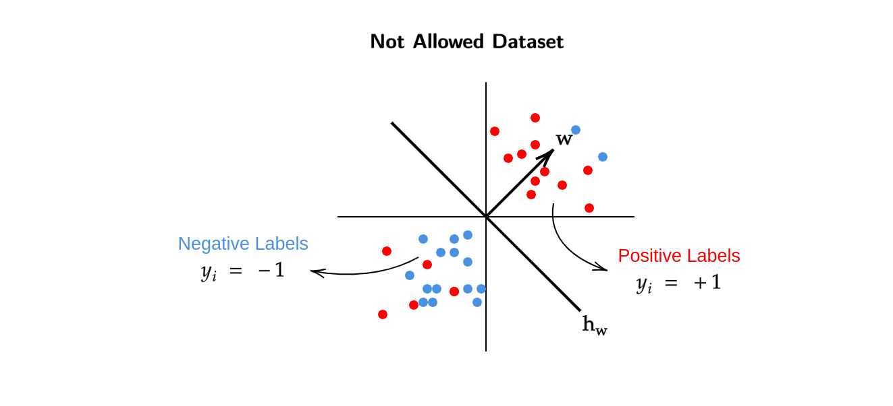
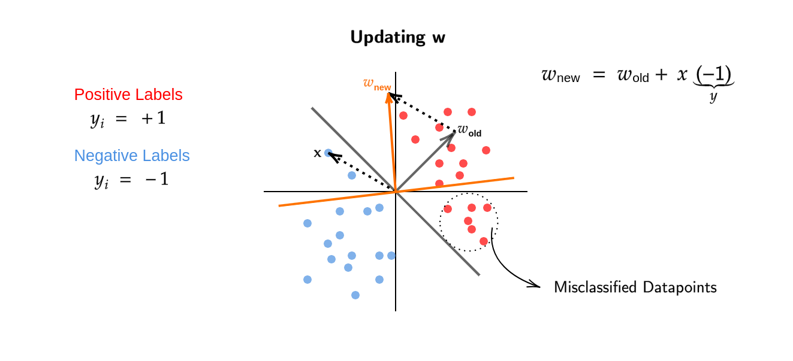

# Introduction 
Our goal in this week is to discover discriminative models which can be 
used for classification.

We want to create a discriminative model for $P(y=1|x)$ and the simplest 
model that one can think of is a linear classification model.

$$\begin{equation*}
P(y=1|x) = 
\begin{cases}
1 & \text{for } w^Tx \geq 0 \\
0 & \text{otherwise}
\end{cases}
\end{equation*}$$

> In generative model we looked at how $x$ was generated , but for a 
discriminative model we only care about how $y|x$ is generated.

### Linear Separatability Assumption 
From our above linear model to classify datapoints , either they 
will have the label 1 or label -1. This means there should be no 
outliers in a dataset and all the points belong to either side of 
$w^Tx = 0$ (Linear Separator).

<figure markdown>
  
  <figcaption> Here the data is linearly separable , there are not outliers in 
  this dataset.</figcaption>
</figure>

<figure markdown>
  
  <figcaption>This dataset is not allowed because there are 
  outliers and hence the dataset is not linearly spearabale.</figcaption>
</figure>

> If the "Not Allowed Dataset" is given to us then our assumption would be that 
the *labeler* used some $w$ which correctly classified all the datapoints , but
according to our current model such datasets are not possible. Hence we say that
this dataset is not allowed under our model.

>When we make strong assumptions like linear separatability of the dataset,
we hope to build fast and efficient algorithms, but do such algorithms really
exist? The short answer is Yes.

Our goal here was to get a discriminative model for classification which minimizes 
the zero-one loss over a dataset.

$$\underset{h \in \mathcal{H}}{\min} \sum_{i=1}^n \mathbb{1}( h(x_i) \neq y_i )$$

For a general dataset this is an NP-HARD problem even if $\mathcal{H}$ is considered 
to be linear.

Now if we get back to our "Linear Separatability Assumption" , then the loss for 
our algorithm will be 0 (on the training dataset) as it will be able to correctly 
classify all the datapoints because there are no outliers present.

$$\exists w \in \mathbb{R}^d \text{  s.t.  } \text{sign}(w^Tx) =y_i \forall i \in [n]$$

> There exists a $w$ such that sign($w^Tx$) = $y_i$ (we make the correct prediction) for 
all the $i$ (datapoints) in $[n]$ (dataset)

### Perceptron Algorithm
The Input for this algorithm is $\{ (x_1,y_1) , (x_2,y_2) , ... (x_n,y_n) \}$ where 
$x_i \in \mathbb{R}^d$ and $y_i \in \{+1,-1 \}$.

The algorithm is trying to find a $w$ that correctly classifies all the datapoints,
if such a $w$ exists.

This algorithm is an **iterative algorithm** and it starts with a $w^0$ , where $0$
indicates the iteration number and initially $w^0 = [0,0,0,...0]$ i.e. $w^0$ is a
zero vector.

**Until Convergence**

$$\begin{align}
& \text{Pick } (x_i, y_i) \text{ pair from the dataset}\\
& \text{If sign}(w^Tx_i) = y_i \\
\\
& \quad \text{Do nothing} \\
\\
& \text{else}\\
\\
& \quad \boxed{w^{t+1} = w^t + x_i y_i} \\
\\
& \text{end}
\\
\end{align}$$

Basically , we check if our current $w$ predicts the datapoint correctly , if it 
doesnt predict the datapoint correctly then we multiply the datapoint with its label
(+1 or -1) and add this product to our current $w$ until convergence.

Also note that the **update rule** here is the boxed equation,

$$ w^{t+1} = w^t + x_i y_i $$

## Understanding Perceptron Update Rule
In our current perceptron algorithm , two types of mistakes can happen

**Mistake Type 1**

- Predicted Label = +1 (sign $(w^Tx_i) \geq 0$)
- Actual Label = -1 ($y_i$ = -1)

**Mistake Type 2**

- Predicted Label = -1 (sign $(w^Tx_i) < 0$)
- Actual Label = +1 ($y_i$ = -1)

>When we encounter a mistake , we either make a mistake in prediction 
of Type 1 Category or Type 2 Category and then we update $w$ accordingly.
A general question to ask here would be , we have updated our $w$ on some
datapoint at $t^\text{th}$ iteration, but how does this $w^{t+1}$ 
($w^t$ after update) perform on the point where we made the mistake?

We know that,

$$\begin{equation*}
\begin{split}
w^{t+1} &= w^t + x_i y_i \\
\\
\text{Multiplying both sides by } x_i \\
\\
(w^{t+1})^T x_i &= (w^t + x_i y_i)^T x_i \\
&= w^{t^T} x_i + y_i ||x_i||^2 \\
\end{split}
\end{equation*}$$

>Lets assume that a mistake of Type 1 occurs.

$$ (w^{t+1})^T x_i = \underbrace{w^{t^T} x_i}_{\geq 0} + \underbrace{\underbrace{y_i}_{-1} \underbrace{||x_i||^2}_{\geq 0}}_{\text{Negative}}$$

Here $y_i = -1$ represents the "actual" label of $x_i$ and $||x_i||^2$ 
will always be positive because it is squared.

The product of $y_i$ and $||x_i||^2$ will be less than zero (negative).

> Now what does all this mean?

In a Type 1 Mistake , we predicted the label to be positive (+1) because our 
$w^T x_i \geq 0$ , but it should have been negative (as the actual label is -1).
We can see that the product of $y_i$ and $||x_i||^2$ will be negative and will 
get subtracted from $w^{t^T} x_i$ which will shift the $w$ towards the negative 
direction. This doesnt mean that $w$ will immediately give a negative dot product
just after this iteration (where we made the Type 1 Mistake) but **it does moves/shifts 
the $w$ to the correct direction.**

**Conclusion** : Update rule pushes $w$ in the right direction.

> The update of $w$ we discussed fixes the prediction for the "current" datapoint,
but does does it affect the prediction of previous datapoints (which predicted 
correctly )? In on overall sense , does our current algorithm give use the best $w$?

Here we can see that updating $w$ for a point $x$ leads to misclassification of 
some datapoints which were correctly classified before.
