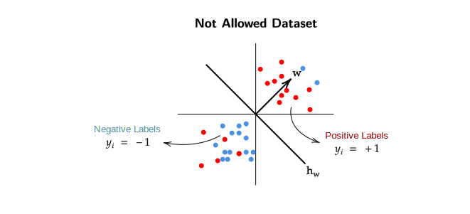
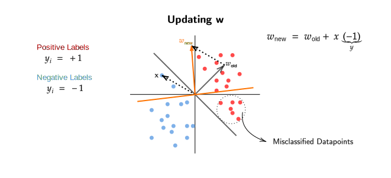
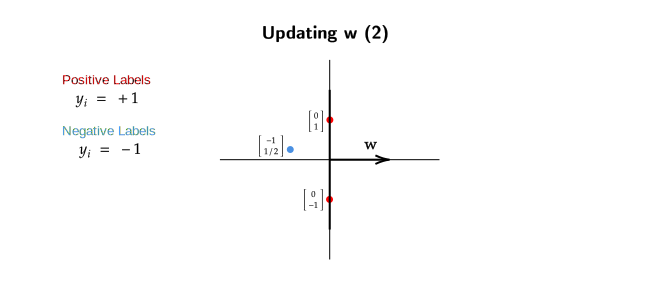
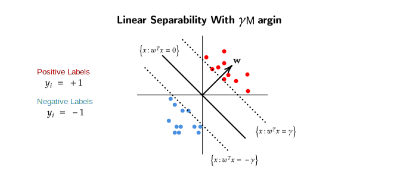
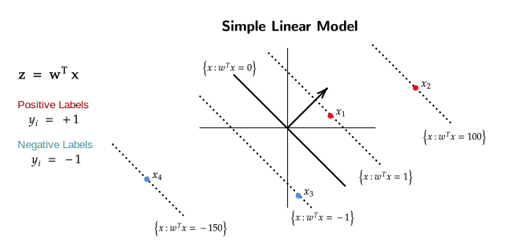
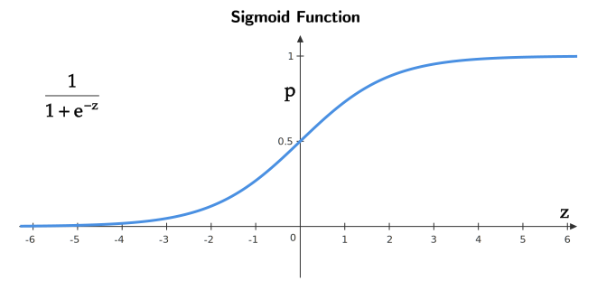
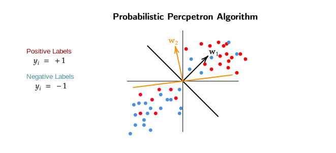

# Logistic Regression
## Introduction 
Our goal in this week is to discover discriminative models which can be 
used for classification.

We want to create a discriminative model for $P(y=1|x)$ and the simplest 
model that one can think of is a linear classification model.

$$\begin{equation*}
P(y=1|x) = 
\begin{cases}
1 & \text{for } w^Tx \geq 0 \\
0 & \text{otherwise}
\end{cases}
\end{equation*}$$

> In generative model we looked at how $x$ was generated , but for a 
discriminative model we only care about how $y|x$ is generated.

### Linear Separatability Assumption 
For our above linear model to be able to classify datapoints , 
the datapoints must have either label 1 or label -1. 
This means there should be no  outliers in a dataset and all 
the points should belong to either side of $w^Tx = 0$ (Linear Separator).

<figure markdown>
  
  <figcaption> Here the data is linearly separable , there are no outliers in 
  this dataset.</figcaption>
</figure>

<figure markdown>
  
  <figcaption>This dataset is not allowed because there are 
  outliers and hence the dataset is not linearly spearabale.</figcaption>
</figure>

> If the "Not Allowed Dataset" is given to us then our assumption would be that 
the *labeler* used some $w$ which correctly classified all the datapoints , but
according to our current model such datasets are not possible. Hence we say that
this dataset is not allowed under our model.

>When we make strong assumptions like linear separatability of the dataset,
we hope to build fast and efficient algorithms, but do such algorithms really
exist? The short answer is Yes.

Our goal here was to get a discriminative model for classification which minimizes 
the zero-one loss over a dataset.

$$\underset{h \in \mathcal{H}}{\min} \sum_{i=1}^n \mathbb{1}( h(x_i) \neq y_i )$$

For a general dataset this is an NP-HARD problem even if $\mathcal{H}$ is considered 
to be linear.

Now if we get back to our "Linear Separatability Assumption" , then the loss for 
our algorithm will be 0 (on the training dataset) as it will be able to correctly 
classify all the datapoints because there are no outliers present.

$$\exists w \in \mathbb{R}^d \text{  s.t.  } \text{sign}(w^Tx) =y_i \forall i \in [n]$$

> There exists a $w$ such that sign($w^Tx$) = $y_i$ (we make the correct prediction) for 
all the $i$ (datapoints) in $[n]$ (dataset)

### Perceptron Algorithm
The Input for this algorithm is $\{ (x_1,y_1) , (x_2,y_2) , ... (x_n,y_n) \}$ where 
$x_i \in \mathbb{R}^d$ and $y_i \in \{+1,-1 \}$.

The algorithm is trying to find a $w$ that correctly classifies all the datapoints,
if such a $w$ exists.

This algorithm is an **iterative algorithm** and it starts with a $w^0$ , where $0$
indicates the iteration number and initially $w^0 = [0,0,0,...0]$ i.e. $w^0$ is a
zero vector.

**Until Convergence**

$$\begin{align}
& \text{Pick } (x_i, y_i) \text{ pair from the dataset}\\
& \text{If sign}(w^Tx_i) = y_i \\
\\
& \quad \text{Do nothing} \\
\\
& \text{else}\\
\\
& \quad \boxed{w^{t+1} = w^t + x_i y_i} \\
\\
& \text{end}
\\
\end{align}$$

Basically , we check if our current $w$ predicts the datapoint correctly , if it 
doesnt predict the datapoint correctly then we multiply the datapoint with its label
(+1 or -1) and add this product to our current $w$ until convergence.

Also note that the **update rule** here is the boxed equation,

$$ \boxed{w^{t+1} = w^t + x_i y_i} $$

## Understanding Perceptron Update Rule
In our current perceptron algorithm , two types of mistakes can happen

!!! failure "Mistake Type 1"
    - Predicted Label = +1 (sign $(w^Tx_i) \geq 0$)
    - Actual Label = -1 ($y_i$ = -1)

!!! failure "Mistake Type 2"
    - Predicted Label = -1 (sign $(w^Tx_i) < 0$)
    - Actual Label = +1 ($y_i$ = +1)

>When we encounter a mistake , we either make a mistake in prediction 
of Type 1 Category or Type 2 Category and then we update $w$ accordingly.
A general question to ask here would be , we have updated our $w$ on some
datapoint at $t^\text{th}$ iteration, but how does this $w^{t+1}$ 
($w^t$ after update) perform on the point where we made the mistake?

We know that,

$$\begin{equation*}
\begin{split}
w^{t+1} &= w^t + x_i y_i \\
\\
\text{Multiplying both sides by } x_i \\
\\
(w^{t+1})^T x_i &= (w^t + x_i y_i)^T x_i \\
&= w^{t^T} x_i + y_i ||x_i||^2 \\
\end{split}
\end{equation*}$$

>Lets assume that a mistake of Type 1 occurs.

$$ (w^{t+1})^T x_i = \underbrace{w^{t^T} x_i}_{\geq 0} + \underbrace{\underbrace{y_i}_{-1} \underbrace{||x_i||^2}_{\geq 0}}_{\text{Negative}}$$

Here $y_i = -1$ represents the "actual" label of $x_i$,

- $||x_i||^2$ will always be positive because it is squared.
- The product of $y_i$ and $||x_i||^2$ will be less than zero (negative).

> Now what does all this mean?

In a Type 1 Mistake , we predicted the label to be positive (+1) because our 
$w^T x_i \geq 0$ , but it should have been negative (as the actual label is -1).
We can see that the product of $y_i$ and $||x_i||^2$ will be negative and will 
get subtracted from $w^{t^T} x_i$ which will shift the $w$ towards the negative 
direction. 

This doesnt mean that $w$ will immediately give a negative dot product
just after this iteration (where we made the Type 1 Mistake) but **it does moves/shifts 
the $w$ to the correct direction.**

**Conclusion** : Update rule pushes $w$ in the right direction.

> The update of $w$ we discussed fixes the prediction for the "current" datapoint,
but does it affect the prediction of previous datapoints (which was predicted 
correctly )? In on overall sense , does our current algorithm give use the best $w$?

### Redifining Linear Separatability
!!! info "Case 1"
    

    Here we can see that updating $w$ for a point $x$ leads to misclassification of 
    some datapoints which were correctly classified before.
    
    !!! info "Animation"
		<video width="800" style="filter: none;" controls>
	    	<source src="../videos/PerceptronAlgorithm.mp4" type="video/mp4">
		</video>
		
		- It can be seen that at the end when the new weight vector (yellow)
		is created , it misclassifies the circled points , which were correctly
		classified by the old weight vector (white).

!!! info "Case 2"
    

> Is this data linearly separable?

At first glance this dataset might look linearly separable , but in according to 
our current algorithm **this dataset is not linearly separable**.

>How? Why?

One might say that $w$ lying on x-axis (below diagram) separates the dataset.

Now lets see how the perceptron algorithm work on this dataset.

!!! abstract "Iteration 1"

    Initially $w^0 = [0,0]$ 

    $\large{\substack{w^{0^T}x_1 = 0 \\ \hat{y} = +1}, \;\; \substack{w^{0^T}x_2 = 0 \\ \hat{y} = +1}, \;\; \boxed{\substack{w^{0^T}x_3 = 0 \\ \hat{y} = +1}}}$

!!! abstract "Iteration 2"
    Our algorithm made a mistake in prediciton of the third (boxed) datapoint.
    Now we will update $w$ as a mistake in prediciton occured,

    $w^1 = w^0 + x_3 y_3 = \begin{bmatrix} 1 \\ -1/2 \end{bmatrix}$

    After updating $w$ we again run the algorithm,
  
    $\large{\boxed{\substack{w^{1^T}x_1 = -0.5 \\ \hat{y} = -1}}, \;\; \substack{w^{1^T}x_2 = 0.5 \\ \hat{y} = +1}, \;\; \substack{w^{1^T}x_3 = -1.25 \\ \hat{y} = -1}}$

!!! abstract "Iteration 3"
    Our algorithm made a mistake in prediciton of the third (boxed) datapoint.
    Now we will update $w$ as a mistake in prediciton occured,

    $w^2 = w^1 + x_1 y_1 = \begin{bmatrix} 1 \\ 1/2 \end{bmatrix}$

    $\large{\substack{w^{1^T}x_1 = 0.5 \\ \hat{y} = +1}, \;\; \boxed{\substack{w^{1^T}x_2 = -0.5 \\ \hat{y} = -1}}, \;\; \substack{w^{1^T}x_3 = -0.75 \\ \hat{y} = -1}}$

!!! abstract "Iteration 4"

    Our algorithm made a mistake in prediciton of the second (boxed) datapoint.
    Now we will update $w$ as a mistake in prediciton occured,

    $w^3 = w^0 + x_2 y_2 = \begin{bmatrix} 1 \\ -1/2 \end{bmatrix}$

    We can see that this $w^3$ is the same as $w^1$ , which means if we go ahead with
    this iteration we run into again predict the second datapoint wrong and hence
    the loop will keep on running without stopping. At the end , our perceptron 
    algorithm will never give us a $w$ which classifies all the points correctly 
    and the algorithm will never converge.

**In such an edge case , there exists no $w$ which will correctly classify all 
the datapoints , even though , at first the dataset may look linearly separable**

!!! info "Animation"
	<video width="800" style="filter: none;" controls>
    	<source src="../videos/PerceptronAlgorithm2.mp4" type="video/mp4">
	</video>
	
	- In each iteration the incorrectly predicted point is highlighted 
	in yellow color.
	- Points on the right side of the Decision Boundry are predicted as +1 (positive),
	while points on the left side are predicted as -1 (negative)
	- Even after several iterations it can be seen that the weight vector keeps going
	back and forth between `w=[1,0.5]` and `w=[1,-0.5]`.
	- Hence we can see that the algorithm will never converge.

> Why does this happen?

One of the reasons is , the given dataset is not strictly linearly separable 
as some of the datapoints lie on the decision boundry itself and we chose to 
label such datapoints as +1 , though they can also be labeled as -1.

> What to do to solve this issue?

We can apply more stricter "assumptions" on our dataset to account for the 
edge case described above.

A dataset is linearly separable with $\gamma$ margin if,

$\exists w^* \in \mathbb{R}^d \quad \text{s.t. } \quad (w^{*^T}x_i)y_i \geq \gamma \forall i \quad \text{for some } \gamma > 0$

(There exists a $w^*$ such that $(w^{*^T}x_i) y_i \geq \gamma$ for all the datapoints where $\gamma > 0$)

This assumption makes it so that there are no datapoints between the parallel 
dotted lines , in other words , this also means that no points will lie on 
$w^T x = 0$

## Proof of Convergence of Perceptron Algorithm
To prove the convergence of the algorithm we are going to make a few 
assumptions about the dataset

1. Linear Separatability with $\gamma$ margin.
2. Radius Assumption 

    - $\forall i \in D \quad ||x_i||_2 \leq R \quad \text{for some } R > 0$
    - This basically means that all the points in dataset $D$ fall within a 
    circle of radius $R$.

3. Without loss of generality , assume $||w^*|| = 1$
    - This basically means that we have normalized our $w$ get $w^*$.

We will now try to quantify the number of mistakes our aglorithm can make ,
if the number of mistakes is finite then it means the number of iterations 
is also finite , therefore , our algorithm must converge.  

### Analysis of 'Mistakes' of Perceptron Algorithm

- Observe that an update in perceptron algorithm only happens when a 
mistake occurs.

- Say $w^l$ is the current guess and a mistake happens w.r.t (x,y).

#### Bound 1
> Now we will take look at what happens to the length of $w$ after an
update

$$\begin{equation*}
\begin{split}
w^l &= w^{l-1} + xy \\
||w^l||^2 &= ||w^{l-1} + xy||^2 \\
&= (w^{l-1} + xy)^T (w^{l-1} + xy) \\ 
&= \underbrace{||w^{l-1}||^2}_{\geq 0} + \underbrace{2(w^{{l-1}^T} x)y}_{\leq 0} + \underbrace{||x||^2 \underbrace{y^2}_{\pm1}}_{\leq R^2} \\
\\
\therefore ||w^l||^2 &\leq ||w^{l-1}||^2 + R^2 \\
&\leq (||w^{l-2}||^2 +R^2 ) + R^2 \\ 
&\vdots \\
&\leq ||w^0||^2 + l R^2 \\
\\
\boxed{\therefore ||w^l||^2 \leq l R^2} \\ 
\end{split}
\end{equation*}$$

!!! note 
    - The reason why $y^2$ is always greater than zero because it is this label of 
    of the datapoints and can only take value of either +1 or -1.
    - ||w||^2 will also be always greater than or equal to zero as square of any real
    number is always a positive number ($w$ is just a vector comprising of real numbers)
    - Product of $||x||^2$ and $y^2$ will always be less than or equal to $R^2$ because
    as per our assumption , all the points lie within a circl of radius $R$.
    - $2(w^{{l-1}^T} x) y$ will always be less than one because an update only happens 
    when a mistake occurs,
        - If actual label is +1 and predicted label is -1 , this implies $w^T x < 0$ i.e.
        its a negative value and the (actual) label is a positive value , product of 
        negative and positive values is always negative.
        - Similarly , if actual label is -1 and predicted label is +1, this implies $w^T x \geq 0$ 
        i.e its a positive value and the (actual) label is a negative value , product of 
        positive and negative values is always negative.

#### Bound 2
We will now use $w^*$ (the best $w$ which exists) to obtain another bound for 
number of mistakes.

$$\begin{equation*}
\begin{split}
w^l &= w^{l-1} + x y \\ 
(w^l)^T w^* &= (w^{l-1} + xy)^T w^* \\
&= w^{{l-1}^T} w^* + \underbrace{(w^{*^T} x)y}_{\geq \gamma} \\ 
\\
\therefore (w^l)^T w^* &\geq (w^{l-1})^T w^* + \gamma \\
& \geq (w^{{l-2}^T} w^* + \gamma) + \gamma \\
& \vdots \\
& \geq \underbrace{(w^0)^T w^*}_{0} + l \gamma \\ 
\\
\therefore (w^l)^T w^* &\geq l \gamma \\
\\
((w^l)^T w^*)^2 &\geq l^2 \gamma^2 \\
\\ 
||w^l||^2 \underbrace{||w^*||^2}_{1} &\geq l^2 \gamma^2 \text{ Using Cauchy-Schwarz Inequality }  \\
\boxed {\therefore ||w^l||^2 \geq l^2 \gamma^2}
\end{split}
\end{equation*}$$

!!! abstract "Cauchy-Schwarz Inequaltiy"
    We know that,

    $$ -1 \leq \cos(\theta) \leq 1 $$

    Multiplying the product of norm of some vectors $v$ and $w$ in
    the above equation,

    $$\begin{equation*}
    \begin{split}
    -||v|| \times ||w|| \leq ||v|| &\times ||w|| \cos(\theta) \leq ||v|| \times ||w|| \\
    -||v|| \times ||w|| \leq v &\cdot w  \leq ||v|| \times ||w|| \\
    |v \cdot w| &\leq ||v|| \times ||w||
    \end{split}
    \end{equation*}$$
    
    **Note** : Dot product of any 2 vectors is given by $x \cdot y = ||x|| \times ||y|| \cos(\theta)$

!!! note 
    - In the above assumptions we said that norm of $w^*$ is 1.

#### Radius Margin Bound
Now that we have both upper and lower bound of $||w^l||$,

$$\begin{equation*}
\begin{split}
l^2 \gamma^2 &\leq ||w^l||^2 \leq l R^2 \\
l^2 \gamma^2 &\leq l R^2 \\
\therefore l &\leq \frac{R^2}{\gamma^2}\\
\end{split}
\end{equation*}$$

**Conclusion**: A dataset which follows all the assumptions above , its mistakes 
are always less than or equal to Radius in which all the datapoints lie divided by 
the margin gamma with respect to the optimal $w^*$.

> As the number of mistakes now can be quantified , we can say that this perceptron 
algorithm will converge.

## Sigmoid Function for Modeling Class Probabilities
We know that Perceptron Algorithm makes a linear separatability assumption , 
if we were to write that in probabilistic manner , then one way to do that 
would be,

$$\begin{equation*}
P(y=1|x) =
\begin{cases}
1 & \text{if } w^T x \geq 0 \\
0 & \text{otherwise}
\end{cases}
\end{equation*}$$

As the probabilities of the are 1 and 0 for a given datapoint , the perceptron 
algorithm only works on linearly separable datasets. 

If the [dataset](#linear-separatability-assumption) has points which are not linearly separable but appear to be outliers,
our perceptron algorithm is unable to run on such a dataset.

> Can we somehow relax the probabilities for a given datapoint? 
So that the perceptron algorithm also works on datasets which are not linearly 
separable.

### Simple Linear Probabilistic Model 
We will now start building up to a reasonable algorithm which has realaxed probabilities.
We will start with a simple linear model where the score ($z$) of a datapoint is 
given by $z = w^T x$. 

We are going to allow any point to be labeled as +1 or -1 , but the deciding factor
for which label will +1 or -1 will be based on the score ($z$) of the datapoint.
The higher the score of a label is , the higher will be its probability of being 
labeled as +1 , similarly the lower the score of the datapoint is , the higher
will be its probability of being labeled as -1.

> An intuitive way to think about this would be that , $x_2$ is farther away from the
decision boundry/linear separator , hence we're more confident that $x_2$ should be 
labeled as +1 when compared to $x_1$ which is much much closer to the decision boundry.

!!! example 
    In the above diagram , 
    
    - $x_1$ will have a lower score when compared to $x_2$ ($w^T x_1 < w^T x_2$),
    this means that probability of $x_1$ being labeled as +1 is lower than 
    probability of $x_2$ being labeled as +1 ($P(y = 1 | x_1) < P(y = 1 | x_2)$).

    - Similarly , $x_4$ is farther away than $x_3$ , which means that $x_4$ has 
    higher probability of being labeled as -1 when compared to $x_3$ 
    ( $P(y = -1 | x_3) < P(y = -1 | x_4)$).

According to this simple linear model , **every point has the probability to be 
labeled as +1 or -1 , just the chance that it gets labeled (+1 or -1) depends on
how far it is form the decision boundry.** 

!!! failure "Problems With Current Linear Model"
    We can calculate the score for any datapoint given a $w$ but we dont have 
    function/method to convert this score to a probability.

To convert the score to a probability will use the Sigmoid Function.

This function goes from $0 \to 1$ over the domain of $(-\infty , \infty)$ and 
is given by $g(z) = \frac{1}{1 + e^{-z}}$.
Here , $z = w^T x$.

**Hence, with sigmoid function we define probabilities of a datapoint being 
labeled as +1 or -1 which means datasets which were previously
[not allowed](#linear-separatability-assumption) are now allowed for our 
Probabilistic Perceptron Algorithm.**

## Logistic Regression 
We have developed Probabilistic Perceptron Algorithm , which labels datapoints 
on certain score (z) , but the problem with our current approach is that there may 
exist many $w$ which correctly classify the datapoints. We dont have any method to 
identify the best $w$ among all the $w$'s which classify the datapoints.

Here $w_1$ and $w_2$ both will be able to classify the datapoints , but which amongst
them is a better $w$?

This seems to be problem of maximum liklihood which can be solved using using the
traditional method of derivative of log-likelihood.

For a dataset $D = \{(x_1 , y_1) , (x_2 , y_2) , ... (x_n , y_n) \}$, where $x_i \in \mathbb{R}^d$
and $y_i \in \{-1 , 1 \}$

We know that,

$$ P(y=1|x) = g(w^T x_i) = \frac{1}{1 + e^{- w^T x}} $$

The maximum likelihood expression will be,

$$\begin{equation*}
\begin{split}
\mathcal{L}(w;D) &= \prod_{i=1}^n (g(w^T x_i))^{y_i} (1 - g(w^T x_i))^{1 - y_i} \\ 
\log( \mathcal{L}(w;D) ) &= \sum_{i=1}^{n} y_i \log(g(w^T x_i)) + (1 - y_i) \log(1 - g(w^T x_i)) \\
&= \sum_{i=1}^{n} y_i \log (\frac{1}{1 + e^{-w^T x_i}}) + (1 - y_i) \log (\frac{e^{-w^T x_i}}{1 + w^{-w^T x_i}}) \\
&= \sum_{i=1}^{n} [(1 - y_i)(-w^T x_i) -log(1 + e^{-w^T x_i})] \\
\end{split}
\end{equation*}$$

??? note 
    - Our assumption here is the probabilities are generated independent of other labels.
    - The above Maximum Likelihood is very similar to Maximal Likelihood of a bernoulli 
    random variable.

Our goal now is maximize the above equation with respect to $w$ , so that we get the 
best possible $w$,

$$ \underset{w}{\max} \sum_{i=1}^{n} [(1 - y_i)(- w^T x_i) - \log(1 + e^{- w^T x_i})] $$ 

However , the above equation doesnt have a closed-form solution when a derivative is taken
to solve further. Therefore, we will use gradient descent to identify the best $w$.

The gradient descent of the above log-likelihood function will be,

$$\begin{equation*}
\begin{split}
\nabla \log (\mathcal{L}(w;D)) &= \sum_{i=1}^{n} \left[(1 - y_i)(-x_i) - \frac{e^{-w^T x_i}}{1 + e^{-w^Tx)i}} (-x_i)  \right] \\
&= \sum_{i=1}^{n} \left[ -x_i + x_i y_i + x_i \left( \frac{e^{-w^T x_i}}{1 + e^{-w^Tx_i}} \right)  \right] \\
&= \sum_{i=1}^{n} \left[ x_iy_i - x_i \left( \frac{1}{1 + e^{-w^T x_i}} \right) \right] \\
\nabla \log(\mathcal{L}(w;D)) &= \sum_{i=1}^{n} \left[ x_i \left(y_i - \frac{1}{1 + e^{-w^T x_i}}  \right)  \right]
\end{split}
\end{equation*}$$

Using the Gradient Descent formula we get,

$$\begin{equation*}
\begin{split}
w_{t+1} &= w_t + \mathcal{n}_t \nabla \log ( \mathcal{L}(w;D))\\
&= w_t + \mathcal{n}_t \left( \sum_{i=1}^n x_i \left(\overbrace{y_i - \underbrace{\frac{1}{1 + e^{-w^Tx_i}}}_{g(w^T x_i)}}^{\theta_i}  \right)  \right)
\end{split}
\end{equation*}$$

!!! note 
    - The term after $y_i$ is the Sigmoid Function which outputs a probability for a certain 
    score of a datapoint.
    - Lets say for a point the actual label is +1 and it is predicted correctly as +1 ($y_i = 1$) , this 
    means that the point has a higher probability (lets say $g(w^Tx_i) = 0.9$) when compared to the other 
    binary label, which was derived from the sigmoid function.
    This also means that $\theta_i$ will be a small value as $1 - 0.9 = 0.1$. This also means that 
    this particular datapoint will not have much effect on the direction of the gradient descent algorithm.
    - **Prediction of a datapoint $x_\text{test}$ is given by** ,

    $$ y_\text{test} = \text{sign}( \hat{w}^T x_\text{test} ) $$

### Advantages of Logistic Regression
- There is a kernel version for the above equation as it can be argued that 
$w = \sum_{i=1}^n \alpha_i x_i$

- Regularized Version for the above equation is ,

$$\underset{w}{\min} \sum_{i=1}^n \left[ \log(1 + e^{-w^T x_i}) + w^T x_i (1-y_i) \right] + \underbrace{\frac{\lambda}{2} ||w||^2}_{\text{Regularizer}} $$

Here $\lambda$ is Cross Validated Hyperparameter.

