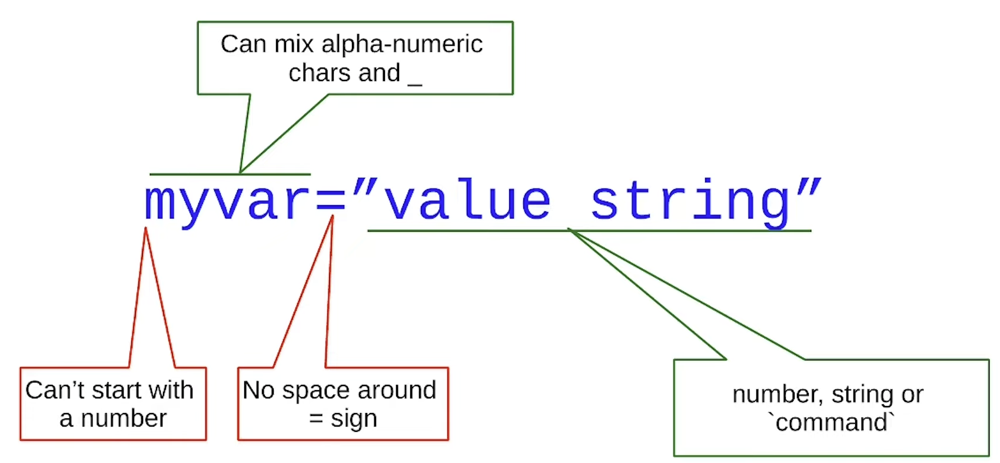
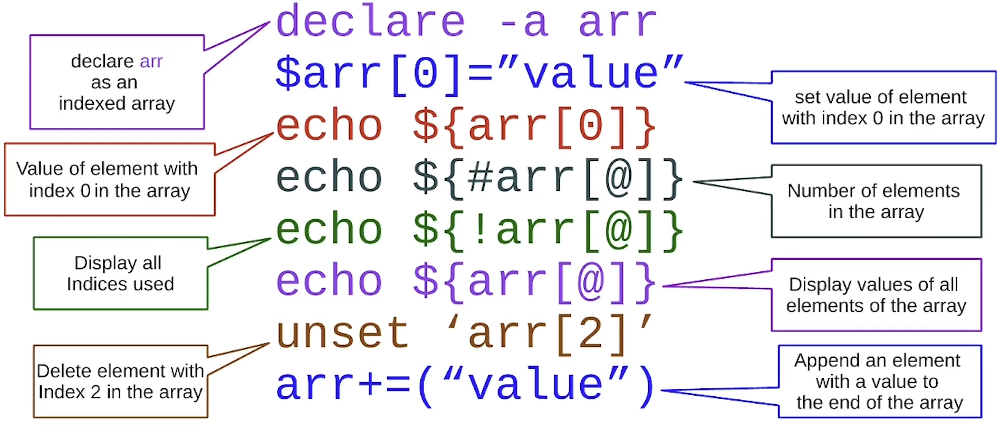
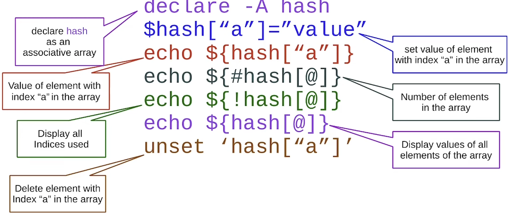

## Shell Variables (Part 1)

### Creating Shell Variables
{width="500"}

### Exporting Shell Variables
Exporting a variable makes it available to the parent shell as well 
as the children shell.

> If a variable is set in the parent shell then it wont be accessible
in the child shell. To make the value of the variable available in the child
shell , exporting is used.

!!! note 
    Any changes made in the child shell to an exported variable (from parent shell)
    will not be reflected in the parent shell.

```bash
export myvar="value string"
```
**or**  

```bash
myvar="value string"
export myvar
```

### Using Variable Values 
The value of the variable is displayed using the `echo` command.

```bash
echo $myvar 
echo ${myvar}
echo "${myvar}_something"
```
Using curly braces helps in manipulating the value of the variable 
for the desired output.

### Removing a variable
```bash
unset myvar
```

**The value of the variable can also be removed by doing**
```bash
myvar=
```
> Note : There is nothing after the `=` sign in the above command.

### Testing if a variable is set 

```bash
[[ -v myvar ]];
echo $?
```
**Return Codes**  
0 : success (variable is set)  
1 : failure (variable is not set)

!!! note 
    `echo $?` returns the exit code of the last executed command.  
    A status code of 0 means that the command was executed successfully
    and a stuatus code of non-zero value means that the command resulted in 
    an error or failed to execute.

### Testing if a variable is **not** set
```bash
[[ -z ${myvar+x} ]];
echo $?
```

Here `x` can be any string.

**Return Codes**  
0 : success (variable is not set)  
1 : failure (variable is set)

### Substitue default value
If the variable **is not set**, display "bananas" 
as its default value

```bash
echo ${myvar:-"bananas"}
```

If the variable **is not set**, change its 
value to "bananas" and display its value as "bananas".

```bash
echo ${myvar:="bananas"}
```

### Reset value if variable is set
If the variable `myvar` **is set**, then set "wutermellon"
as its value

```bash
echo ${myvar:+"wutermellon"}
```

### List of variable names

```bash
echo ${!H*}
```
This will give a list of shell variables that start with `H`.

### Length of (string) value of variable 
```bash
echo ${#myvar}
```

If `myvar` is not set then it displays `0`.

### Slice of (string) value of variable
```bash
echo ${myvar:5:4}
```

This will display 4 characters of the value and 
will also skip the first 5 characters of the value.  
Here `5` is the offset and `4` is the slice length.

The offset can also be negative. All the characters to the left
of the index -2 are ignored.

```bash
echo ${myvar: -2:9}
```

### Remove matching pattern
```bash
echo ${myvar#pattern}
```

This will only remove the matched pattern once.

```bash
echo ${myvar##pattern}
```

This will match the pattern maximum number of times 
and remove them.

### Keep matching pattern
```bash
echo ${myvar%pattern}
```

This will display the matched pattern only once.

```bash
echo ${myvar%%pattern}
```

This will display the matched pattern maximum 
number of times.

### Replace matching pattern 

```bash
echo ${myvar/pattern/string}
```

This will match once and replace it with the string.

```bash
echo ${myvar//pattern/string}
```

This will match maximum number of times with the pattern 
and replace it with the string.

### Replace matching pattern by location 

```bash
echo ${myvar/#pattern/string}
```
This will match the pattern at beginning of the value and
replace it with the string.

```bash
echo ${myvar/%pattern/string}
```

This will match the pattern at the end of the value and 
replace it with the string

### Changing Case 
#### Changing to Lowercase
```bash
echo ${myvar,}
```
This will change the first character to lowercase

```bash
echo ${myvar,,}
```

This will change all the characters to lowercase.

#### Changing to Uppercase
```bash
echo ${myvar^}
```

This will change the first character to uppercase.

```bash
echo ${myvar^^}
```

This will chane all the characters to uppercase.

### Restricting value types of a variable

```bash
declare -i myvar
```
This will make it so that only integers can be assigned to 
`myvar`.

```bash
declare -l myvar
```
This will make it so that only lowercase characters can
be assigned to `myvar`.

```bash
declare -u myvar
```
This will make it so that only uppercase characters can
be assigned to `myvar`.

```bash
declare -r myvar
```

This will make it so that the variable is read only.

### Removing restrictions on types of a variable


```bash
declare +i myvar
```
```bash
declare +l myvar
```
```bash
declare +u myvar
```
This will remove the restrictions on `myvar`.  
In the case of read-only restriction , removing it is 
not possible.

### Indexed Arrays
{width="700"}

The index of arrays in bash need not be in succession.

### Associative Arrays
{width="700"}
