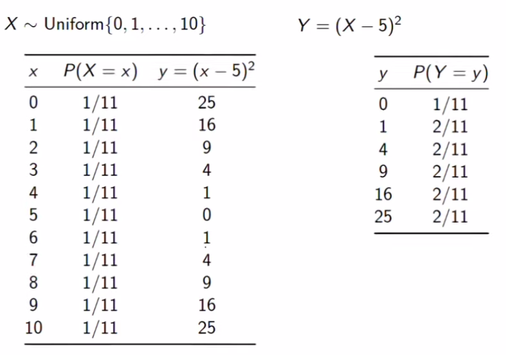
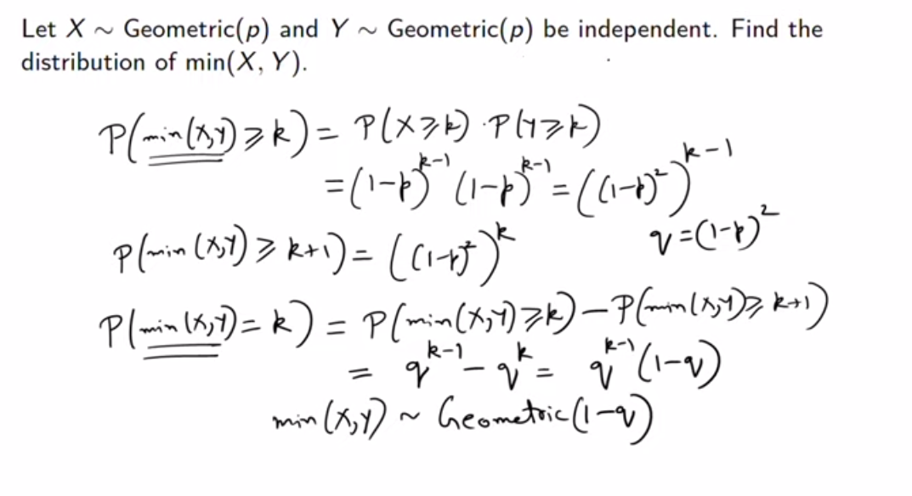

# Extra Content
## Visualizing Random Variables 
Sometimes we dont want the usual representation of random variables,
that is when we use functions. Functions change the horizontal axis of the graph. $f(x) = x- 10$ is a function which shifts the x axis to the left by 10.

Sometimes these functions can either be **one to one** , which means that each input has a unique output/ no two outputs are the same OR the functions can be **many to one** , which means outputs for different inputs can be the same/ two or more outputs are same.

[See This](https://www.youtube.com/watch?v=vQ8nsT6RH1I) for what changes occurs on different types of functions.

### Many To One Functions 
In the case of many to one functions we add the probabilities when the outputs are the same.

!!! info
    If two variables $X$ and $Y$ are independent then their functions $f(X)$ and $g(Y)$ will also be independent.

---

## Formulas 
**You are probably better off mugging up these because its not gonna come in future weeks.
Also you will be provided with a forumla sheet in the exam with all the formula required for STATS2.**
### Two uniformly distributed iid random variables
#### Sum
Given that $X,Y \sim Uniform \{1,2,3,4.....n\} , W=X+Y$
$\implies W \in \{2,3,4,5....2n\}$

$$P(W=w) = 
\begin{cases} \frac{w-1}{n^2}, & 2 \leq w \leq n+1 \\
\frac{2n - w + 1}{n^2} & n+2 \leq w \leq 2n
\end{cases}$$

#### Maximum 
Given that $X,Y \sim Uniform \{1,2,3,4.....n\} , Z=\max(X,Y)$

$\implies Z \in \{1,2,3,....n\}$

$$P(Z=z) = \frac{2z-1}{n^2}$$

### Sum of n independent bernoulli trials 
Let $X_1 , X_2 , X_3 .... X_n$ be the results of $n$ i.i.d $Bernoulli(p)$ trials. 

The sum of the n random variables $X_1 , X_2 , X_3 .... X_n$ is $Binomial(n,p)$

### Sum of 2 random variables taking integer values 
Suppose $X$ and $Y$ take integer values and let their joint PMF be $f_{XY}$.
Let $Z = X+Y$

Let $z$ be some integer.

$$\begin{align}
    P(Z=z) &= P(X+Y=z) \\
    &= \sum^{\infty}_{x=- \infty} P(X=x , Y=z-x) \\
    &= \sum^{\infty}_{x=- \infty}f_{XY}(x , z-x) \\
    &= \sum^{\infty}_{x=- \infty}f_{XY}(z-y , y) \\
\end{align}$$

### Convolution 
If $X$ and $Y$ are independent,

$$ f_{X+Y}(z) = \sum^{\infty}_{x = - \infty}f_{X}f_{Y}(z-x) $$

### Two Independent Poisson 
#### Sum
$Z = X+Y$

$$f_Z(Z) = \frac{e^{-(\lambda_1 + \lambda_2)} \times (\lambda_1 + \lambda_2)^Z}{Z!} $$

#### Conditional distribution of X|Z

$$P(X=k|Z=n) = \frac{n!}{k!(n-k)!} \times (\frac{\lambda_1}{\lambda_1 + \lambda_2})^k \times (\frac{\lambda_2}{\lambda_1 + \lambda_2})^{n-k}$$

which is also equals to 

$$P(X=k|Z=n) = Binomial(n, \frac{\lambda_1}{\lambda_1 + \lambda_2})$$

given that $X|Z \sim Binomial(n, \frac{\lambda_1}{\lambda_1 + \lambda_2})$

---
## Max of CDF of 2 independent random variables 
!!! note "Definition (CDF of a random variable)"
    Cumulative distribution function of a random variable $X$ is a function $F_X : \mathbb{R} \to [0,1]$ defined as

    $$ F_{X}(x) = P(X \leq x)$$

Suppose $X$ and $Y$ are **independent** and $Z = \text{max}(X,Y)$.

$$\begin{align}
    F_Z(z) &= P(\text{max}(X,Y) \leq z) \\
    &= P((X \leq z) \text{and} (Y \leq z)) \\
    &= P(X \leq z)P(Y \leq z) \\
    &= F_X(z)F_Y(z)
\end{align}$$

---
## Min of 2 independent Geometric Random Variables 

