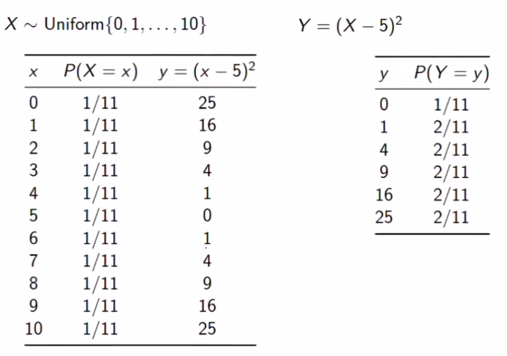
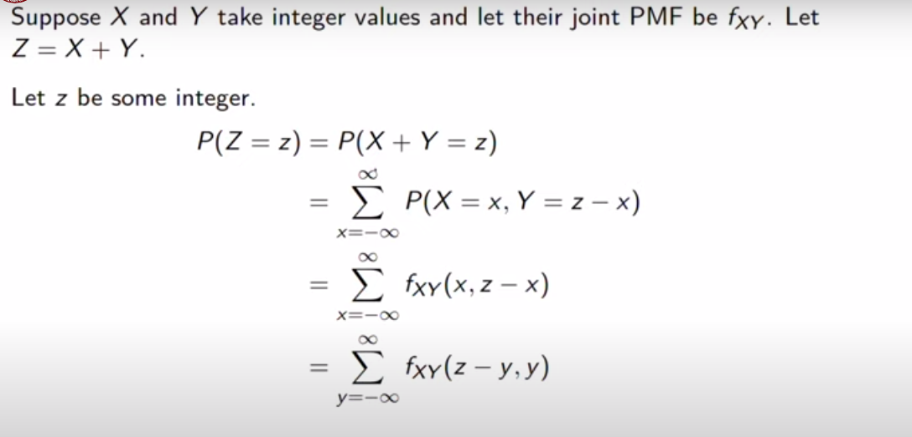
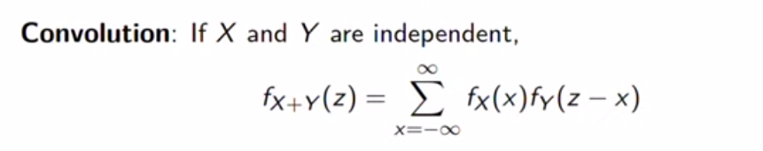
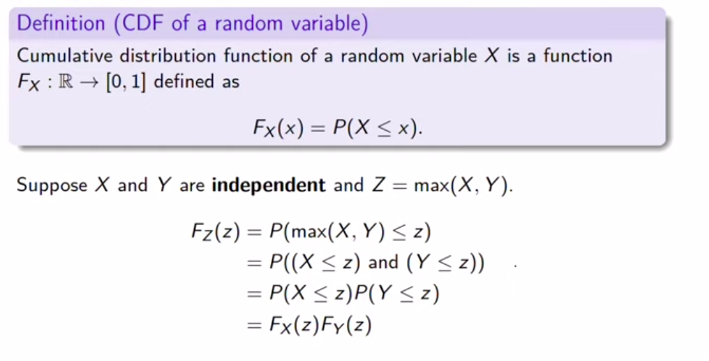
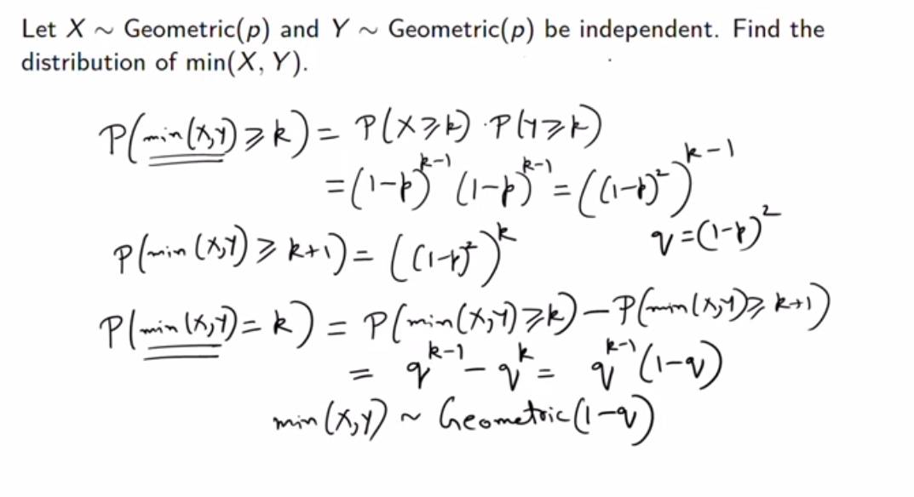

## Takeaways from this week
- Being able to check whether a given join distribution has indepenedent random variables or not.
- Memoryless Property 

# Independence of Random Variables 
Let $X$ and $Y$ be two random variables defined in a probability space with ranges $T_X$ and $T_Y$ respectively.
$X$ and $Y$ are considered independent if :

$$f_{XY}(t_1 , t_2) = f_X(t_1) \times f_{Y|X=t_1}(t2)$$

where,

$$f_{Y|X=t_1}(t2) = f_Y(t_2)$$

$$\therefore f_{XY}(t_1 , t_2) = f_X(t_1) \times f_Y(t_2)$$

!!! info
    - Joint PMF is the product of the marginal PMFs when the variables are independent.
    - All the subsets of independent random variables are independent.

## Checking Independence of Random Variables 
- For every element in the table of 2 or more random variables.
Each entry must be the product of their respective marginal PMFs then only they are considered **independent.** 
- If for any element $f_{XY}(t_1 , t_2) \neq f_X(t_1)f_Y(t_2)$ then the variables are considered **dependent.**

!!! tip
    - i.i.ds (independent and identically distributed) are one of the examples for independent random variables for any $f_{XY}(t_1 , t_2) \neq 0$
    - Finding dependent variables is easier when $f_{XY}(t_1)(t_2) =0$.
    The logic behind it is for some $t_1$ and $t_2$ $f_X(t_1) \times f_Y(t_2) \neq 0$ , if it is 0 then it would mean that either or both of the marginals are 0 which is generally not true.

---

## Geometric iid 
### Question 1
Let $X_1 , X_2 , X_3 ... , X_n$ be an iid with a Geometric(p) distribution. What is the probability that all of these random variables are larger than some positive integer $j$.

$$X \sim \{1,2,3,....\}$$

$$P(X=k) = (1-p)^{k-1}p$$

The probability that the random variables are greater than $j$ is :

$$(P(X > j))^n = (1-p)^{jn}$$

### Question 2
Let $X \sim \{\stackrel{\frac{1}{2}}{0},\stackrel{\frac{1}{4}}{1} , \stackrel{\frac{1}{8}}{2} , \stackrel{\frac{1}{16}}{3} , \stackrel{\frac{1}{16}}{4}\}$ , and let $X_1 ..... X_n$ be the iid samples with distribution $X$.

#### What is the probability that 4 is missing in some samples.
- $P(X_1 \neq 4 , X_2 \neq 4 , X_3 \neq 4 , X_4 \neq 4 .... X_n \neq 4)$
- $(P(X \neq 4))^n$ as all the probabilities are same for an iid.
- $(P(X \neq 4))^n = (1 - P(X = 4))^n$
- $(P(X \neq 4))^n = (1 - \frac{1}{16})^n = (\frac{15}{16})^n$

#### What is the probability that 4 appears exactly once. 
$\implies P( \text{4 Appears exactly once})=$

$$\begin{align} \implies P(X_1 = 4 , X_2 \neq 4 , X_3 \neq 4 .... X_n \neq 4) + \\ 
P(X_1 \neq 4 , X_2 = 4 , X_3 \neq 4 ... X_n \neq 4) + ... \\
P(X_1 \neq 4 , X_2 \neq 4 , X_3 \neq 4 .... X_{n-1} \neq 4 , X_n =4) \end{align}$$

$\implies n \times P(X \neq 4)^{n-1} \times P(X=4)$
$\implies n \times (\frac{15}{16})^{n-1} \times (\frac{1}{16})$

---

## Memoryless property
Just mug up the formula for this one.💀🥲

$$P(X > k+m | X>m ) = P(X>k)$$

For a detailed proof see the lecture.

---

# Extra Content
## Visualizing Random Variables 
Sometimes we dont want the usual representation of random variables,
that is when we use functions. Functions change the horizontal axis of the graph. $f(x) = x- 10$ is a function which shifts the x axis to the left by 10.

Sometimes these functions can either be **one to one** , which means that each input has a unique output/ no two outputs are the same OR the functions can be **many to one** , which means outputs for different inputs can be the same/ two or more outputs are same.

[See This](https://www.youtube.com/watch?v=vQ8nsT6RH1I) for what changes occurs on different types of functions.

### Many To One Functions 
In the case of many to one functions we add the probabilities when the outputs are the same.

!!! info
    If two variables $X$ and $Y$ are independent then their functions $f(X)$ and $g(Y)$ will also be independent.

---

## Formulas 
You are probably better off mugging up these because its not gonna come in future weeks.
Also you will be provided with a forumla sheet in the exam with all the formula required for STATS2.
### Two uniformly distributed iid random variables
#### Sum
Given that $X,Y \sim Uniform \{1,2,3,4.....n\} , W=X+Y$
$\implies W \in \{2,3,4,5....2n\}$

$$P(W=w) = 
\begin{cases} \frac{w-1}{n^2}, & 2 \leq w \leq n+1 \\
\frac{2n - w + 1}{n^2} & n+2 \leq w \leq 2n
\end{cases}$$

#### Maximum 
Given that $X,Y \sim Uniform \{1,2,3,4.....n\} , Z=\max(X,Y)$

$\implies Z \in \{1,2,3,....n\}$

$$P(Z=z) = \frac{2z-1}{n^2}$$

### Sum of n independent bernoulli trials 
Let $X_1 , X_2 , X_3 .... X_n$ be the results of $n$ i.i.d $Bernoulli(p)$ trials. 

The sum of the n random variables $X_1 , X_2 , X_3 .... X_n$ is $Binomial(n,p)$

### Sum of 2 random variables taking integer values 

### Convolution 

### Two Independent Poisson 
#### Sum
$Z = X+Y$

$$f_Z(Z) = \frac{e^{-(\lambda_1 + \lambda_2)} \times (\lambda_1 + \lambda_2)^Z}{Z!} $$

#### Conditional distribution of X|Z

$$P(X=k|Z=n) = \frac{n!}{k!(n-k)!} \times (\frac{\lambda_1}{\lambda_1 + \lambda_2})^k \times (\frac{\lambda_2}{\lambda_1 + \lambda_2})^{n-k}$$

which is also equals to 

$$P(X=k|Z=n) = Binomial(n, \frac{\lambda_1}{\lambda_1 + \lambda_2})$$

given that $X|Z \sim Binomial(n, \frac{\lambda_1}{\lambda_1 + \lambda_2})$

## Max of CDF of 2 independent random variables 

## Min of 2 independent Geometric Random Variables 

