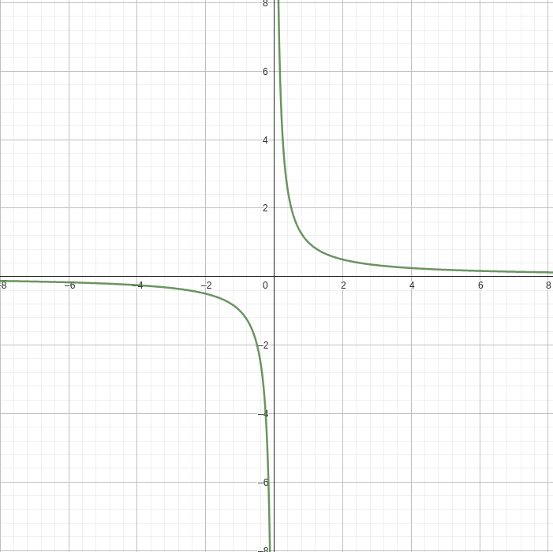
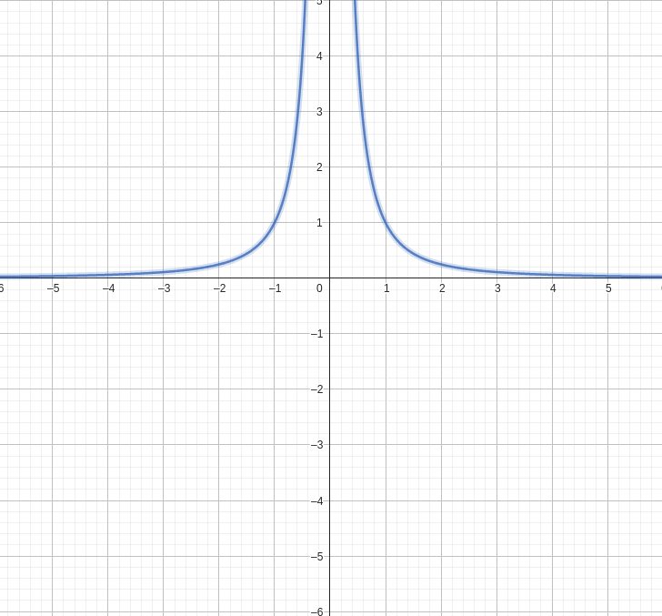

## Takeaways From This Week
- Bounds on Probabibilites is an important concept and will be used in the future
- Rest of the content in this week is formula based so you have to figure out how and where to apply the formulas.
- The formulas will be given in the in-person exams so no need to remember them , just study the application.

# Random Variables , Expectations and Variances
## Expectation of Random Variables
The expectation of a random variable is like its average value or what you would typically expect it to be. It gives you an idea of the central tendency of the variable.

!!! example "Coin Toss"
    The expected value for a fair coin toss should be 0.5 . 

Suppose $X$ is a random variables defined in the range of $T_X$ and PMF of $X$ is $f_X$ . The expected value of the random variables $X$ will be

$$E[X] = \sum_{t \in T_X} t \times f_X(t) = \sum_{t \in T_X} t \times P(X =t)$$

!!! note
    - $E[X]$ has the same unit of $X$
    - $E[X]$ may or may not belong to range of $X$

    !!! info "Expectation Properties"
        - $E[c \times X] = c \times E[X]$ , where $c$ is a constant and $X$ is a random variable.
        - $E[X + Y] = E[X] + E[Y]$ , where $X$ and $Y$ are 2 random variables.
        - $E[X - Y] = E[X] + E[Y]$ 
        - **If X and Y are independent** :$E[XY] = E[X]E[Y]$

## Variance and Standard Deviation Properties 
The variance of a random variable measures how spread out or how much the values of the variable differ from the expected value (or mean). In simpler terms, it tells you how much the individual values of the random variable tend to deviate from the average.

Let $X$ be a random variable. Let $a$ be a constant real number.

$$\begin{align} Var(X) = E[X^2] - E[X]^2 \\ 
SD(X) = \sqrt{Var(X)} \end{align}$$

!!! note "Variance Properties"
    - $Var(aX) = a^2Var(X)$
    - $SD(aX) = |a|SD(X)$
    - $Var(X + a) = Var(X)$
    - $SD(X + a) = SD(X)$

    !!! info
        - **If X and Y are independent** : $Var(X+Y) = Var(X) + Var(Y)$

## Types of Random Variables 
### Uniform Random Variable 
Given that , $X \sim \text{Uniform} \{a , a+1 , a+2 , ... b\}$

$$E[X] = \frac{a+b}{2}$$

#### Variance 
$$ Var(X) = \frac{(b-a)^2}{12} = \sigma^2 $$

### Geometric Random Variable
Given that , $X \sim \text{Geometric}(p)$

$$E[X] = \sum^{\infty}_{t=1} t(1-p)^{t-1}p = \frac{1}{p}$$

#### Variance 
$$Var(X) = \frac{1-p}{p^2} = \sigma^2$$

### Poisson Random Variable 
Given that , $X \sim \text{Poisson}(\lambda)$

$$E[X] = \sum^{\infty}_{t = 0} t \times e^{- \lambda} \times \frac{\lambda ^ {t}}{t!} = \lambda$$

#### Variance 
$$Var(X) = \lambda = \sigma^2$$

### Binomial Random Variable 
Given that , $X \sim \text{Binomial}(n,p)$

$$E[X] = \sum^{n}_{t=0} t \times {n \choose x} p^t (1-p)^{n-t} = np$$

#### Variance 
$$Var(X) = np(1-p) = \sigma^2$$

### Bernoulli Random Variable 
Given that , $X \sim \text{Bernoulli}(p)$

$$E[X] = 0(1-p) + p = p$$

#### Variance 
$$Var(X) = p(1-p) = \sigma^2$$

## Bounds In Probabilities 
!!! question "How do Probability bounds even work?"
    The Central Limit Theorem (CLT) states that **when independent random variables are added together, their sum tends to follow a normal distribution**, regardless of the shape of the individual variables' distributions. This holds true as the number of variables increases. In simpler terms, the CLT explains why many real-world phenomena exhibit a bell-shaped or normal distribution when multiple random factors are involved.

    ??? abstract "Understanding CLT"
        <iframe width="560" height="315" src="https://www.youtube.com/embed/zeJD6dqJ5lo" frameborder="0" allowfullscreen></iframe>
        
        This video dives deep into the concept of CLT (Central Limit Theorem) , after watching this you will have a much better
        understanding of CLT and Probability Bounds.

### Markov's Inequality 
??? note inline end 
    Markov's inequality provides a general upper bound, but it may not provide a tight bound in many cases.

Markov's inequality states that the probability of a non-negative random variable exceeding a certain value is bounded by the ratio of its expected value to that value.

Let $X$ be a random variable.

$$P(X \geq a) \leq \frac{E(X)}{a}$$

??? question "Why is it $\frac{1}{k^2}?$"
    A general explanation would be to look at the graphs of $\frac{1}{k}$ and $\frac{1}{k^2}$.

    It can be seen that this graph does not look like a bell curve , also it goes in 3rd quadrant too.
    If we were to plot probability along the y-axis , it would become negative according to this graph.
    {: style="width:70%;"}
    <figcaption style="padding:auto"> Graph of $\frac{1}{k}$</figcaption>

    This graph is much more similar to a bell curve and does not go in 3rd quadrant.
    {: style="width:70%;"}
    <figcaption style="padding:auto"> Graph of $\frac{1}{k^2}$</figcaption>

 

!!! example
    A shopkeeper sells mobile phones. The expected demand for mobile phones is 4 per week. $X$ is denoting the number of phones sold in a week.

    $$
    P(X \geq 10) \leq 0.4
    $$

    Also, 

    $$P(X < 10) \geq 0.6$$

### Chebyshev's Inequality 
Chebyshev's inequality states that the probability of a random variable deviating from its mean by a certain number of standard deviations is bounded by the reciprocal of that number squared.

Let $X$ be a random variable with mean $\mu$ and finite variance $\sigma^2$ , then for any real number $k>0$

$$P(|X - \mu| < k \sigma) \geq 1 - \frac{1}{k^2}$$

**Also,**

$$P(|X - \mu| \geq k \sigma) \leq \frac{1}{k^2}$$

## More Important Formulas 
### Standardized Random Variables 
A random variable $X$ is said to be standardized if $E[X] = 0 \text{ and } Var(X) = 1$

Also,
If $X$ is a random variable.  Then,

$$\frac{X - E[X]}{SD(X)}$$

is a standardized random variable.

### Covariance Formula
$$Cov(X,Y) = E[XY] - E[X] \times E[Y]$$

### Correlation Coefficient 
$$Cor(X,Y) = \frac{Cov(X,Y)}{SD(X) \times SD(Y)}$$

