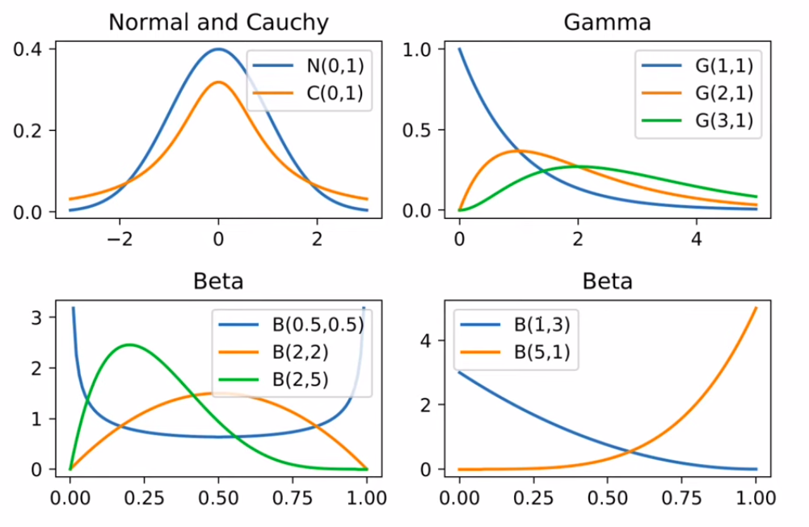

# Central Limit Theorem
## Moment Generating Functions
Let $X$ be a zero-mean random variable. 
The MGF of $X$ , denoted $M_X(\lambda)$, 
is a function from $\mathbb{R} \to \mathbb{R}$ defined as 

$$M_X(\lambda) = E[e^{\lambda X}]$$

!!! note 
    - **When $X$ is Discrete with PMF $f_X$**

    X takes the values $\{x_1 , x_2 , x_3 ....\}$

    $$M_X(\lambda) = f_X(x_1)e^{\lambda x_1} + f_X(x_2)e^{\lambda x_2} + ....$$

    - **When $X$ is continuous with PDF $f_X$ and support $T_X$**

    $$M_{(\lambda)} = \int^{}_{x \in T_X} f_X(x) e^{\lambda x} dx$$

!!! example
    $\mathbf{X \in \{\overset{1/2}{-1} , \overset{1/4}{0} , \overset{1/4}{2}\}}$

    $$M_X(\lambda) = 0.5e^{-\lambda} + 0.25 + 0.25 e^{2 \lambda}$$

    $\newline$

    $\mathbf{M_X(\lambda) = (1/3)e^{3 \lambda / 2} + (1/6)e^{-3\lambda} + (1/8)e^{-\lambda} + (1/8)e^{\lambda} + 1/4}$

    $$X \sim \{\overset{1/6}{-3} , \overset{1/8}{-1} , \overset{1/4}{0} , \overset{1/8}{1} , \overset{1/3}{3/2}\}$$

    !!! note
        $\mathbf{X \sim Normal(0 , \sigma^2)}$

        $$M_X(\lambda) = e^{\lambda^2 \sigma^2 / 2}$$

## Expectation Of MGF 
$E[e^{\lambda X}] = E[1 + \lambda X + \frac{\lambda^2}{2!}X^2 + \frac{\lambda ^3}{3!}X^3 + ....]$

$\implies 1 + \lambda E[X] + \frac{\lambda^2}{2!}E[X^2] + \frac{\lambda^3}{3!} E[X^3]$

- **If** $\mathbf{X \sim \text{Normal}(0,\sigma^2) , M_X(\lambda) = e^{\lambda^2 \sigma^2 / 2}}$
$1 + E[X] + \frac{\lambda^2}{2!}E[X^2] + \frac{\lambda ^3}{3!}E[X^3]$
$\implies 1 + \frac{\lambda^2}{2!}\sigma^2 + \frac{\lambda^4}{4!}3\sigma^4$

$\implies E[X]=0 , E[X^2] = \sigma^2 , E[X^3] = 0 , E[X^4] = 3\sigma^4 ...$

## MGF of Sample Mean 
Let $X_1 , X_2 .... X_n \sim \text{iid }X , M_X(\lambda) = \frac{e^{\lambda/2} + e^{-\lambda/2}}{2}$

- Sample Mean : $\overline{X} = (X_1 + X_2 + ... X_n) / n$
- $M_{X/n}(\lambda) = \frac{e^{\lambda / 2n} + e^{-\lambda / 2n}}{2}$

$$M_{\overline{X}}(\lambda) = {\left(\frac{e^{\frac{\lambda}{2n}} + e^{\frac{\lambda}{2n}}}{2}\right)}^n$$

## MGF convergence at  $\mathbf{1 / \sqrt{n}}$ scaling 
Let $X_1 , X_2 .... X_n \sim \text{iid }X , M_X(\lambda) = \frac{e^{\lambda/2} + e^{-\lambda/2}}{2}$

$E[X]=0 , Var(X) = 1/4$

Consider $Y = (X_1 + X_2 ... + X_n) /  \sqrt{n}$

$M_{X/\sqrt{n}}(\lambda) = \frac{e^{\lambda / 2\sqrt{n}} + e^{-\lambda / 2\sqrt{n}}}{2}$

$$M_Y(\lambda) = M_{\overline{X}}(\lambda) = {\left(\frac{e^{\frac{\lambda}{2\sqrt{n}}} + e^{\frac{\lambda}{2\sqrt{n}}}}{2}\right)}^n$$

## Using CLT to approximate probability 
$$X_1 , X_2 , .... X_n \sim \overset{iid}{X}$$

Let $\mu = E[X] , \sigma^2 = Var(X)$

$Y = X_1 + X_2 + .... X_n$

What is $P(Y - n\mu > \delta n \mu)$ ? 

$$Z = \frac{Y - n\mu}{\sqrt{n} \sigma} \approx \text{Normal}(0,1)$$

$P(Y-n \mu > \delta n \mu) = P(\frac{Y - n \mu}{\sqrt{n} \sigma} > \frac{\delta \sqrt{n} \mu}{\sigma}) \approx 1 - F(\frac{\delta \sqrt{n} \mu}{\sigma})$

$\begin{align*} F_{Z}(0.2617) = 0.603, F_{Z}(1.6) = 0.9452, F_{Z}(1.5) = 0.933 \end{align*}$

## Types of Distributions 
### Combination of Independent Normals 
Let $X_1 , X_2 ... X_n \sim \text{independent Normal}$

Let $X_i \sim \text{Normal}(\mu_i ,\sigma_{i}^{2})$

Suppose $Y = a_1X_1 + a_2X_2 + a_nX_n$ be a linear combination of independent normals. 

Then,

$$Y \sim \text{Normal}(\mu , \sigma^2)$$

where $\mu = E[Y] = a_1\mu_1 + a_2\mu_2 + ... + a_n\mu_n$

$\sigma^2 = a_{1}^{2}\sigma_{1}^{2} + a_{2}^{2}\sigma_{2}^{2} + .... a_{n}^{2}\sigma_{n}^{2}$

**Therefore Linear combinations of independent normals is normal distribution.**

### Gamma Distribution 
$X \sim \text{Gamma}(\alpha , \beta)$ if PDF $f_X(s) \propto x^{\alpha -1} e^{-\beta x} , x>0$

!!! note "Points to be noted"
    - $\alpha > 0$ and $\alpha$ is called the shape parameter
    - $\beta > 0$ and $\beta$ is called the rate parameter
    - $\theta = 1/ \beta$ and $\theta$ is called the scale parameter.
    - Sum of n iid $\text{Exp}(\beta)$ is $\text{Gamma}(n, \beta)$
    - Square of $\text{Normal}(0 , \sigma^2)$ is $\text{Gamma}(\frac{1}{2} , \frac{1}{2 \sigma^2})$

**Mean:** $\mathbf{\frac{\alpha}{\beta}}$ , **Variance:** $\mathbf{\frac{\mathbf{\alpha}}{\beta^2}}$  

### Cauchy Distribution 
$X \sim \text{Cauchy}(0, \alpha^2)$ if PDF $f_X(x) = \frac{1}{\pi} \frac{\alpha}{\alpha^2 + (x - \theta)^2}$

!!! note
    - $\theta$ is the location parameter
    - $\alpha > 0$ and $\alpha$ is called the scale parameter 
    - Suppose $X , Y \sim \text{iid} Normal(0,\sigma^2)$. Then,

    $$\frac{X}{Y} \sim \text{Cauchy}(0,1)$$

**Mean** : undefined , **Variance** : undefined 

### Beta Distribution 
$X \sim \text{Beta}(\alpha , \beta)$ if PDF $f_X(x) \propto x^{\alpha -1}(1- x)^{\beta -1} , 0 < x < 1$

!!! note
    - $\alpha > 0 , \beta > 0$ and both of them are the shape parameters
    - $\text{Beta}(\alpha ,1)$ has PDF $\propto x^{\alpha -1}$ which is called the power function distribution 
    - Suppose $X \sim \text{Gamma}(\alpha , 1 / \theta), Y \sim \text{Gamma}(\beta , 1/\theta)$ , then 

    $$\frac{X}{X + Y} \sim \text{Beta}(\alpha , \beta)$$

### Plotted Distributions 

### Sample Mean Distribution 
$X_1 , X_2 , .... X_n \sim \text{iid Normal}(\mu , \sigma^2)$

$\overline{X} = \frac{1}{n}X_1 + ... \frac{1}{n}X_n$

Sample mean is a linear combination of iid normal random variables 

$$\overline{X} \sim \text{Normal}(\mu , \sigma^2/n)$$

**Mean** : $E[\overline{X}] = \mu$ , **Variance** : $\text{Var}(\overline{X}) = \sigma^2 /n$

### Sum of squares of Normal Samples 
$X_1 , X_2 , .... X_n \sim \text{iid Normal}(0 , \sigma^2)$

- $X_{i}^{2}$ : $\text{Gamma}(1/2 , 1/2\sigma^2)$ , independent
- Sum of *n* independent $\text{Gamma}(\alpha , \beta)$ is $\text{Gamma}(n\alpha , \beta)$

$$X_{1}^{2} + X_{2}^{2} + X_{3}^{2} + ... + X_{n}^{2}
\sim \text{Gamma}(\frac{n}{2} , \frac{1}{2\sigma^2})$$

### Sample Mean and variance of normal samples 
Suppose $X_1 , X_2 , .... X_n \sim \text{iid Normal}(\mu , \sigma^2)$. Then,

- $\overline{X} \sim Normal(\mu , \sigma^2 /n)$
- $\frac{(n-1)S^2}{\sigma^2} \sim \chi_{n-1}^{2}$ , Chi-square with $n-1$ degrees of freedom.
- $\overline{X}\text{ and }S^2$ are independent.
